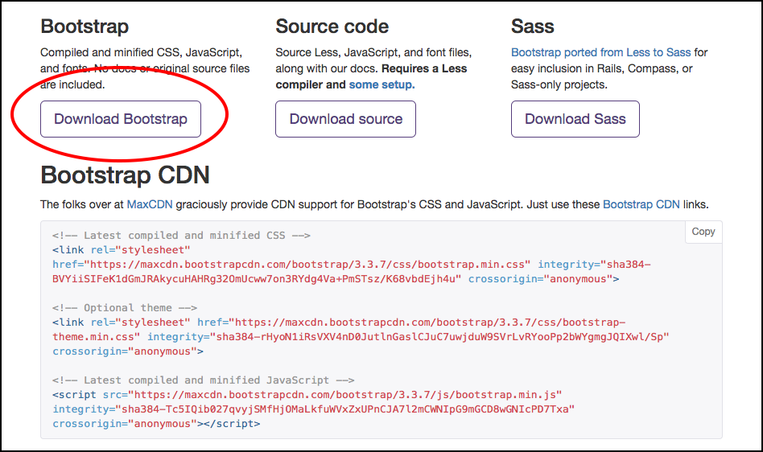
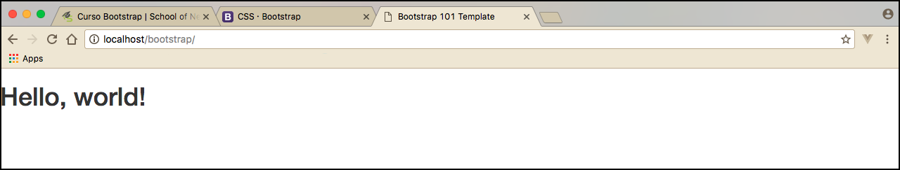

# Instalando o Bootstrap

Seja bem vindo ao módulo de Bootstrap da School of Net.

Gostaria de informar que vamos praticar muito, conhecer e entrar de cabeça neste mundo do framework Bootstrap. Ele é muito útil e muito utilizado por programadores do mundo inteiro, para agilizar a parte visual dos sistemas, aplicações e até websites.

Então se você chegar até o final deste conteúdo você estará apto a trabalhar com um framework CSS chamado Bootstrap, facilitando assim a criação da parte visual dos seus trabalhos web. Desta forma não irá mais se preocupar com a parte de estilos, porque o Bootstrap fará quase tudo por você.

# Iniciando com Bootstrap

Primeiramente iremos acessar o site <http://getbootstrap.com/>. Neste site podemos perceber que o Bootstrap veio para facilitar o desenvolvimento **front-end**. Ele torna o desenvolvimento mais rápido e fácil e também foi desenvolvido para pessoas de todos os níveis. Ele foi criado para se adaptar a todos os dispositivos.

O Bootstrap irá rodar nos principais processadores de CSS como **Sass** e **Less** e também existem muito recursos e plugins Jquery para você utilizar muito facilmente.

Resumindo, podemos dizer que a vida do front-end fica muito mais fácil quando ele utiliza o Bootstrap. Porque ele terá disponível, e pré configurado, toda parte de formulário, slides, menus, mensagens de alerta e muitos outros recursos.

Você pode encontrar no site a documentação completa ou também acessar pelo Github. Existem também alguns templates prontos que utilizam o Bootstrap, você pode baixar e utilizar como início de projeto ou material de estudo.

# Instalação

Primeiro você precisa fazer o download do Bootstrap no site. Na parte de download você terá três opções de download e mais uma quarta opção utilizando o CDN, para utilizar de forma online.



Para dar continuidade, iremos baixar os arquivos da primeira opção de download, que foi sinalizada na imagem acima.

Depois de baixado e descompactado teremos três diretórios: css, fonts e js. Estes diretórios contém tudo o que precisamos para utilizar o framework.

# Criando projeto

Crie um diretório que será o seu projeto. Depois copie os três diretórios do Bootstrap, que foram baixados, e cole dentro do seu projeto.

O Bootstrap trás duas versões do css e do javascript: normal e minificada. A versão mais indicada, para produção, é a versão reduzida ou minificada, o arquivo é conhecido de ambas as formas. Então algumas pessoas utilizam a versão normal para desenvolvimento e sobe a versão minificada para produção. A versão normal é mais simples e visual, então é mais fácil entender o que está acontecendo com sua aplicação, ao analisar o código, por este motivo alguns desenvolvedores utilizam esta versão durante o desenvolvimento.

Existem alguns arquivos de template que vem na pasta de CSS, mas nós não iremos utilizar, porque vamos pegar um padrão pronto do próprio Bootstrap, que é disponibilizado no site.

Então, ciente da estrutura, vamos dar início ao conteúdo.

# Basic Template

No próprio site do Bootstrap você pode encontrar um template básico para implementação do framework. Basta pesquisar por **Basic Template** ou acessar o link <http://getbootstrap.com/getting-started/#template>.

Então iremos criar um arquivo chamado **index.html**, na raiz do projeto, e vamos colar o conteúdo deste template básico do Bootstrap.

```html
<!DOCTYPE html>
<html lang="en">
  <head>
    <meta charset="utf-8">
    <meta http-equiv="X-UA-Compatible" content="IE=edge">
    <meta name="viewport" content="width=device-width, initial-scale=1">
    <!-- The above 3 meta tags *must* come first in the head; any other head content must come *after* these tags -->
    <title>Bootstrap 101 Template</title>

    <!-- Bootstrap -->
    <link href="css/bootstrap.min.css" rel="stylesheet">

    <!-- HTML5 shim and Respond.js for IE8 support of HTML5 elements and media queries -->
    <!-- WARNING: Respond.js doesn't work if you view the page via file:// -->
    <!--[if lt IE 9]>
      <script src="https://oss.maxcdn.com/html5shiv/3.7.3/html5shiv.min.js"></script>
      <script src="https://oss.maxcdn.com/respond/1.4.2/respond.min.js"></script>
    <![endif]-->
  </head>
  <body>
    <h1>Hello, world!</h1>

    <!-- jQuery (necessary for Bootstrap's JavaScript plugins) -->
    <script src="https://ajax.googleapis.com/ajax/libs/jquery/1.12.4/jquery.min.js"></script>
    <!-- Include all compiled plugins (below), or include individual files as needed -->
    <script src="js/bootstrap.min.js"></script>
  </body>
</html>
```

Entre as implementações do código HTML acima, um fator importante que o Bootstrap configura é a escala padrão para que todos os dispositivos possam reconhecer.

`<meta name="viewport" content="width=device-width, initial-scale=1">`

Esta linha é responsável por criar uma escala padrão, desta forma você pode acessar de um tablet ou um celular que a aplicação irá se adaptar ao tamanho do dispositivo automaticamente. Caso você não coloque esta configuração, em seu HTML, você terá problemas com alguns dispositivos.

Você pode também tornar sua aplicação nativa e desabilitar o recurso de zoom do aparelho, basta utilizar a meta tag abaixo ao invés do exemplo acima. O fator que é responsável por desabilitar o zoom para o usuário é: `user-scalable=no`.

`<meta name="viewport" content="width=device-width, initial-scale=1, maximum-scale=1, user-scalable=no">`

Estas informações se encontram na parte de CSS da documentação, caso queira ler mais sobre o assunto.

Depois de falar sobre a configuração de escala na meta tag, vamos falar sobre a chamada do css e do javascript no template básico. Reparem que ele já chama os arquivos minificados.

`<link href="css/bootstrap.min.css" rel="stylesheet">`

`<script src="js/bootstrap.min.js"></script>`

O template básico utiliza a biblioteca jquery de forma online, mas você pode fazer o download da biblioteca e fazer a inclusão de forma local caso queira. Veja a inclusão online:

`<script src="https://ajax.googleapis.com/ajax/libs/jquery/1.12.4/jquery.min.js"></script>`

***

Vá até seu navegador para visualizar o projeto, a aplicação já está rodando com o Bootstrap devidamente configurado e funcionando. Então o processo é bem simples, basta baixar os arquivos, inserir em sua aplicação e chamar o template básico. Se sua aplicação utilizar outra estrutura de pastas você deverá adequar a chamada dos arquivos css e javascript, mas caso utilize a mesma estrutura, na pasta raiz, a implementação é idêntica a que o site sugere.



Na imagem acima você pode ver que a aplicação já está rodando, porque a fonte está estilizada e vem do Bootstrap.

No próximo conteúdo iremos criar um menu ou navbar, como é conhecido também, utilizando o Bootstrap. Desta forma vamos dando andamento ao conteúdo e aprofundando ainda mais no framework.

O nosso objetivo, além de ensinar a utilizar, é ensinar a buscar na documentação do Boostrap, que é muito boa. Você aprendendo a buscar na documentação não terá problema algum para construir sua aplicação utilizando o Bootstrap.