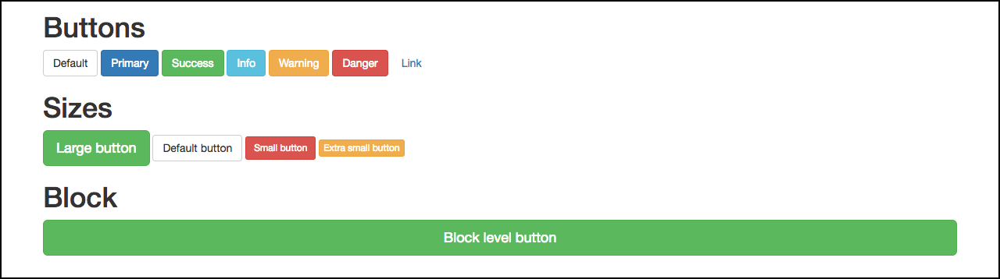

# Trabalhando com botões

Mostraremos como é simples trabalhar com os botões do Bootstrap. 
Vocês podem criar botões utilizando div, âncora, button ou input, mas o ideal é que utilizem a tag **button**, que foi criada, especificamente, para esta finalidade. 
Para caracterizar um botão, basta que adicionemos as classes btn e depois definamos o tipo do botão. 

Vejam os exemplos existentes, na imagem abaixo:


```html
<main>
    <section>
        <div class="container">
            <div class="row">
                <h1>Buttons</h1>
                <button type="submit" class="btn btn-default">Default</button>
                <button type="submit" class="btn btn-primary">Primary</button>
                <button type="submit" class="btn btn-success">Success</button>
                <button type="submit" class="btn btn-info">Info</button>
                <button type="submit" class="btn btn-warning">Warning</button>
                <button type="submit" class="btn btn-danger">Danger</button>
                <button type="submit" class="btn btn-link">Link</button>
            </div>
        </div>
    </section>
</main>
```

# Trabalhando com botões de diferentes tamanhos

```html
<main>
    <section>
        <div class="container">
            <div class="row">
                <h1>Sizes</h1>
                <button type="submit" class="btn btn-success btn-lg">Large button</button>
                <button type="submit" class="btn btn-default">Default button</button>
                <button type="submit" class="btn btn-danger btn-sm">Small button</button>
                <button type="submit" class="btn btn-warning btn-xs">Extra small button</button>
            </div>
        </div>
    </section>
</main>
```

Vejam que o padrão é o mesmo dos primeiros exemplos, só precisamos adicionar mais uma classe, que definirá o tamanho destes botões. As classes existentes são:

* btn-lg
* btn-sm
* btn-xs

Todas seguem o mesmo padrão de dispositivos.

Classe | Dispositivo
--------- | ---------------
btn-lg | **l**ar**g**e - tvs ou projetores
btn-sm | **sm**all - tablets
btn-xs | e**x**tra **s**mall - celulares

# Trabalhando com botões do tipo block

```html
<main>
    <section>
        <div class="container">
            <div class="row">
                <h1>Block</h1>
                <button type="submit" class="btn btn-success btn-lg btn-block">Block level button</button>
            </div>
        </div>
    </section>
</main>
```

Este botão ocupa o espaço total da div em que estiver inserido. Ele é muito utilizado para o desenvolvimento de aplicativos, mas vocês podem utilizar da maneira que acharem melhor, no projeto.

# Resultados

Acessem o navegador depois de terem adicionado todos os tipos de botões, no projeto local. Vocês deverão obter o mesmo resultado da imagem abaixo:



Vocês podem ver que, trabalhar com botões é muito simples. Não deixem de olhar a documentação do Bootstrap, pois existem mais alguns tipos de botões a serem utilizados, que não são muito comuns. 
Sempre é muito bom saber o que o framework pode oferecer, pois algum dia, podemos precisar.