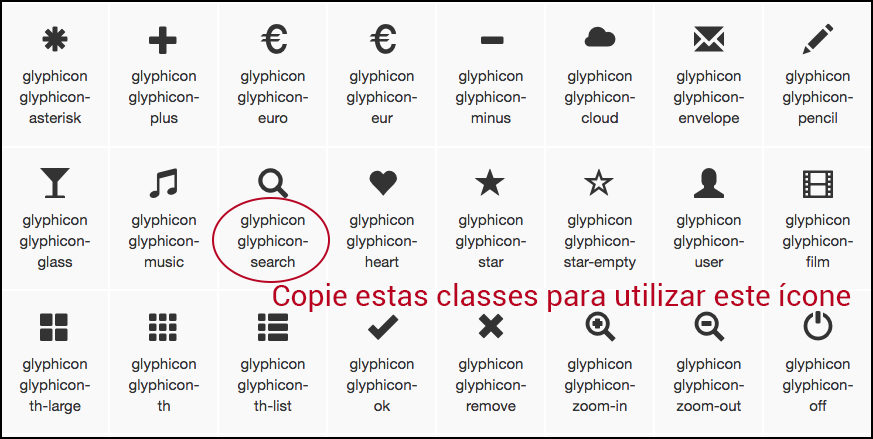

# Ícones

Outro recurso, muito interessante e útil, que o Bootstrap disponibiliza são os ícones. Ter ícones a sua disposição faz com que você ganhe muito tempo e consiga estilizar muito mais a sua aplicação.

No primeiro módulo, quando instalamos o Bootstrap, falamos de uma pasta chamada **fonts** e os ícones são todos tratados como fontes. Isso é ótimo porque você pode alterar o tamanho e as cores, dos ícones, de forma muito fácil utilizando CSS apenas.

Acessando o link de **components**, no site do Bootstrap, você verá os ícones em primeiro lugar na documentação.



Você verá, nos exemplos abaixo, como é fácil utilizar ícones. Basta que olhe no site as opções e copie as classes referentes a cada um deles, como mostra a imagem acima.

# Inserindo os ícones

```html
<main>
    <section>
        <div class="container">
            <div class="row text-center">
                <h1>Glyph icons</h1>
                <p><span class="glyphicon glyphicon-search" aria-hidden="true"></span></p>
                <p><span class="glyphicon glyphicon-education" aria-hidden="true" style="font-size: 40px;"></span></p>
                <p><span class="glyphicon glyphicon-user" aria-hidden="true" style="font-size: 40px; color: blue;"></span></p>
                <p><span class="glyphicon glyphicon-user text-danger" aria-hidden="true" style="font-size: 40px;"></span></p>
                <p><button class="btn btn-success glyphicon glyphicon-ok " aria-hidden="true" style="font-size: 40px;"></button></p>
            </div>
        </div>
    </section>
</main>
```

Acima mostramos como utilizar ícones com a tag span e também com a tag button. Você pode ver que são maneiras muito parecidas e em ambas você pode utilizar o atributo **style** para formatar, da maneira que quiser. Você pode alterar cores e tamanhos muito facilmente.

Demos um exemplo de como alterar a cor, do ícone, utilizando classes do próprio Bootstrap. Exemplo: **text-danger**.

Vale a pena informar também que utilizamos o atributo **aria-hidden="true"** porque estamos utilizando uma tag span vazia. O span possui somente as classes e o objetivo dele é produzir um ícone apenas, então não existe valor entre as tags de abertura e fechamento. Por isso o Bootstrap nos orienta a utilizar este atributo.