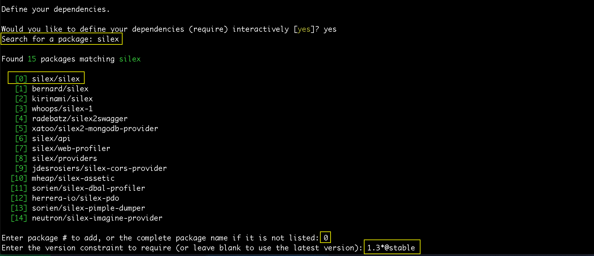

# Configurando o Composer Json

Ensinaremos a instalar o composer. 

Acessem o site <https://getcomposer.org/>


Depois de acessarem, vão até a parte de **download** ou acessem o link <https://getcomposer.org/download/>.

Acessando esta página vocês terão duas opções de instalação: via curl ou php.

Curl:

`$ curl -sS https://getcomposer.org/installer | php`

PHP:

`$ php -r "readfile('https://getcomposer.org/installer');" | php `

Querendo fazer da maneira mais atual, vocês podem seguir os comandos abaixo:

`$ php -r "copy('https://getcomposer.org/installer', 'composer-setup.php');"`

`$ php -r "if (hash_file('SHA384', 'composer-setup.php') === '55d6ead61b29c7bdee5cccfb50076874187bd9f21f65d8991d46ec5cc90518f447387fb9f76ebae1fbbacf329e583e30') { echo 'Installer verified'; } else { echo 'Installer corrupt'; unlink('composer-setup.php'); } echo PHP_EOL;"`

`$ php composer-setup.php`

`$ php -r "unlink('composer-setup.php');"`

Vale lembrar que estes passos de instalação deverão ser feitos dentro da pasta raiz do projeto. Porque vocês rodarão o comando a seguir dentro da pasta do projeto. O arquivo composer.phar deverá estar no mesmo local.

# Trabalhando com arquivo composer.phar

Depois de executar os passos de instalação, vocês deverão conferir se existe o arquivo composer.phar na pasta raiz do projeto. 
Se estiver lá, é porque a instalação foi feita corretamente e vocês poderão rodar o comando: 

`$ php composer.phar`. 

Digitando este comando, no terminal, deverão obter como resultado, uma lista de todos os comandos do Composer.

## Criando arquivo composer.json

Podemos criar o arquivo manualmente, caso saibamos a estrutura, ou podemos criar utilizando o terminal com o comando específico do Composer. 
Na documentação do Composer, no site citado acima, há muitos exemplos para seguir. Não deixem de olhar.

Iremos enisnar, utilizando o terminal. 

Rodem o comando abaixo:

`$ php composer.phar init`

Este comando fará algumas perguntas, antes da criação do arquivo de configuração.

1. Qual o nome do pacote ou da aplicação.
    * Colocaremos **son/phpcoursecomp**
2. Descrição
    * Colocaremos **Composer course in SON**
3. Autor
    * O Composer já reconhece o usuário do computador, automaticamente, há a possibilidade de alterar, mas iremos deixar o padrão.
4. Estabilidade mínima
    * Nós colocaremos **dev** (desenvolvimento)
5. Tipo do pacote
    * Vocês podem colocar **Library** ou o tipo da aplicação que estiverem fazendo. Nós deixaremos em branco.
6. Licença
    * Vocês podem inserir a licença, caso necessite. Nós deixaremos em branco, também.
7. Dependências
    * Vamos digitar **yes** e o composer dará a opção de pesquisar por pacotes.

Para exemplificar, iremos instalar duas bibliotecas: silex e doctrine.

Vocês podem colocar o nome principal da biblioteca para que o Composer faça uma busca no repositório. 
Caso tenham alguma dúvida de versão da biblioteca, podem pesquisar no próprio site do Composer em **Browse Packages**. 

O link para pesquisa é: <https://packagist.org/>.

Neste setor do site podem pesquisar as diversas bibliotecas existentes e suas versões, para informar ao Composer. 
Para a biblioteca silex verificamos a versão estável como sendo **1.3.5** e para o doctrine a versão **2.5.4**. 
Estamos falando das versões atuais, no momento em que este conteúdo foi produzido, vocês podem estar lendo este conteúdo e as versões já estarem mais avançadas.

Ao pesquisar no Composer, ele trará uma lista de itens relacionados. Vocês deverão informar o número do índice relacionado ao pacote que desejam instalar. 
Depois disso, será solicitada a versão que vocês querem instalar. Iremos informar as versões da maneira abaixo:

`1.3.*@stable` e `2.5.*@stable`

Desta maneira, ele pega a última versão que existir e que seja a versão mais estável da biblioteca.



Assim que adicionarem todas as dependências do projeto, deêm um enter sem nenhum conteúdo, para que o composer entenda que não existem mais dependências. Dessa forma ele passará para as dependências de desenvolvimento.

Dependências de desenvolvimento quer dizer que vocês utilizarão estas bibliotecas apenas para desenvolverem. Quando forem para o ambiente de produção, por exemplo, o projeto não dependerá delas. 
É o caso do PHPUnit que utilizamos para testes. Esta biblioteca não tem necessidade de estar no ambiente de produção, porque não será utilizada, então adicionamos somente nas dependências de desenvolvimento.

Para desenvolvimento, adicionaremos apenas o **PHPunit** e a versão **5.1.*@stable**.

Do mesmo modo que nas dependências, você deve dar um enter em branco, assim que terminar de adicionar as dependências de desenvolvimento. 
Após terminar as adições de dependências, o Composer perguntará se está tudo ok, dando uma prévia de como estará o arquivo de configuração. 
Estando tudo em ordem, digitem **yes** e o arquivo de configuração **composer.json** será criado com sucesso.

Vejam o código gerado pelo comando init do Composer:

```json
{
    "name": "son/phpcoursecomp",
    "description": "Composer course in SON",
    "require": {
        "silex/silex": "1.3.*@stable",
        "doctrine/dbal": "2.5.*@stable"
    },
    "require-dev": {
        "phpunit/phpunit": "5.1.*@stable"
    },
    "authors": [
        {
            "name": "Thiago Valls",
            "email": "thiago@schoolofnet.com"
        }
    ],
    "minimum-stability": "dev"
}
```

No próximo conteúdo adicionaremos a configuração de autoload e já rodaremos o comando de instalação do Composer.
Mas a primeira etapa já foi concluída, onde vocês aprenderam a configurar um arquivo composer.json. 
Lembrando que vocês podem criar este arquivo, via terminal, do jeito que fizemos, ou podem fazê-lo, manualmente.