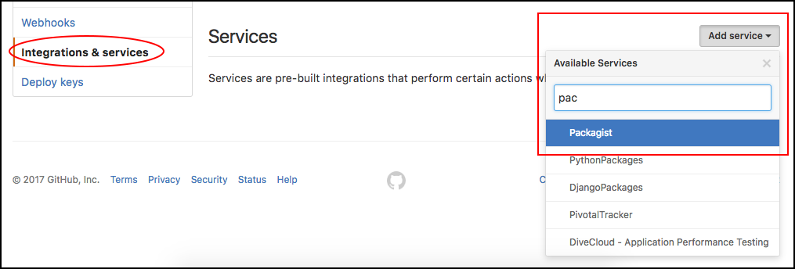
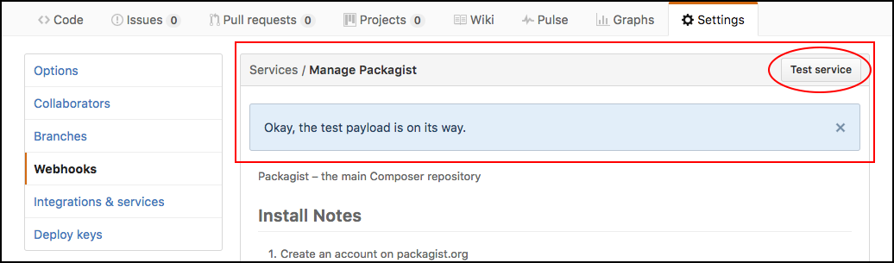
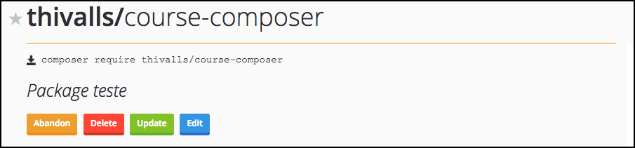

# Configurando Packagist Github

Depois de subirmos a biblioteca para o gitbub precisaremos fazer um cadastro no site <https://packagist.org/>. 
Com o cadastro realizado e logado, podemos ir até o menu **Submit** e inserir o link do projeto no github para teste.

Biblioteca no github:

# Fazendo o Submit no Packagist

Observem que na imagem abaixo tivemos muitos nomes parecidos, porque muitos alunos já fizeram este teste até a criação deste conteúdo, mas se o site permitir que vocês façam o **submit**, quer dizer, que está tudo ok com o pacote.

Após o processo de checagem, vem o submit. Após darmos um submit, significa que a biblioteca já faz parte dos pacotes disponíveis no composer.

Depois de clicar em submit aparecerá a seguinte mensagem:

Isso ocorre porque a atualização automática não está configurada, ainda. Esclarecendo, sempre que fizermos uma atualização na biblioteca e subirmos para o Github, teremos que ir até o packagist e atualizar, manualmente, clicando no botão Update, que está em verde.

Para que a atualização seja feita automaticamente, sigam os seguintes passos.

1. Cliquem em **GitHub Service Hook** que foi marcado na imagem acima.
2. Depois abram outra aba e vão até o repositório no Github. Depois cliquem em **settings** do repositório.

Na aba **Integrations & Services**, do lado esquerdo, terá a opção de adicionar serviços. Vejam imagem abaixo:

Quando selecionarem a opção **packagist** a página será recarregada e pedirá o token, que deve ser gerado no link 

<https://packagist.org/profile/>. 

Vejam a  imagem abaixo:

Depois de gerado, vocês devem voltar no github e colar no campo solicitado. 

Vejam imagem:

Após terem adicionado o token, vocês devem editar o serviço, novamente, porque ele ainda não estará ativo, e depois de clicarem em editar, devem clicar no **Test service**. Deverão obter a mensagem abaixo:

Assim que o teste rodar, podem ir até o site do packagist e a mensagem de erro na biblioteca, deve desaparecer. 

Vejam a imagem abaixo:

# Pesquisando no site Packagist

Depois de um tempo, vocês já podem pesquisar a biblioteca no site que já terão acesso a ela e, consequentemente, vocês poderão instalar, via composer, no terminal.

# Conclusão

Próximo passo será criar um novo projeto e incluir a biblioteca que criamos e adicionamos no packagist, como dependência do projeto. 
Depois de instalar, vamos testar a classe criada pra ver se ela está funcionando corretamente.

Façam todo o procedimento, criando uma biblioteca com seus dados e colocando no github. 
Depois insiram esta biblioteca no packagist, para treinarem e fixarem o conteúdo. 
Tenham o hábito de criar pequenos códigos e disponibilizem para a comunidade, isso fará com que o PHP cresça cada vez mais.