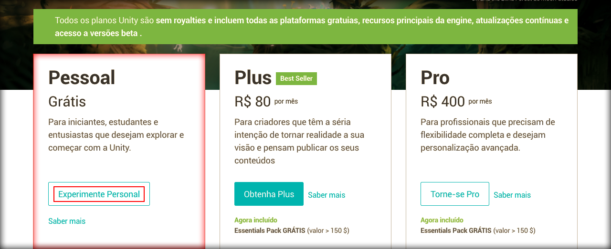
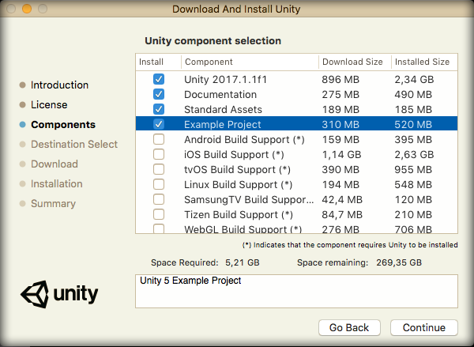

# Instalando a Unity

Agora que já sabe um pouco sobre Unity e também o nosso objetivo, vamos mostrar como fazer a instalação da ferramenta.

Acesse o site abaixo para fazer o download.

<https://unity3d.com/pt/>

Clique no botão **Obtenha o Unity* e depois escolha a opção gratuita para iniciantes.

Depois de escolhar a versão gratuita ou **Personal**, você será direcionado para a página de download onde é mostrada as plataformas que suportam o programa.

Apesar de criar jogos para praticamente todas as plataformas ele não é rodado em todas as plataformas. O Unity utiliza a linguagem **C#** em sua base de desenvolvimento, por este motivo você não encontra uma versão para Linux, por exemplo. Apesar de já existir uma versão demo para Linux, rodando pela internet, não garantimos 100% do real funcionamento do programa.

A linguagem C# ainda tem muitas limitações no ambiente Linux, apesar da Microsoft já estar tratando estes detalhes para trazer a linguagem para o Linux definitivamente. Portanto este é um dos motivos que só existe uma versão demo para Linux.

Outro motivo é o fato do Unity utilizar o **DirectX 9**, que é um renderizador de gráficos, o qual não possui suporte para Linux também, somente Windows e Mac.

Depois de baixar você pode proceder com a instalação normalmente, como se fosse qualquer outro programa. Basta ir avançando as etapas de instalação.

Um detalhe importante a ser falado, mesmo que seja de conhecimento mais avançado, é que se seu sistema operacional utilizar a estrutura 32bits, você não conseguirá criar jogos para consoles e nem para alguns navegadores web.

Durante a instalação, na sessão **Choose Components**, você terá os três primeiros itens selecionados e mais a IDE **Visual Studio** selecionada. Caso o Visual Studio não apareça, pode ser que já tenha instalado em seu computador, caso não esteja marcado não deixe de marcar.

Existe também a IDE Mono Developer que pode ser utilizada, mas o Visual Studio é a IDE oficial da linguagem C#. Portanto deixa o Visual Studio marcado na instalação.

Não significa que precisa se limitar somentes a estas duas IDEs, você poderá utilizar qualquer editor de código.

Além de marcar os três primeiros itens selecione também o item **Example Project**, para ter uma parâmetro de início de nossos estudos.

Como estamos apenas iniciando os estudos com Unity não precisaremos marcar nenhuma opção a mais do que as citadas acima, porém, em um futuro, você pode querer compilar seus jogos para algumas plataformas, então você terá que reinstalar o Unity com outras opções selecionadas. No momento não existe e necessidade então faremos a instalação mais limpa e leve possível da ferramenta.

Depois de terminar a instalação é muito importante que você reinicie seu computador, para que a sua máquina reconheça o Visual Studio.

Assim que reiniciar você pode abrir o Unity e terá uma pesquisa feita, pela ferramenta, para saber alguns dados do motivo da instalação e depois terá uma tela para login, onde precisará criar uma conta para logar no programa. Você pode trabalhar offline, mas você não terá acesso à **asset store**.

Fazendo uma comparação a Asset Store seria como se fosse o **Google Play** da Unity. Neste canal você pode encontrar recursos para o desenvolvimento do seu jogo. Existem muitos recursos pagos, mas também existem muitos gratuitos.

Você pode baixar:

* sistemas
* personagens
* armas
* animações
* audios
* scripts
* outros 

Você pode criar uma conta diretamente na tela de instalação ou acessando diretamente o site abaixo:

<https://www.assetstore.unity3d.com/en/>

Assim que logar com sua conta, você terá uma tela com todos os projetos existentes em seu computador. Se estiver começando, logicamente, não terá nenhum projeto listado. Porém se você marcou a opção Example Project, durante a instalação, você terá este projeto listado de qualquer maneira.

Abra o projeto de exemplo, mas não se preocupe com a interface do Unity, pois pode parecer confusa para quem está iniciando, mas nos próximos módulos mostraremos como deixar um ambiente mais amigável e você começará a se ambientar com a interface.