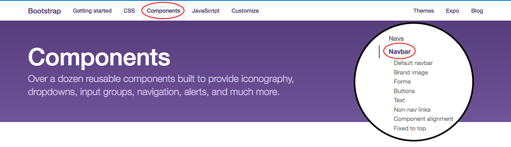
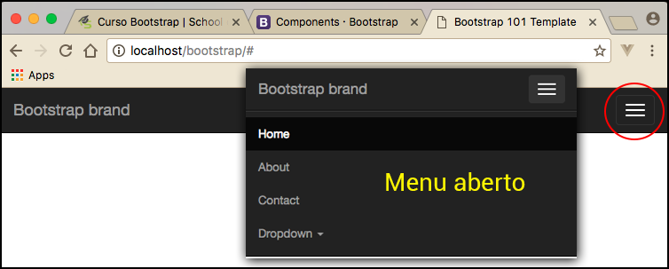

# Criar um menu de navegação

A primeira funcionalidade do framework que iremos ensinar a criar é a barra de navegação, que geralmente é um dos primeiros itens de uma aplicação.

Mostraremos onde encontrar este recurso na documentação do Bootstrap. Vejam  a imagem abaixo:



Neste setor do site temos um exemplo de navbar padrão, porém ela não é fixada na tela, conforme a tela é rolada. 
Em nosso exemplo, criaremos a navbar fixa. Se o usuário rolar a tela, o menu ficará no topo, sempre, acompanhando o conteúdo da página.

A documentação ensina como colocar logomarca no menu, inserir campos de formulários, entre outros recursos. Para isso, basta ler com calma e procurar o que está precisando.

Veja o código completo da navbar do nosso projeto. Logo abaixo, comentaremos:

```html
<header>
    <nav class="navbar navbar-inverse navbar-fixed-top">
        <div class="container">
            <div class="navbar-header">
                <button type="button" class="navbar-toggle collapsed" data-toggle="collapse" data-target="#navbarCollapse" aria-expanded="false">
                    <span class="sr-only">Toggle navigation</span>
                    <span class="icon-bar"></span>
                    <span class="icon-bar"></span>
                    <span class="icon-bar"></span>
                </button>
                <a href="#" class="navbar-brand">Bootstrap brand</a>
            </div>
            <div id="navbarCollapse" class="navbar-collapse collapse">
                <ul class="nav navbar-nav navbar-right">
                    <li class="active"><a href="#">Home</a></li>
                    <li><a href="#">About</a></li>
                    <li><a href="#">Contact</a></li>
                    <li class="dropdown">
                        <a href="#" class="dropdown-toggle" data-toggle="dropdown" role="button" aria-haspopup="true" aria-expanded="false">Dropdown <span class="caret"></span></a>
                        <ul class="dropdown-menu">
                            <li class="dropdown-header">Title 1</li>
                            <li><a href="#">Action</a></li>
                            <li><a href="#">Another action</a></li>
                            <li><a href="#">Something else here</a></li>
                            <li role="separator" class="divider"></li>
                            <li class="dropdown-header">Title 2</li>
                            <li><a href="#">Separated link</a></li>
                            <li role="separator" class="divider"></li>
                            <li><a href="#">One more separated link</a></li>
                        </ul>
                    </li>
                </ul>
            </div>
        </div>
    </nav>
</header>
```

# Comentando estrutura e classes

Criamos a tag **header** para englobar o menu inteiro. Depois inserimos a tag **nav** com as seguintes classes:

Classe | Função
--------- | ----------
navbar | Tem a função identificar o menu e estilizar
navbar\-inverse | Inverte as cores principais da aplicação. A cor principal padrão é clara, quando utilizamos o inverse, ele trabalha com o menu escuro e inverte as cores das fontes, também.
navbar\-fixed-top | Responsável por fixar o menu ao topo, mesmo que o usuário role a tela para baixo o menu é fixado ao topo da página.

Depois, adicionamos uma div com a classe **container**, que serve para centralizar o conteúdo, adicionando margens. 
Há, também, a classe **container-fluid**, que libera as margens do container para que o layout seja fluído e pegue a tela inteira.

Logo após, temos o navbar-header:

```html
<div class="navbar-header">
    <button type="button" class="navbar-toggle collapsed" data-toggle="collapse" data-target="#navbarCollapse" aria-expanded="false">
        <span class="sr-only">Toggle navigation</span>
        <span class="icon-bar"></span>
        <span class="icon-bar"></span>
        <span class="icon-bar"></span>
    </button>
    <a href="#" class="navbar-brand">Bootstrap brand</a>
</div>
```

Este botão possui as classes **navbar-toggle e collapsed** que são responsáveis por esconder o botão em dispositivos maiores. Ele deve ser mostrado, de outra forma, em dispositivos menores. Possui também atributos para javascript **,data-toggle e data-target**. 
O data-toggle serve para o javascript disparar um evento para mostrar o menu, em dispositivos menores, e o data-target serve para fazer a identificação do menu correto a ser mostrado, ao clicar no botão.

Notem que o atributo **id**, da div que engloba o menu acima, tem o mesmo valor do atributo data-target, informado no botão. Vocês poderiam utilizar o data-target como sendo uma classe também, basta que a div do menu tenha a mesma classe. 
Vejam nos fragmentos de código abaixo:

```html
// Data target do botão
<button type="button" class="navbar-toggle collapsed" data-toggle="collapse" data-target="#navbarCollapse" aria-expanded="false">
</button>

// ID da div que engloba o menu
<div id="navbarCollapse" class="navbar-collapse collapse">
</div>
```

Ambos devem ter o mesmo valor, isso assegura que ao clicar, no botão do menu, o código irá mostrar o menu que tem o mesmo ID, senão poderia mostrar algum outro menu existente na página. Vocês podem criar o data-target que quiserem, basta que coloquem o mesmo valor no id.

Veja imagem do botão em layouts menores:



Depois do navbar-header, temos o menu, finalmente.

```html
<div id="navbarCollapse" class="navbar-collapse collapse">
    <ul class="nav navbar-nav navbar-right">
        <li class="active"><a href="#">Home</a></li>
        <li><a href="#">About</a></li>
        <li><a href="#">Contact</a></li>
        <li class="dropdown">
            <a href="#" class="dropdown-toggle" data-toggle="dropdown" role="button" aria-haspopup="true" aria-expanded="false">Dropdown <span class="caret"></span></a>
            <ul class="dropdown-menu">
                <li class="dropdown-header">Title 1</li>
                <li><a href="#">Action</a></li>
                <li><a href="#">Another action</a></li>
                <li><a href="#">Something else here</a></li>
                <li role="separator" class="divider"></li>
                <li class="dropdown-header">Title 2</li>
                <li><a href="#">Separated link</a></li>
                <li role="separator" class="divider"></li>
                <li><a href="#">One more separated link</a></li>
            </ul>
        </li>
    </ul>
</div>
```

Notem que temos uma estrutura html normal de menu, porém temos as classes que fazem toda a diferença.

Classe | Função
--------- | ----------
nav e navbar\-nav | Identificar e estilizar o menu.
navbar\-right | Deslocar menu para o lado direito, caso não coloque, o menu sempre ficará para esquerda, como padrão.
active | Destacar a página atual no menu, para mostrar ao usuário qual página ele se encontra, de uma forma visual.
dropdown | Informar que existe uma estrutura de submenus e fazer toda estilização. Reparem que dentro da classe dropdown vocês podem ter títulos e separadores tudo pronto, só basta utilizar.

Falamos um pouco sobre as classes, caso precisem saber mais, podem consultar a documentação, que encontrarão tudo sobre as mesmas, e todos os recursos possuem exemplos práticos.

# Conclusão

O objetivo deste capítulo é implementar um menu de navegação, inclusive deixá-lo ativo para dispositivos móveis. 
Nós utilizamos somente informações contidas na documentação do Bootstrap. Tudo que adicionamos vocês podem encontrar e tirar maiores dúvidas no site.

Façam mais testes, retirem classes e incluam novamente, para conhecerem o papel de cada uma. 
Adicionem mais elementos ao menu e façam testes diminuindo o tamanho do browser para conferir as modificações, nas versões mobiles.

Lembrem-se, quanto mais praticarem, maior será a fixação sobre o conteúdo. Menus são itens fundamentais em aplicações web. 
O mais importante é saber que a aplicação está servindo um menu para todos os tipos de dispositivos e o trabalho foi praticamente zero. O Bootstrap trouxe tudo pronto.