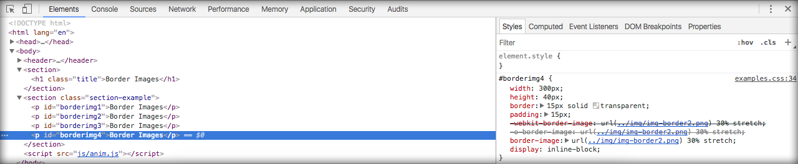

# Usando imagens em bordas

Neste módulo mostraremos que é possível, com os novos recursos do CSS3, adicionar imagens em bordas.

Lembrando que você pode ter acesso às imagens e ao código no repositório deste conteúdo, bem como criar suas próprias imagens e acompanhar o código por aqui.

Duplique a pasta do módulo anterior e renomeie para **03_border _images**. Desta forma você não perderá os conteúdo e poderá acompanhar depois.

Após ter duplicado a pasta, abra o arquivo **/03_border _images/index.html**. 

Altere o código do arquivo para o código abaixo:

```html
<!DOCTYPE html>
<html lang="en">
<head>
    <meta charset="UTF-8">
    <title>CSS3 - School of Net</title>
    <link rel="stylesheet" href="css/style.css">
    <link rel="stylesheet" href="css/examples.css">
</head>
<body>
<header>
    <h1 onmouseover="stopRotate()" id="test" style="transform: rotateY(0deg);">School of Net</h1>
</header>
<section>
    <h1 class="title">Border Images</h1>
</section>
<section class="section-example">
    <p id="borderimg1">Border Images</p>
    <p id="borderimg2">Border Images</p>
    <p id="borderimg3">Border Images</p>
    <p id="borderimg4">Border Images</p>
</section>

<script src="js/anim.js"></script>
</body>
</html>
```

Alteramos apenas o título e os elementos de exemplo. Veja o código alterado abaixo:

```html
<section>
    <h1 class="title">Border Images</h1>
</section>
<section class="section-example">
    <p id="borderimg1">Border Images</p>
    <p id="borderimg2">Border Images</p>
    <p id="borderimg3">Border Images</p>
    <p id="borderimg4">Border Images</p>
</section>
```

Depois, abra o arquivo **/03_border _images/css/examples.css** e faça a alteração para o código abaixo:

```css
#borderimg1{
    width: 300px;
    height: 40px;
    border: 15px solid transparent;
    padding: 15px;
    -webkit-border-image: url(../img/img-border1.png) 50 round;/* Safari 3.1-5*/
    -o-border-image: url(../img/img-border1.png) 50 round;/* Opera 11-12.1*/
    border-image: url(../img/img-border1.png) 50 round;
    display: inline-block;
}

#borderimg2{
    width: 300px;
    height: 40px;
    border: 15px solid transparent;
    padding: 15px;
    -webkit-border-image: url(../img/img-border1.png) 65 stretch;/* Safari 3.1-5*/
    -o-border-image: url(../img/img-border1.png) 65 stretch;/* Opera 11-12.1*/
    border-image: url(../img/img-border1.png) 65 stretch;
    display: inline-block;
}

#borderimg3{
    width: 300px;
    height: 40px;
    border: 15px solid transparent;
    padding: 15px;
    -webkit-border-image: url(../img/img-border2.png) 20% round;/* Safari 3.1-5*/
    -o-border-image: url(../img/img-border2.png) 20% round;/* Opera 11-12.1*/
    border-image: url(../img/img-border2.png) 20% round;
    display: inline-block;
}

#borderimg4{
    width: 300px;
    height: 40px;
    border: 15px solid transparent;
    padding: 15px;
    -webkit-border-image: url(../img/img-border2.png) 30% stretch;/* Safari 3.1-5*/
    -o-border-image: url(../img/img-border2.png) 30% stretch;/* Opera 11-12.1*/
    border-image: url(../img/img-border2.png) 30% stretch;
    display: inline-block;
}
```

Mostraremos e descreveremos as configurações comuns a todos os exemplos e depois comentaremos as características principais.

| Configuração                    | Descrição                                             |
|---------------------------------|-------------------------------------------------------|
| width: 300px;                   | Largura de 300px                                      |
| height: 40px;                   | Altura de 40px                                        |
| border: 15px solid transparent; | Borda de 15px, sólida e transparente                  |
| padding: 15px;                  | Espaçamento interno de 15 px                          |
| display: inline-block;          | Configuramos para que sejam mostrados na mesma linha  |

Acima, estão as características comuns a todos os exemplos.

O que irá diferenciar um exemplo do outro, são as características abaixo.

| Configuração         | Descrição                                                           |
|----------------------|---------------------------------------------------------------------|
| -webkit-border-image | Configura a borda no navegador safari                               |
| -o-border-image      | Configura a borda no navegador opera                                |
| border-image         | Configura borda mais atual, apenas para navegadores que dão suporte |

A definição para imagem em borda mais atual é **border-image**, porém alguns navegadores ainda não dão suporte. Por este motivo foram criadas as demais configurações. Quando todos os navegadores derem suporte à configuração atual, as demais configurações deixarão de existir.

Como ainda temos esta falta de suporte, é necessário mantermos em nossos projetos as demais configurações, mesmo que tenham exatamente a mesma função na configuração.

Em nossos exemplos estamos utilizando o navegador **Chrome**. Com o developer tools aberto e inspecionando os elementos, você pode ver que ele já reconhece o padrão atual e ignora os demais. 

Veja imagem abaixo:



Sabendo das diferenças dos comandos CSS, vamos às demais configurações.

Veja os exemplos completos, abaixo:

```css
-webkit-border-image: url(../img/img-border2.png) 30% stretch;/* Safari 3.1-5*/
-o-border-image: url(../img/img-border2.png) 30% stretch;/* Opera 11-12.1*/
border-image: url(../img/img-border2.png) 30% stretch;
```

O comando border-image exige alguns parâmetros. Passamos 3 deles, que são:

| Parâmetro     | Descrição                                                                |
|---------------|--------------------------------------------------------------------------|
| url           | Configura o caminho da imagem para que o comando possa inserir           |
| 30%           | Define o tamanho do corte na imagem                                      |
| round/stretch | Configura o comportamento da imagem, ou seja, se vai repetir ou estender |

Desta forma, você pode brincar alterando os valores e acompanhar o comportamento.

Tanto no exemplo utilizando porcentagem quanto no exemplo que não utiliza, quanto mais próximo de 100, mais próximo da realidade a imagem será. Ou seja, em 100% a imagem deverá ser real e estar localizada aos cantos da imagem, depende também do terceiro parâmetro. Caso seja round o elemento sofrerá repetições e stretch, um esticamento.

Faça bastante alterações nos parâmetros, para entender o real comportamento do recurso.