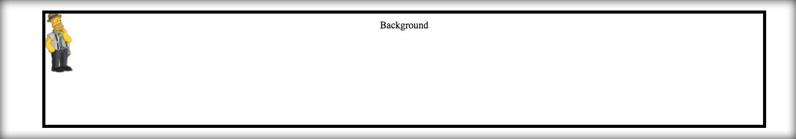
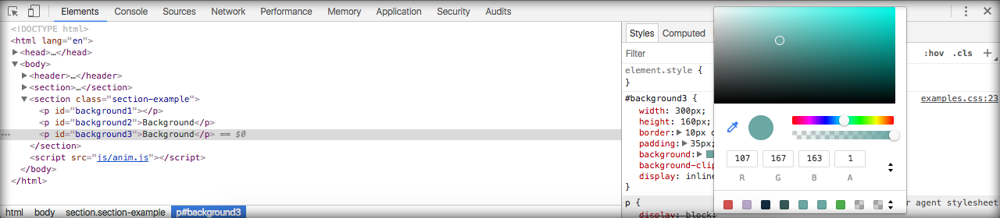

# Personalizando background

Neste módulo, mostraremos como utilizar backgrounds nos elementos.

Duplique o módulo anterior e renomeie para **04_backgrounds**.

Depois de duplicar, atualize os arquivos principais para começar a trabalhar nos exemplos de background. Lembrando que as imagens estão disponíveis no repositório ou você pode criar suas próprias imagens.

Abra o arquivo **/04_backgrounds/index.html** e altere-o.

```html
<!DOCTYPE html>
<html lang="en">
<head>
    <meta charset="UTF-8">
    <title>CSS3 - School of Net</title>
    <link rel="stylesheet" href="css/style.css">
    <link rel="stylesheet" href="css/examples.css">
</head>
<body>
<header>
    <h1 onmouseover="stopRotate()" id="test" style="transform: rotateY(0deg);">School of Net</h1>
</header>
<section>
    <h1 class="title">Background</h1>
</section>
<section class="section-example">
    <p id="background1"></p>
    <p id="background2">Background</p>
    <p id="background3">Background</p>
</section>

<script src="js/anim.js"></script>
</body>
</html>
```

Código alterado no arquivo index.

```html
<section>
    <h1 class="title">Background</h1>
</section>
<section class="section-example">
    <p id="background1"></p>
    <p id="background2">Background</p>
    <p id="background3">Background</p>
</section>
```

Veja que teremos 3 elementos para exemplificar.

1. Sobreposição de imagens no background
2. Posicionamento de um background no elemento
3. Background color e posicionamento

Abra o arquivo **/04_backgrounds/css/examples.css** e altere-o.

```css
#background1{
    width: 500px;
    height: 270px;
    background-image: url(../img/back2.png) ,url(../img/back3.png), url(../img/back1.jpg);
    background-position: left bottom, right bottom, left top;
    background-size: 92px, cover, cover;
    background-repeat: no-repeat,no-repeat,no-repeat;
    display: inline-block;
}

#background2{
    width: 90%;
    height: 160px;
    border: 5px solid black;
    padding: 10px;
    background-image: url(../img/back2.png);
    background-size: 52px;
    background-repeat: no-repeat;
    background-origin: border-box;/*border-box  padding-box content-box */
    display: inline-block;
}

#background3{
    width: 300px;
    height: 160px;
    border: 10px dotted black;
    padding: 35px;
    background: rgb(107,167,163);
    background-clip: content-box;/*border-box  padding-box content-box */
    display: inline-block;
}
```

Como este módulo tem exemplos diferentes, comentaremos um por um.

### Sobreposição de imagens no background

Este é um novo recurso que permite utilizarmos várias imagens sobrepostas em um mesmo elemento. 

Veja as configurações abaixo para entender melhor.

| Configuração                    | Descrição                                             |
|---------------------------------|-------------------------------------------------------|
| width: 500px;                   | Define o tamanho do elemento |
| height: 270px;                  | Define a altura do elemento | 
| background-image: url(../img/back2.png) ,url(../img/back3.png), url(../img/back1.jpg); | Informa a localização das 3 imagens, em sequência, separadas por vírgulas |  
| background-position: left bottom, right bottom, left top; | Determina a posição de cada imagem, em sequência, separando por vírgulas |  
| background-size: 92px, cover, cover; | Determina o tamanho de cada imagem, em sequência, separando por vírgula |
| background-repeat: no-repeat,no-repeat,no-repeat; | Determina se vai se repetir ou não, para preencher o conteúdo do elemento |  
| display: inline-block; | Define a disposição dos blocos |

Isso significa que estamos definindo 3 imagens, sendo que a primeira ficará alinhada à esquerda e abaixo, a segunda a direita e abaixo e a terceira ficará posicionada à esquerda e acima.

**background-position: left bottom, right bottom, left top;**

Definimos que a primeira imagem terá um tamanho de 92px e as demais estão configuradas como **cover**, que preenche o espaço total do elemento. Caso a imagem seja menor que o elemento, o CSS esticará a imagem, forçando o preenchimento, o que pode distorcer a imagem. Em nosso caso as imagens são maiores e não teremos este problema. Muita atenção a este detalhe, durante o desenvolvimento.

**background-size: 92px, cover, cover;**

Estamos dizendo ao CSS que não queremos que os elementos se repitam, no caso da imagem ser menor  que o elemento. Se não colocarmos esta configuração e a imagem de background for menor que o elemento, teremos esta mesma imagem se repetindo até preencher todo elemento.

**background-repeat: no-repeat,no-repeat,no-repeat;**

Se estiver utilizando nossas imagens de exemplo, você deverá ter o exemplo conforme imagem abaixo:


Faça as alterações que desejar no posicionamento das imagens e verifique as alterações no browser. Isso ajuda a entender o conteúdo e a fixar.

### Posicionamento de um background no elemento

Neste exemplo apenas brincaremos com o posicionamento de uma única imagem de background.

| Configuração                             | Descrição                                               |
|------------------------------------------|---------------------------------------------------------|
| width: 90%;                              | Define o tamanho do elemento                            |
| height: 160px;                           | Define a altura do elemento                             | 
| border: 5px solid black;                 | Define uma borda de 5px sólida e com cor preta          |
| padding: 10px;                           | Define um espaçamento interno de 10px em todos os lados |
| background-image: url(../img/back2.png); | Informa a localização da imagem                         |  
| background-size: 52px;                   | Determina o tamanho da imagem                           |
| background-repeat: no-repeat;            | Determina a não repetição da imagem                     |
| background-origin: border-box;           | Define onde a imagem deve iniciar                       |
| display: inline-block;                   | Define a disposição dos blocos                          |

Perceba que, apesar de estarmos falando de posicionamento, não estamos utilizando o comando background-position. Estamos falando de outro tipo de posicionamento.

O comando **background-origin** define a origem da imagem e pode receber 3 parâmetros: 

| Configuração | Descrição                                                       |
|--------------|-----------------------------------------------------------------|
| border-box   | Inicia à partir da borda                                        |
| padding-box  | Inicia à partir do padding                                      |
| content-box  | Inicia à partir do conteúdo real do elemento, depois do padding |

Altere estes valores no CSS, para conferir as alterações no browser. Levando em consideração a configuração **border-box**, você deve ter o exemplo abaixo:



### Background color e posicionamento

Este exemplo é bem mais simples e trabalharemos com background utilizando cores.

| Configuração                  | Descrição                                               |
|-------------------------------|---------------------------------------------------------|
| width: 300px;                 | Define o tamanho do elemento                            |
| height: 160px;                | Define a altura do elemento                             | 
| border: 10px dotted black;    | Define uma borda de 10px pontilhada e com cor preta     |
| padding: 35px;                | Define um espaçamento interno de 35px em todos os lados |
| background: rgb(107,167,163); | Informa a cor utilizando parâmetros rgb                 |  
| background-clip: content-box; | Define onde background deve iniciar                     |
| display: inline-block;        | Define a disposição dos blocos                          |
    
Veja que o posicionamento neste exemplo, é definido através do comando **background-clip**. Definimos uma borda do tipo **dotted** para que você possa alternar as configurações e conseguir entender melhor a diferença entre elas.

O comando **background-clip** também pode receber 3 parâmetros: 

| Configuração | Descrição                                                       |
|--------------|-----------------------------------------------------------------|
| border-box   | Inicia à partir da borda                                        |
| padding-box  | Inicia à partir do padding                                      |
| content-box  | Inicia à partir do conteúdo real do elemento, depois do padding |

Levando em consideração a configuração **content-box**, você deve ter o exemplo abaixo:


Para finalizar, queremos mostrar que é possível você obter uma cor rgb através do navegador, utilizando o developer tools. 

Veja a imagem abaixo:



Ao inspecionar o elemento e clicar sobre o quadrado da cor, você terá uma janela aberta para escolher uma determinada cor ou pinçar qualquer outra cor da página HTML.