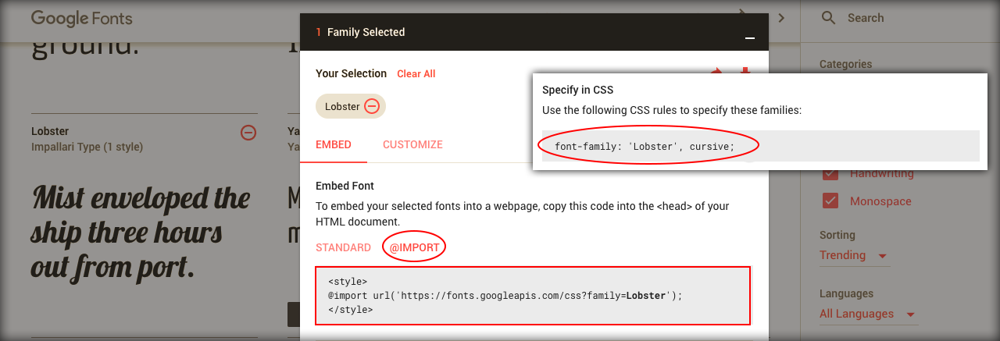

# Fontes

Neste módulo, mostraremos como configurar fontes diferentes em seus projetos.

Duplique o módulo anterior e renomeie para **08_fonts**.

Após duplicar, atualize os arquivos principais para começar a trabalhar com os exemplos de fontes.

Abra o arquivo **/08_fonts/index.html** e altere-o.

```html
<!DOCTYPE html>
<html lang="en">
<head>
    <meta charset="UTF-8">
    <title>CSS3 - School of Net</title>
    <link rel="stylesheet" href="css/style.css">
    <link rel="stylesheet" href="css/examples.css">
</head>
<body>
<header>
    <h1 onmouseover="stopRotate()" id="test" style="transform: rotateY(0deg);">School of Net</h1>
</header>
<section>
    <h1 class="title">Fonts</h1>
</section>
<section>
    <div class="row">
        <div class="col-3">
            <p>Font 1 - Google Fonts</p>
            <p class="font1">This is a text test for the course of the School of Net</p>
        </div>
        <div class="col-3">
            <p>Font 2 - Google Fonts</p>
            <p class="font2">This is a text test for the course of the School of Net</p>
        </div>
        <div class="col-3">
            <p>Font 3 - My Font</p>
            <p class="font3">This is a text test for the course of the School of Net</p>
        </div>
        <div class="col-3"></div>
    </div>

</section>

<script src="js/anim.js"></script>
</body>
</html>
```

Abra o arquivo **/08_fonts/css/examples.css** e altere-o.

```css
@import url(https://fonts.googleapis.com/css?family=Lobster);
@import url(https://fonts.googleapis.com/css?family=Bad+Script);

@font-face {
    font-family: "MyFont";
    src: url(../fonts/ARDESTINE.ttf);
}

.font1{
    font-family: 'Lobster', cursive;
}

.font2{
    font-family: 'Bad Script', cursive;
}

.font3{
    font-family: 'MyFont';
}
```

### Utilizando fontes do Google

Primeiro, você deve acessar o site do Google Fontes para escolher a fonte. Escolhemos as fontes **Lobster** e **Bad Script**, caso queira utilizar as mesmas para seus exemplos. Nada impede você escolher outras fontes, pois o processo é o mesmo.

Veja o link: <https://fonts.google.com/>

Você acessará a fonte escolhida e o Google mostrará duas opções de implementação.

1. <link href="https://fonts.googleapis.com/css?family=Lobster" rel="stylesheet">
2. @import url(https://fonts.googleapis.com/css?family=Lobster);

Isso significa que pode importar a fonte via **link** no HTML ou via **import** no CSS. Escolhemos trabalhar com import.

Veja a imagem do Google, para que possa se familiarizar.



Veja a importação e a implementação no arquivo de CSS.

```css
@import url(https://fonts.googleapis.com/css?family=Lobster);
@import url(https://fonts.googleapis.com/css?family=Bad+Script);

.font1{
    font-family: 'Lobster', cursive;
}

.font2{
    font-family: 'Bad Script', cursive;
}
```

o Google permite utilizar um único **import** para carregar mais de uma fonte. 

Veja abaixo, caso queira utilizar e testar.

```css
@import url('https://fonts.googleapis.com/css?family=Bad+Script|Lobster');
```

### Utilizando fontes de arquivo local

Neste caso você deve possuir o arquivo de fonte em sua máquina ou no servidor, caso seja um site, pois precisaremos informar o caminho do arquivos para o CSS.

Veja como proceder neste caso.

Primeiro, crie uma pasta chamada fonts e adicione sua fonte dentro desta pasta. Caso queira utilizar a mesma fonte do exemplo, você pode encontrá-la no repositório.

Depois de criar a pasta e mover a fonte para dentro dela, você deverá utilizar o recurso **font-face**. 

Veja código abaixo:

```css
@font-face {
    font-family: "MyFont";
    src: url(../fonts/ARDESTINE.ttf);
}

.font3{
    font-family: 'MyFont';
}
```

Você chama o font-face e passa dois parâmetros: **font-family** e **src**.

Você pode cadastrar a font-family que desejar, desde que você configure com o mesmo nome em sua classe, conforme exemplo abaixo.

```css
.font3{
    font-family: 'MyFont';
}
```

Veja que tanto no registro da fonte quanto na configuração da fonte na classe, estamos utilizando a mesma font-family.

Agora, você pode adicionar qualquer fonte que quiser em seus projetos.

Apenas certifique-se que você está autorizado a utilizá-la, pois existem fontes que necessitam de licença para serem utilizadas.