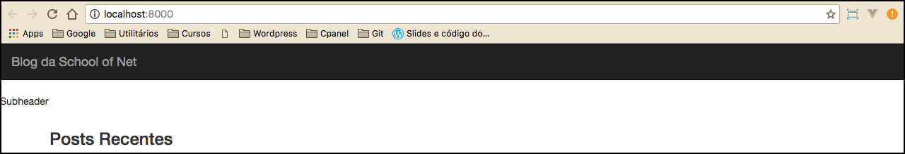

# Mostrando informações do blog

Para melhorar o exemplo atual, modificaremos o **header** do projeto. Utilizaremos o **navbar** do Bootstrap, para preparar o header que receberá a listagem de páginas, formando um menu.

Apresentaremos uma função que é capaz de pegar as informações do Blog que estão contidas no menu **Configurações/Geral**.

# Função bloginfo

```php
<nav class="navbar navbar-inverse">
    <div class="container-fluid">
        <div class="navbar-header">
            <button type="button" class="navbar-toggle collapsed" data-toggle="collapse" data-target="#bs-example-navbar-collapse-1" aria-expanded="false">
                <span class="sr-only">Toggle navigation</span>
                <span class="icon-bar"></span>
                <span class="icon-bar"></span>
                <span class="icon-bar"></span>
            </button>
            <a class="navbar-brand" href="<?php bloginfo('url');?>"><?php bloginfo('name');?></a>
        </div>
        <div class="collapse navbar-collapse" id="bs-example-navbar-collapse-1">
            <ul class="nav navbar-nav">
                <!-- Listagem de páginas -->
            </ul>
        </div>
    </div>
</nav>
```

Obeservem que utilizamos duas vezes a função **bloginfo()**, a única diferença foi o parâmetro utilizado.

Função | Parâmetro | Resultado
---------- | -------------- | --------------
bloginfo | name | Imprime nome do site, configurado durante a instalação
bloginfo | url | Imprime a url do site
get_bloginfo | name | Return o nome do site

Notem que não utilizamos a função **get_bloginfo**, mas nós citamos porque pode ser utilizada. A diferente entre get\_blofinfo e bloginfo é que, a primeira apenas retorna o valor e a segunda imprime, direto, o valor. Utilizando a primeira, teremos o mesmo resultado, mas teríamos que utilizar o **echo**, do PHP, para imprimir.

Vocês podem ver todos os parâmetros existentes para estas duas funções, no link:

<https://codex.wordpress.org/pt-br:Template_Tags/bloginfo>

Os parâmetros são os mesmos, para ambas as funções.

Com a alteração do header, vocês deverão ter um resultado como a imagem abaixo:

