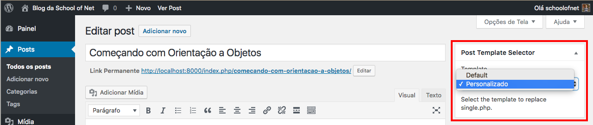

# Template para posts

Criaremos um template, específico, para mostrar os posts completos. Não é legal mostrarmos no template index.php.

Apresentamos o template **single.php**. Ele é responsável por mostrar o conteúdo de todos os posts publicados.

Lembrando que, a regra do **ID** e do **slug**, do módulo passado, não se aplica para os posts. Para conseguirmos um template personalizado para cada post, ou grupo de posts, teremos que instalar um plugin.

 Acessem **Plugins/Adicionar novo**. Em seguida, pesquisem por **AMS Single Post Template Selector**. Encontrando, façam a instalação e ativação.

Após instalar o plugin, basta criarem um arquivo, com o nome que quiserem. Nós indicamos que tenha sempre **single-** como prefixo, para que possam organizar melhor o tema.

Nós criaremos o arquivo **single-cursos.php**.

# Conteúdo arquivo single-cursos.php

```php
<?php
/* Post Template - Name: Personalizado */
?>

<p>Meu template personalizado</p>
```

Notem que, o identificador para o Wordpress, é o comentário inicial. Nós definiremos o nome do nosso template personalizado, no comentário do arquivo. Desta forma, cada template que criarmos, deverá ter um nome único.

Depois de criarmos o arquivo e configurarmos as ações e layout que ele deverá assumir, basta ir até os posts criados e editá-los ou criar novos posts, selecionando este template. Vejam a imagem abaixo:



Caso não queiram nenhum template específico, podem deixar como **Default**, que ele pegará o arquivo **single.php**, automaticamente, caso selecione, ele assumirá o template selecionado.

O Wordpress tem esta facilidade de podermos contar com plugins, para auxiliar o desenvolvimento. Sempre que precisarem de uma funcionalidade, pesquisem por um plugin já pronto, caso não tenha, vocês podem desenvolver um.

Agora, vocês podem personalizar seus templates para posts.