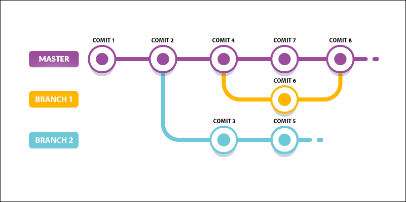

# Falando sobre branches

Este assunto é um pouco mais complexo, mas com certeza vocês entenderão, tranquilamente.

Antes de falarmos sobre branchs, de forma técnica, tentaremos mostrar o conceito que existe por trás.

O Git trabalha como se fosse uma linha do tempo e esta linha seria o nosso branch principal, que é conhecido como **master**. Cada commit que fazemos, esta linha do tempo é marcada com este commit.

Suponham que estão desenvolvendo um software e precisam fazer alterações de layout, para o cliente aprovar, e precisam fazer várias cores. Vocês não querem parar o desenvolvimento do software para definição de layout. Neste ponto que o branch é muito indicado, porque vocês criarão uma ramificação do projeto, que trabalhará, independentemente, do projeto principal e não interferirá no desenvolvimento.

Outro exemplo seria: se um design e um programador estivessem trabalhando juntos no branch master, ou pior ainda, se uma equipe inteira estivesse trabalhando, todos no branch master. Cada um, fazendo seus commits, aleatórios, e vocês sem saberem se alguma alteração, que fizeram, quebraria o código.

Temos uma imagem que pode ilustrar muito bem o processo e o caminho de um projeto com branchs.

Vejam, na imagem acima, que temos três branchs, trabalhando de forma simultânea. O master e mais dois branchs, em paralelo.

Criar um branch é fazer um novo commit, contendo todos os commits, anteriores a ele. Então o commit 3, do branch 2, é igual ao commit 2 do branch master, porém o commit 5, tem tudo que o commit dois tem e mais as alterações.

Observem que o commit 8, do branch master, ainda não possui o código do commit 5 do branch 2, por exemplo. Porque ainda não rodamos o comando **merge**.

Vejam que o commit 6, que está no branch 1, foi criado, modificado e no commit 8 foi feito o merge. Isso quer dizer que, o branch 1 já pode ser excluído, porque ele já executou o seu papel e já mesclou com o branch master, fazendo com que o commit 8 possua o código do commit 6. O mesmo não ocorreu, ainda, com o branch 2, que ainda está em desenvolvimento. Assim que for concluído, poderá ser mesclado com o branch master, através do comando merge.

Resumindo, trabalhar com branch é trabalhar em um mesmo projeto de forma assíncrona, de modo que, muitos desenvolvedores possam trabalhar em um mesmo projeto, sem um atrapalhar o outro. O desenvolvimento de várias funcionalidades serão possíveis, sem atrapalhar o fluxo normal de desenvolvimento.

Notem que os commits não são independentes, sempre são progressivos.

Podemos dar exemplos mais complexos. Suponham que, em uma aplicação, seja necessário criar um sistema de cadastro de produtos. Tudo bem, criamos um branch e o desenvolvedor começará a desenvolver, enquanto o restante da aplicação continua no branch master.

Suponham que, temos outro desenvolvedor que criará um sistema de estoque e este sistema dependa do cadastro de produtos. Criaremos um branch para o desenvolvimento do sistema de estoque, mas o branch não será em relação ao master desta vez, este branch terá o branch do sistema de produtos, sendo o master para ele. Criamos uma ramificação da ramificação ou branch de branch.

Esta ramificação não tem limite, vocês podem ramificar o projeto de acordo com a necessidade que tiverem. O merge continua do mesmo jeito, mas, geralmente, costumamos dar um merge, de acordo com a hierarquia. Primeiro, daríamos um merge do sistema de estoque para o sistema de produtos e depois, outro merge, do sistema de produtos para o branch master, que é a aplicação raiz.

Observem que é um assunto mais complexo, mas não é complicado para entender. Basta projetarem, muito bem a aplicação, e dividirem, corretamente, a equipe. Desta forma, o projeto caminha em paralelo, com diversas funcionalidades sendo desenvolvidas, ao mesmo tempo, e de forma organizada. O que é mais interessante, tudo versionado, podendo retornar e arrumar erros, em qualquer ponto do projeto.