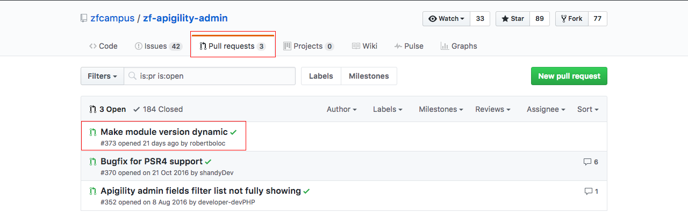

# Github - Dicas gerais

Apresentaremos algumas dicas, gerais, do Github para que vocês possam trabalhar da melhor forma, possível, com a ferramenta.

Será comum, quando se trabalha em equipe, que alguém peça para fazerem um **Pull Request**.

Suponham que o nosso repositório de exemplo seja um projeto e que disponibilizamos online, como um projeto open source. Assim que disponibilizamos, tiveram outros desenvolvedores interessados no projeto e quiseram contribuir com a melhoria do mesmo.

Este desenvolvedor pode contribuir com o projeto, mas a princípio, ele não terá como fazer alterações, diretamente, no projeto, a não ser que vocês deem permissão a ele. Não aconselhamos que isso seja feito. Para esta situação, existe o pull request.

Para começarmos a contribuir com um projeto no Github, em primeiro lugar, precisamos dar um **Fork**. Quando damos um Fork, estamos criando uma cópia do repositório, que nos interessamos, para a nossa conta do Github.

A partir do fork, podemos fazer qualquer alteração que quisermos, porque este é o nosso repositório. E, após as alterações, podemos enviar um pull request, para o repositório original do projeto que demos o fork.

O dono do repositório, comparará o código original dele com suas alterações e se ele achar que foi válido, ele aceitará seu pull request, dando um **merge**, no repositório dele. A partir daí, suas implementações farão parte do repositório original, e você já contribuiu com sua parte.

Na primeira imagem, mostramos um exemplo, de um repositório qualquer, que possuem 3 pull requests. Isso quer dizer que são 3 colaboradores querendo aplicar modificações, ou melhorias, no projeto.

Na segunda imagem, mostramos uma parte das alterações que foram feitas. Seriam estas diferenças que o dono do repositório iria avaliar e, caso sejam válidas, ele aprovaria e faria o merge com seu repositório principal. 
Esta é uma forma de permitir que outras pessoas melhorem seus projetos e de uma forma segura. 
Caso vocês identifiquem qualquer código malicioso, vocês só precisam recusar o pull request. Caso seja uma melhoria sadia, vocês podem aprovar, sem problema algum.

Existe uma maneira de acompanharem todas as alterações e evoluções de um projeto no Github. Basta selecionarem o **watch** e o **star**. Com isso, vocês estão informando para o Github que se interessam por aquele repositório e que cada alteração que ele tiver, vocês querem ser informados.

Estas são as dicas, básicas, para que vocês consigam trabalhar com o Github, não só como um repositório para seus projetos, mas como uma comunidade que pode se ajudar e melhorar os códigos, uns dos outros.