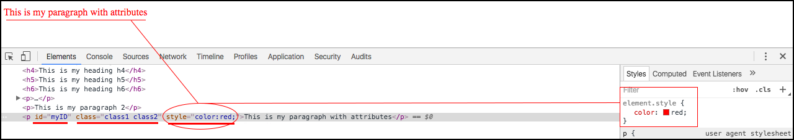

# Atributos

Após aprenderem sobre as tags básicas, falaremos sobre os **atributos** do HTML.

Atributos são informações que podemos passar nas tags html, para que, desta forma, ela consiga se comportar de uma maneira diferente.

Existem alguns atributos, que são globais, servem para todas as tags html que forem utilizar. Existem outros atributos que são específicos, onde só poderão utilizar em determinada tag, específica.

### Atributos Globais

Atributo | Exemplo | Função
---------- | ------------ | ----------
id | <p id="myID"></p> | Serve como um identificador único para a tag. Podem utilizar para dispararem um evento javascript ou estilizarem com CSS
class | <p class="myClass"></p> | Serve para dispararem um evento javascript ou estilizarem com CSS. Este, pode ser repetido em outras tags
style | <p style="color:red;"></p> | Adiciona estilo à tag. Neste exemplo o texto, de dentro da tag, ficará vermelho
tabindex | <p tabindex="1"></p> | Este atributo informa ao navegador qual a sequência de navegação, quando o usuário for apertando a tecla tab
hidden | <p hidden="true"></p> | Este atributo oculta a tag inteira. Desta forma, o elemento será carregado mas não será mostrado ao usuário
title | <p title="This is my tooltip"></p> | Este atributo mostra o conteúdo quando o usuário fica com o cursor sobre a tag

É importante falarmos que, em uma mesma tag, pode conter todos os atributos juntos. Importante, também, falarmos que, a classe aceita mais do que um valor. Vejam no exemplos abaixo:

```html
<p id="myID" class="class1 class2" style="color:red;">This is my paragraph with attributes</p>
```



### Atributos específicos

Existe uma tag, que ainda não falamos, que se chama âncora. Esta tag é utilizada para criação de links, na página, e possui um atributo chamado **href**, que é específico dela. Desta forma, este atributo só deverá ser utilizado nesta tag e não, nas demais.

Além do atributo href, ela tem também o atributo **target**, que serve para definir se a página, que o link abrirá, será aberta na página atual ou será aberta em outra janela. Caso não insiram o atributo target, ela sempre abrirá na mesma janela, por padrão. Se adicionarem, ela terá um comportamento diferente. Vejam exemplo de como abrir em outra janela:

```html
<a href="http://www.schoolofnet.com" target="_blank">School of Net</a>
```

Existem as seguintes opções para o atributo target: **_blank, _self, _parent, _top e framename**. Os mais utilizados são **\_self**  e **\_blank**.

Valor | Descrição
------- | -------------
_blank | Abrir em uma nova janela
_self | Abrir na mesma janela

### Atributos customizados

Existe a possibilidade de criarem um atributo próprio, que não exista. Basta inserirem da mesma forma que um atributo já existente. 
Vale lembrar que, não haverá efeito algum no html ou no comportamento da tag, se não tratarem este atributo com um javascript, por exemplo. Mas se utilizarem o javascript para recuperarem este atributo e dispararem uma ação, vocês conseguem trabalhar desta forma.

Para todo atributo customizado é muito aconselhado utilizarem o prefixo **data-**. Para capturarem o valor, continuaria sendo da mesma forma, não precisam do **data-**. Dessa forma, estarão trabalhando dentro das normas da W3C. 

Exemplo:

```html
<p data-myAttribute="myAttribute">School of Net</p>
```

# Conclusão

Gostaríamos de dizer que falar de atributos não é muito fácil. Este é um assunto muito extenso, uma vez que existem diversos tipos de atributos.

Não citamos a metade dos atributos existentes, mas conseguimos mostrar a forma que eles são declarados e falamos de alguns que são muito comuns. 
Tenho certeza que, se visualizarem um atributo, dentro de uma tag, já saberão reconhecer.

No decorrer do conteúdo, mostraremos mais atributos, conforme necessário.