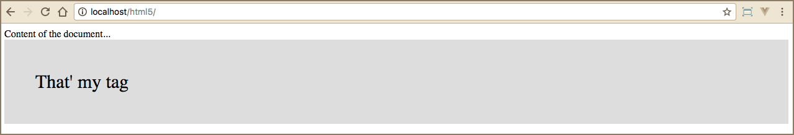

# Compatibilidade

Como falamos, no módulo passado, a maioria dos navegadores modernos, já reconhecem o HTML 5, nativamente. Existem alguns navegadores, não atualizados, que ainda não o reconhece.

Quando um navegador não reconhece qualquer elemento que seja novo, ele trata como código inline. Podemos ensinar o navegador antigo a reconhecer estes elementos, que para ele, são novos, permitindo que o recurso do HTML 5 tenha seu papel garantido em qualquer navegador. Para isso, utilizaremos o CSS.

Para começarem a praticar, criem uma pasta para o projeto. Em seguida, criem um arquivo chamado **index.html**, dentro desta pasta. Este será nosso arquivo de exemplos. Desta forma, vocês poderão acompanhar a evolução dos módulos.

```html
<style>
    header, section, footer, nav, main, article, figure {
        display: block;
    }
</style>
```

O código acima, garante que os navegadores antigos reconheçam os novos elementos do HTML 5, como blocos e não mais in line, como anteriormente.

### Criar elementos personalizados

Podemos criar elementos personalizados, utilizando o javascript.

```js
<script>
    document.createElement("myTag");
</script>
```

Observem que utilizamos o método createElement para criar uma tag personalizada, onde podemos colocar o nome que quisermos. Após a criação da tag, podemos estilizar com o css. Vejam no exemplo abaixo:

```html
<style>
    header, section, footer, nav, main, article, figure {
        display: block;
    }
    myTag{
        display: block;
        background-color: #ddd;
        padding: 50px;
        font-size: 30px;
    }
</style>
```

Depois, basta que utilizemos, dentro da tag body, o nosso elemento criado e estilizado.

```html
<!DOCTYPE html>
<html lang="en">
<head>
    <meta charset="UTF-8">
    <title>Title of the document</title>
</head>
<body>
    Content of the document...

    <myTag></myTag>

</body>
</html>
```

Assim, já teremos o resultado esperado no browser. Façam as alterações acima, no arquivo index.html e depois acessem o navegador, para visualizar.



Está tudo muito lindo, tudo funcionando, mas os navegadores antigos não reconhecem esta forma de criação de novos elementos. Para isso, foi criado um arquivo de ativação, via Javascript. Vocês deverão adicionar, dentro da tag **head**, o código abaixo:

```html
<!--[if lt IE 9]>
    <script src="https://cdnjs.cloudflare.com/ajax/libs/html5shiv/3.7.3/html5shiv.js"></script>
<![endif]-->
```

Fazendo isso, estamos ativando o reconhecimento destes novos recursos, apenas, nos navegadores do Internet Explorer abaixo da versão 9. Isso acontece porque os novos navegadores reconhecem este código, como um comentário. Ele não executará a chamada do arquivo javascript. Os navegadores antigos não reconhecerão os comentários e incluirão o arquivo.

Nossa dica é que copiem este código, em algum local, ou decorem, para utilizarem em todos os projetos.