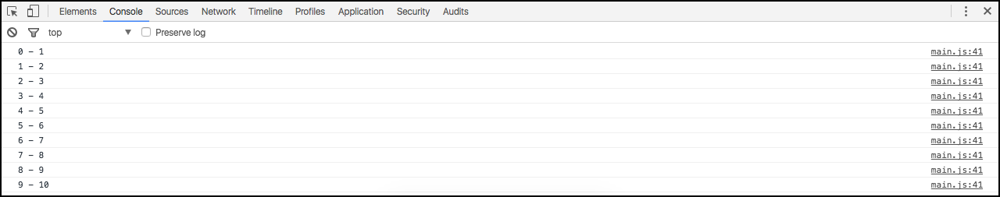

# Loops

Aprenderemos como iterar objetos dentro do javascript. Temos as seguintes opções:

* foreach
* while
* for

As estruturas de iterações e loops não fogem muito das demais linguagens.

# While

Cada iteração irá acontecer com base em uma condição e esta, tende a mudar, ao final de cada iteração.

Exemplo:

```javascript
var i = 0;

while(i < 10){
    console.log(i);
    i++;
}
```

Resultado no console:


Uma iteração sempre começará em 0, por este motivo temos até o 9 e não 10, como sendo o último elemento. 
De 0 a 9 temos os 10 elementos que esperávamos. Caso queiram que termine em 10, vocês deverão alterar a lógica para: `while(i <= 10)`.

Qual a lógica que está por trás desta estrutura?

1. Primeiro, há uma análise da condição `while(i < 10)`. Como iniciamos a variável `i = 0` a condição será válida.
2. Depois, como passou pela lógica, irá executar o bloco interno. Que imprime o valor da variável e soma 1 ao valor atual. Como era 0 agora passa a ser 1.
3. Volta a analisar a lógica, onde o i não é mais 0, mas sim 1. Como 1 é menor que 10 ainda ele executa, novamente. Imprime o valor e soma mais 1. O valor de i agora é 2 e assim passará pela logica, novamente, até que o valor de i seja 10. 
Como 10 não é menor do que 10 a repetição tem um fim. Por isso que acaba em 9, porque 9 é o último número menor do que 10.

# For

```javascript
for(var a = 0; a < 10; a++){
    console.log(a);
}
```

Resultado no console:


Observem que temos o mesmo resultado no console. E a lógica que acontece, é a mesma que a do while. Só modifica a estrutura. O for soma 1, automaticamente, por sua declaração, o while não soma automaticamente. Temos que inserir, dentro do loop, o incremento, caso não façamos, teremos um erro de loop infinito.

Quando o loop não tem fim é porque a lógica sempre será verdadeira e nunca terá um valor falso.

No exemplo do while, caso não somarmos 1 a cada iteração, a lógica sempre será verdadeira, porque o i sempre será zero e zero é sempre menor do que 10. Temos um caso de loop infinito. O mesmo acontece no loop for, se não incrementarmos a variável a. Estejam muito atentos a isso.

# Foreach

O foreach utiliza callback para sua iteração e quando utilizamos callback, estamos trabalhando de forma assíncrona. Temos que prestar atenção, porque quando trabalhamos de forma assíncrona, sabemos a hora que demos entrada à execução, mas não conseguimos saber quando esta execução será finalizada.

Podemos iterar qualquer tipo de array, desde o mais simples até o mais complexo.

## Criando array

```javascript
var array = [1,2,3,4,5,6,7,8,9,10];

array.forEach(function(value, key) {
    console.log(key + ' - ' + value);
});
```

A função callback só será executada após o término da iteração do array. Vocês deverão ter isso em mente, ao programar. Devem saber desta característica ao trabalharem com callbacks.

Resultado da iteração acima:



Notem que, key é o índice da iteração e o value é referente a cada valor do array. Vocês podem brincar com estes valores para irem testando. Os itens do array podem ser números inteiros, flutuantes ou strings.

# Interagindo prompt com for

Pegaremos o valor digitado no prompt para ser o número de iterações a serem realizadas.

```javascript
var age = prompt("How old are you?");

var ageParser = parseInt(age);

for(var a = 0; a < ageParser; a++){
    console.log(a);
}
```

Reparem que a lógica do for é a mesma, apenas substituimos o valor **10**, por um valor dinâmico que vem do valor digitado por algum usuário, por exemplo.

Agora basta colocar o número de iterações que deseja e dar um **ok**. Depois confiram o resultado no console.