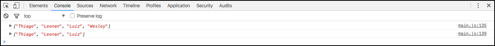

# Arrays

Arrays são coleções de dados e, assim como os outros, é um assunto muito importante na programação com javascript.

Dentro de um array podemos armazenar, desde números simples até objetos complexos. Utilizamos muito arrays quando trabalhamos com banco de dados. 
Quando fazemos uma busca no banco, podemos armazenar os resultados em um array para depois percorrer com um foreach, por exemplo.

É utilizado tanto no back-end quanto no front-end.

# Definições

```javascript
//Forma complexa
var ft = new array(1,2,3,4,5);

//Forma simplificada
var ft = [1,2,3,4,5];
```

Além de ser uma forma de armazenamento de dados, os arrays possuem uma série de métodos que ajudam a manipular estas informações.

# Funções para arrays

```javascript
var ft = [
    'Thiago',
    'Leonan',
    'Luiz'
];

ft.push('Wesley');

console.log(ft);

ft.pop();

console.log(ft);
```

Notem que, primeiro criamos um array com nomes. Em seguida, utilizamos a função push, que é responsável por adicionar um elemento ao final do array. Por último, usamos a função pop, que remove o último elemento do array, seja ele qual for.

Observem no console, para verificarem estas alterações ocorrendo.



Na imagem, acima, temos o resultado, primeiro com o Wesley, que foi adicionado pelo push e logo depois, removido pelo pop.

Como o push adiciona sempre ao final do array, podemos querer adicionar no início. É bem simples, basta invertermos a função para **unshift()**.

```javascript
var ft = [
    'Thiago',
    'Leonan',
    'Luiz'
];

ft.unshift('Wesley');

console.log(ft);

ft.pop();

console.log(ft);
```

Do mesmo modo, podemos querer remover o primeiro elemento, ao invés do último. Basta utilizarmos a função **shift()**. Esta função remove o primeiro elemento do array.

Para removermos elementos que estão no meio de um array, existe uma outra função chamada **splice()**.

A função splice recebe dois parâmetros: 

o índice de posicionamento 
o número de elementos que queremos remover, a partir daquele índice.

```javascript
var ft = [
    'Thiago',
    'Leonan',
    'Luiz',
    'Wesley',
    'Diego',
    'Rafael'
];

//Remove Thiago
ft.splice(0,1);
console.log(ft);

var ft = [
    'Thiago',
    'Leonan',
    'Luiz',
    'Wesley',
    'Diego',
    'Rafael'
];

//Remove Leonan e Luiz
ft.splice(1,2);
console.log(ft);

var ft = [
    'Thiago',
    'Leonan',
    'Luiz',
    'Wesley',
    'Diego',
    'Rafael'
];

//Remove Luiz, Wesley e Diego
ft.splice(2,3);
console.log(ft);
```

Façam testes para gravarem bem estes conceitos e funções que envolvem os arrays. 
Acredito que tenham entendido a função splice com os exemplos acima. 

***

Existe também a opção de concatenar dois arrays com a função **concat()**.

```javascript
var ft = [
    'Thiago',
    'Leonan',
    'Luiz'
];

var ft1 = ["Wesley"];

var concat = ft.concat(ft1);

console.log(concat);
```

Temos dois arrays: ft e ft1. Quando usamos o concat, concatenamos os dois e os transformamos em um. Geramos um novo array chamado **concat**, que possui todos os valores de ft e também ft1. 
Poderia existir qualquer quantidade de elementos, tanto no array ft quando no ft1.

# Acessando um item de um array

Para acessarmos algum item do array, podemos fazê-lo, diretamente se soubermos o índice em que ele se encontra, ou utilizando iterações(loops).

Exemplo:

```javascript
var ft = [
    'Thiago',
    'Leonan',
    'Luiz'
];

//Imprime Thiago
console.log(ft[0]);
//Imprime Leonan
console.log(ft[1]);
//Imprime Luiz
console.log(ft[2]);
```

Quando sabemos o índice do array é mais simples. Se não soubermos o índice, existe uma função que nos auxilia nesta situação.

```javascript
var ft = [
    'Thiago',
    'Leonan',
    'Luiz'
];

//Imprime índice de Thiago
console.log(ft.indexOf('Thiago'));
//Imprime índice de Leonan
console.log(ft.indexOf('Leonan'));
//Imprime índice de Luiz
console.log(ft.indexOf('Luiz'));
```

# Resumo de funções

Função | O que ela faz?
------ | --------------
push | Adiciona um elemento no final do array
pop | Remove um elemento do final do array
unshift | Adiciona um elemento no início do array
shift | Remove um elemento do início do array
splice | Remove elementos internos do array
indexOf | Retorna o índice em que o elemento se encontra
concat | Concatena dois arrays ou mais

# Conclusão

Existem outras funções para arrays, as principais e mais utilizadas, apresentamos aqui.

Lembrem-se que, só aprendemos estudando e só gravamos praticando. 
Façam muitos testes para fixarem bem estes conceitos. 