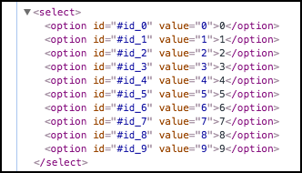

# Interagindo com o DOM - HTML

Para explicarmos este capítulo, continuaremos com o exemplo anterior.

```html
<div id="bg" style="width:200px; height:200px; background: #000" onmouseover="over(this)">
        <h2 style="text-align: center; color:#fff">Over me</h2>
        <h2 style="text-align: center; color:#fff">Now</h2>
</div>
```

A diferença é que estamos passando o **this** como argumento, para a função **over()**. Desta forma conseguimos dar uma assinatura para a função e resgatar, o elemento em questão dentro da função, para que possamos alterar. Este this informa à função que é deste elemento que estamos falando.

```javascript
function over(obj) {
    obj.innerHTML = '<h2 style="text-align: center; color:#fff">Over me JS</h2>;'
}
```

Quando passarmos o mouse sobre o quadrado preto, conseguiremos alterar o conteúdo da div, porque passamos o objeto, referente a ela, como parâmetro para função.

Fiquem atentos que a função **innerHTML** altera todo conteúdo da div. Notem que no HTML original temos duas tags h2 e quando passamos o mouse sobre a div, passamos a ter somente um. Isso acontece porque, na função, passamos apenas um h2.

Fizemos isso para mostrar que o innerHTML remove todo conteúdo anterior e insere o novo conteúdo que passarmos. Se tivermos alguma característica anterior, que deva ser mantida, deveremos passar para a função.

Façam o teste no navegador para verem a mágica acontecendo.

# Criando elementos com javascript - INPUT

Primeiro criaremos elementos input, de acordo com o número de campos solicitados:

```html
<input type="number" id="val" class="number_val_input">
<button id="generate_btn">Generate</button>
```

Inserimos um campo de input onde o usuário informará quantos campos deseja criar, depois, basta clicarmos no botão Generate, para que sejam gerados os campos.

```javascript
var input = document.getElementsByClassName('number_val_input');
var btn_generate = document.getElementById('generate_btn');
btn_generate.addEventListener('click',generate);

function generate() {
    var value = input[0].value;

    for(var i = 0; i < parseInt(value); i++ ){
            var inpt = document.createElement('input');
            inpt.id = "#btn_" + i;

            var body = document.getElementsByTagName('body');
            body[0].appendChild(inpt);
    }

}
```

Observem que, primeiro pegamos o valor digitado pelo usuário, através da classe do elemento.

`var input = document.getElementsByClassName('number_val_input');`

Em seguida, pegamos o botão pelo id, e adicionamos um evento ao clicar.

```javascript
var btn_generate = document.getElementById('generate_btn');
btn_generate.addEventListener('click',generate);
```

Por último, criamos uma função que será chamada pelo evento. Esta função faz um loop for, de acordo com o número de repetições escolhidas pelo usuário.

Criamos um elemento input e setamos o id para cada iteração.

```javascript
var inpt = document.createElement('input');
inpt.id = "#btn_" + i;
```

Em seguida, pegamos o elemento body do HTML para localizar onde adicionaremos os campos e depois adicionamos os elementos com a função **appendChild**.

```javascript
var body = document.getElementsByTagName('body');
body[0].appendChild(inpt);
```

Notem que utilizamos o índice, na variável body, porque a função **getElementsByTagName** nos retorna um array. Devemos informar o índice, para que possamos inserir corretamente.

Podem testar no navegador que os campos serão criados de acordo com o número informado.

# Criando elementos com javascript - SELECT

```javascript
// Criando select populado
var body1 = document.getElementsByTagName('body');
var select = document.createElement('select');
body1[0].appendChild(select);

for(var i = 0; i < 10; i++ ){
    var option = document.createElement('option');
    option.id = "#id_" + i;
    option.value = i;
    option.innerHTML = i;

    select.appendChild(option);
}
```

Para criarmos um elemento select já populado, temos uma lógica bem parecida. Primeiro pegamos o elemento body, para informarmos onde iremos adicionar. Depois criamos o elemento select.

O próximo passo é fazermos uma iteração para conseguirmos formar os elementos **option**, onde passamos 10 repetições para o **for**.

Significa que teremos 10 opções dentro do elemento select. Passamos todos os atributos e valores para o option, dinâmicamente, e adicionamos ao select, utilizando o **appendChild**.

Temos o elemento select sendo adicionado ao body1, na ordem.

```javascript
var body1 = document.getElementsByTagName('body');
var select = document.createElement('select');
body1[0].appendChild(select);
```

E depois os elementos **option** sendo adicionados ao elemento select, que já foi adicionado.

```javascript
for(var i = 0; i < 10; i++ ){
    var option = document.createElement('option');
    option.id = "#id_" + i;
    option.value = i;
    option.innerHTML = i;

    select.appendChild(option);
}
```

Vejam o resultado no HTML.



# Conclusão

Vocês puderam ver como trabalhamos com os elementos HTML junto com estruturas de repetições.

Vejam como as coisas vão se encaixando e os assuntos vão se cruzando. Façam muitos testes para que possa fixar os conceitos. 