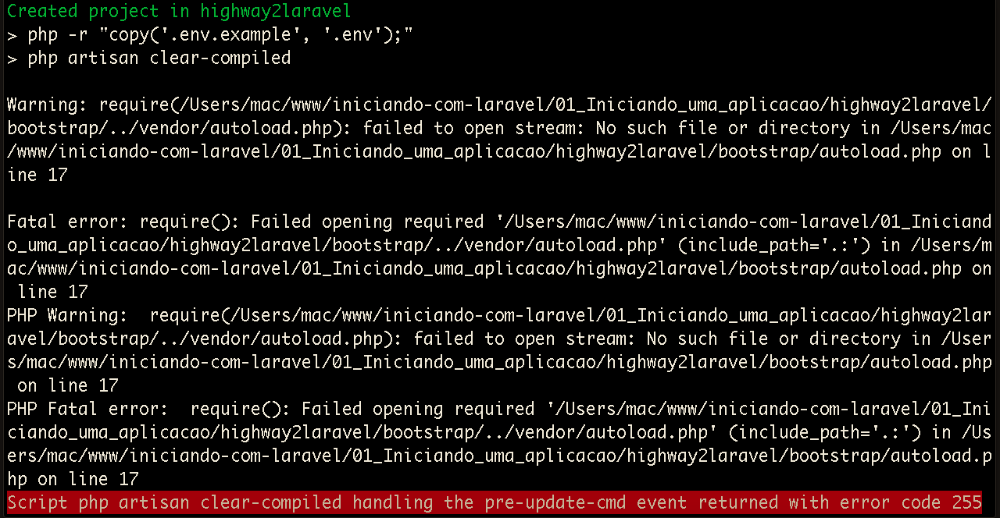

# Iniciando uma aplicação

Neste módulo daremos inicio ao nosso projeto exemplo.

Iniciar uma aplicação Laravel é muito simples, talvez mais simples do que você possa imaginar. Você não precisa de nenhuma configuração para que isso seja feito, levando em consideração que você conheça PHP e que já tenha seu ambiente de desenvolvimento pronto.

Então você precisa apenas ter o PHP, à partir da versão 5.5.9, instalado em sua máquina juntamente com o composer e também que possua o banco de dados instalado, pois utilizaremos com a evolução dos módulos.

O Laravel exige algumas extensões do PHP como:

* OpenSSL PHP Extension
* PDO PHP Extension
* Mbstring PHP Extension
* Tokenizer PHP Extension
* XML PHP Extension

Então confira se você possui estas extensões habilitadas em seu PHP.

Existem duas maneiras de instalar o Laravel:

1. Através do instalador
2. Através do comando **create-project**

Com o instalador basta rodar o comando abaixo, no terminal, e ter a aplicação instalada.

```
laravel new nome_do_projeto
```

Porém esta forma exique que façamos a instalação do instalador através do comando abaixo:

```
composer global require "laravel/installer"
```

Esta forma exige outras configurações e queremos ser práticos neste tema, portanto apresentaremos a segunda forma que não precisa de configuração nenhuma.

Para instalar com o comando *create-project* basta rodar o comando abaixo:

```
composer create-project laravel/laravel nome_do_projeto
```

Este comando instalará sempre a versão mais atual do Laravel, porém para este módulo instalaremos a versão **5.2.15**, que é a versão mais atual, no momento em que este conteúdo foi criado.

Dependendo do momento que estiver lendo este conteúdo a versão pode estar mais evoluída e por este motivo fixaremos a instalação através desta versão em específico.

Para instalar o Laravel rode o comando abaixo:

```
composer create-project laravel/laravel:5.2.15 highway2laravel
```

Quando for iniciar sua aplicação dê preferência sempre ao primeiro comando, sem informar a versão, pois o Laravel sempre será instalado na sua versão mais atual. Lembrando, mais uma vez, que estamos rodando o comando acima para que não existam conflitos de informações, para quem estiver lendo este conteúdo em versões futuras.

Você pode ter um erro durante a instalação da versão 5.2.15. Veja o erro abaixo:



Caso tenha este erro, em seu terminal, basta abrir a pasta do projeto criado e depois abrir o arquivo **/highway2laravel/composer.json**. Ao abrir remova o código abaixo e salve.

```js
"pre-update-cmd": [
    "php artisan clear-compiled"
],
```

Precisamos fazer esta alteração pelo fato deste comando estar sendo executado antes da criação da pasta vendor e esta é a causa do erro.

Após fazer a alteração no arquivo basta rodar o comando abaixo:

```
composer install
```

Depois destas alterações você terá a versão 5.2.15 instalada corretamente e poderá seguir com nosso conteúdo.

Se for a primeira instalação em sua máquina pode ser que leve um tempo maior para ser instalado, porém nas próximas instalação você terá um tempo menor, pois a instalação do Laravel trabalha com cache de alguns recursos.

Veja que o nome do nosso projeto, segundo o comando de instalação, será **highway2laravel**. Fique à vontade para criar com o nome que quiser ou siga nosso exemplo.

Ao concluir a instalação o Laravel já está pronto para ser iniciado, basta acessar a pasta do projeto, que foi criada pelo comando, e rodar o comando abaixo:

```
php artisan serve
```

Depois de rodar o comando acima, basta acessar o link **http://localhost:8000/** e já temos a aplicação rodando. Não foi preciso fazer configuração nenhuma para iniciar a aplicação. Isso prova que o Laravel nos fornece o máximo de facilidade possível.

Analisando o último comando rodado podemos verificar o uso da palavra reservada **artisan**. O artisan é uma ferramenta, disponibilizada pelo Laravel, que nos trás muita praticidade e agilidade durante o desenvolvimento. Através dela podemos criar muitas funcionalidades no Laravel e tudo de forma automatizada.

Você mesmo pode criar comandos no artisan, mas este seria um conteúdo mais avançado e não é nosso objetivo para este momento.

Utilizaremos muito o comando artisan durante os próximos módulos, então você entenderá a importância que ele tem nos projetos para facilitar a nossa vida.

Caso queira saber quais comando estão disponíveis no artisan basta rodar o comando abaixo:

```
php artisan list
```

Nosso objetivo, neste módulo, foi criar e subir a primeira aplicação para que você pudesse ver a facilidade que temos para iniciar um projeto com Laravel.