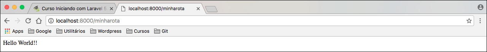
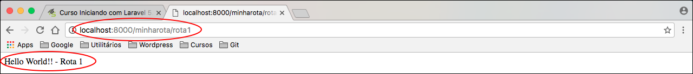
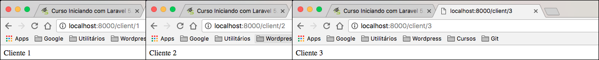
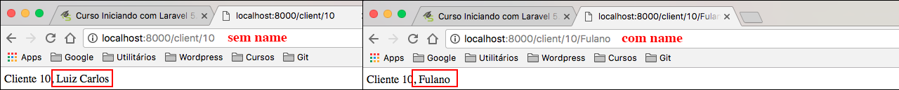

# Começando com rotas amigáveis

Este é um assunto muito importante no Laravel e em qualquer outro framework.

Até agora só vimos como instalar, subir e acessar a aplicação. 
Sabendo criar rotas, poderemos criar novas páginas dentro da aplicação. 
Por este motivo é tão importante prestar atenção neste conteúdo.

Se ainda não trabalhou com nenhum framework e vem do PHP mais antigo, deve lembrar quando criávamos uma aplicação, deixávamos tudo exposto.

Por exemplo:

Podíamos ter a rota: **http://localhost/cadastro.php** ou **http://localhost/client/cadastro.php**

Desta forma o acesso era direto ao arquivo que continha o código, sem falar que, muitas vezes, a url ficava enorme, justamente por isso.

Agora temos a possibilidade de criar urls amigáveis. Não precisaremos mais utilizar extensão de arquivo e teremos a liberdade de criar a url da forma que quisermos.

# Criando a primeira rota amigável no Laravel

Voltando aos arquivos da aplicação, na IDE que estiver utilizando, poderá ver uma pasta chamada **routes**, dentro dela podemos encontrar 3 arquivos:

* api.php
* console.php
* web.php

Isso quer dizer que podemos criar 3 modelos de rotas. Se quisermos criar uma rota para visualizar em nosso browser, utilizaremos o arquivo **web.php**, por exemplo.

Lembra da página que é exibida no browser, quando acessamos a aplicação? Aquela rota inicial está configurada neste arquivo, veja abaixo:


Veja que chamamos a facade **Route** e acessamos o método **get**. Este método, por sua vez, necessita de dois parâmetros:

* Rota
* Função ou algum método de algum controller, mas iremos ver mais pra frente. Por enquando ficamos só na função.

Resumindo, é assim que criamos uma rota. Primeiro chamamos a facade Route, depois informamos o método http que será utilizado. No caso acima, podemos ver que a rota indicada foi a raiz **(/)**, sem complemento algum, significa que é nossa home.

A função, neste caso, apenas retornou uma **view** chamada **welcome**. Vamos falar de views mais tarde.

# O que são Facades?

Quando chamamos a classe para criação de uma rota, estamos na verdade chamando uma **facade**. Você irá trabalhar o tempo todo com facades no Laravel.

Exemplo: `Route::`

Uma Facade não diz respeito àquele design pattern convencional, que utilizamos no mercado, mas a facade é uma classe que irá nos ajudar a fazer algo específico, de uma forma mais simples.

A estrutura da facade sempre será igual: `Nome da Facade + :: + o método`.

Teremos os mais diversos métodos para cada tipo de verbo HTTP que quisermos utilizar, mas por enquanto iremos utilizar somente o get e o post:

* Route::get()
* Route::post()

Quando desejamos criar uma rota amigável, precisamos escolher, primeiro, o verbo http que iremos trabalhar, e depois, o nome da nossa rota, seguida da função. A função será responsável por processar e retornar, uma resposta para a view quando a rota for acessada.

```php
Route::get('/minharota', function () {
    return "Hello World!!";
});
```

Após inserir esta rota em nosso arquivo de rotas web, podemos acessar nossa aplicação e já teremos o resultado da primeira rota.

**http://localhost:8000/minharota**



Pronto!  A primeira rota foi criada com sucesso. Saiba que a barra inicial que colocamos no nome da rota é opcional, se tirar, terá o mesmo resultado.

Vamos criar mais uma rota para fixar melhor. Lembrando que rotas do tipo **post** não são acessadas no nosso browser, por este motivo, iremos criar outra rota, do tipo get.

```php
Route::get('/minharota/rota1', function () {
    return "Hello World!! - Rota 1";
});
```

Podemos criar rotas, da maneira que quisermos, basta irmos acrescentando "/nome". Podemos criar quantas rotas acharmos necessárias no projeto, não há limite.



***

O Laravel faz todo trabalho para que a criação de rotas se torne algo muito fácil e rápido de ser desenvolvido. 
Na verdade, quem faz este trabalho é o Symfony. O Laravel faz o controle e utiliza a facade para poder desenvolver de uma forma tão simples.

Caso queira enganar o usuário maldoso, você pode. Basta acrescentar a extensão do arquivo para sua rota:

```php
Route::get('/minharota.php', function () {
    return "Hello World!!";
});
```

Ele vai pensar que está acessando o script, diretamente, no arquivo **minharota.php**. Sabemos que este arquivo não existe, porque nunca foi criado. Nada nos impede de fazer este tipo rota, porque se trata apenas de nomes, a programação, por trás, não se altera em nenhum momento.

# Rotas com parâmetros obrigatórios

Quando trabalhamos com rotas amigáveis, em algum momento, precisaremos passar parâmetros para estas rotas. 
Isso é muito fácil e irá agilizar o desenvolvimento da aplicação. 
Vamos supor que estamos trabalhando com cadastro de clientes.

Vamos criar mais uma rota para exemplificar:

```php
Route::get('/client/{id}', function ($id) {
    return "Cliente $id";
});
```

Se fizermos uma consulta a um cliente usando o ID dele na rota, como parâmetro, para obter o resultado esperado, teremos que acrescentar à rota, a seguinte notação: **{ }**. Desta forma o Laravel entenderá que haverá um parâmetro com o nome que definimos. No caso do exemplo, colocamos **id**.

Depois de declararmos a notação, em nossa rota, teremos que inserir o parâmetro na função, para que possamos recebê-lo de nossa URL. 
Feito isso, poderemos utilizar este parâmentro dentro da função e retornar a resposta.



Na imagem acima, conseguimos ver que basta passarmos o id na url e já teremos o nosso usuário retornando.

Podemos adicionar quantos parâmetros quisermos, em nossa rota. Basta seguir o mesmo procedimento anterior. Veja o código:

```php
Route::get('/client/{id}/{name}', function ($id,$name) {
    return "Cliente $id, $name";
});
```

Reparem que a ordem dos parâmetros deve ser mantida, para que o Laravel retorne também na ordem correta. Se você trocar a ordem, o Laravel não entenderá sua lógica e retornará invertido também.


Concluímos que, é muito simples a passagem de parâmetros em nossas rotas, basta utilizarmos a notação correta e atentarmos à ordem delas.

# Rotas com parâmetros opcionais

Outro recurso, muito interessante, no trabalho com rotas é a possibilidade de criarmos parâmetros que sejam opcionais.

A lógica é muito semelhante ao exemplo anterior, mas é importante saber que, é necessário passarmos os parâmetros opcionais, por último, em nossa ordem de parâmetros.

Se quisermos que o parâmetro **name** seja opcional, teremos que mantê-lo por último, na ordem.

Para tornar o parâmetro opcional, basta acrescentarmos um sinal de interrogação no final do parâmetro, antes do fechamento da chave. Veja exemplo:

```php
Route::get('/client/{id}/{name?}', function ($id,$name) {
    return "Cliente $id, $name";
});
```

Porém se fizer o teste, vai ver que ainda terá um erro, porque todo parâmetro, ainda que opcional, é considerado um argumento para a função que segue. Portanto, teremos que adicionar um valor padrão para este argumento, caso ele não seja passado na url.

```php
Route::get('/client/{id}/{name?}', function ($id, $name = "Luis Carlos") {
    return "Cliente $id, $name";
});
```

Desta forma poderá testar, novamente, que não apresentará o erro anterior. 
Passamos **Luis Carlos**, para o argumento name, caso não tenha sido passado nenhum valor na url. Caso exista um valor, passado em url, ele substituirá o valor padrão, definido na função. Veja exemplo:

