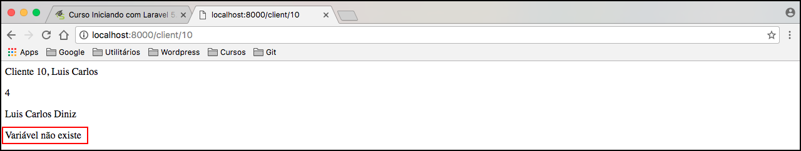

# Aprofundando na interpolação

Aprofundaremos um pouco mais no Blade, para que possam entender melhor a ferramenta de template utilizada pelo Laravel.

Quando utilizamos a interpolação, nós podemos passar qualquer expressão PHP dentro dela, não precisa ser somente para mostrar uma variável, conforme ensinamos anteriormente.

Exemplo em nosso template **client-name.blade.php**:

```php
<p>Cliente {{ $id }}, {{ $name }}</p>
<p>{{ 2 + 2 }}</p>
<p>{{ $name . " Diniz" }}</p>
```

Repare que fizemos uma operação matemática e uma concatenação da variável $name com uma string. Veja o resultado:


O Blade interpretará qualquer expressão que colocamos dentro da interpolação e criará aquele arquivo que mostramos, anteriormente, dentro da pasta **storage/framework/views** e este arquivo será responsável pela renderização.

Caso ele encontre alguma expressão que não exista ou um erro de sintaxe, o Laravel mostrará um erro. 
Portanto, não se preocupem durante o desenvolvimento, o erro será mostrado no arquivo criado pelo Blade. 
Vejamos um exemplo:

```php
<p>Cliente {{ $id }}, {{ $name }}</p>
<p>{{ 2 + 2 }}</p>
<p>{{ $name . " Diniz" . }}</p>
```

Repare que colocamos mais um ponto para concatenar alguma string, mas, não passamos string nenhuma. Isso irá gerar um erro durante a interpretação do Blade e será lançado o erro. 
Veja o resultado no browser:


Marcamos o nome do arquivo onde foi gerado o erro. Note que está no arquivo gerado pelo próprio Blade, na pasta em que falamos.


Agora repare que marcamos o caminho onde o arquivo é criado, além do arquivo e a linha do erro, para que possa identificar corretamente.

***

Podemos trabalhar também com operações ternárias, usando a interpolação. 
Para fazer o exemplo, passamos mais um parâmetro para nossa view, em nossa rota:

```php
Route::get('/client/{id}/{name?}', function ($id, $name = "Luis Carlos") {
    return view('client-name')
        ->with("id",$id)
        ->with("name",$name)
        ->with("conteudo","teste");
});
```

Além de *id* e *name* agora temos a variável **conteúdo** sendo passada como parâmetro. 
Sendo assim, podemos fazer nosso exemplo de operação ternária com interpolação:

```php
<p>Cliente {{ $id }}, {{ $name }}</p>
<p>{{ 2 + 2 }}</p>
<p>{{ $name . " Diniz" . }}</p>
<p>{{ isset($conteudo) ? $conteudo :  "Variável não existe" }}</p>
```

Resultado:


Depois deste exemplo, removemos a variável **conteúdo** que foi passada na rota e tivemos o seguinte resultado:



Assim, mostramos que é possível trabalhar com ternários e que funciona tranquilamente em nossa interpolação.

Existe uma outra forma, mais simplificada, de trabalhar com ternários:

```php
<p>{{ isset($conteudo) ? $conteudo :  "Variável não existe" }}</p>
<p>{{ $conteudo or "Variável não existe" }}</p>
```

Ambos os modelos, retornarão o mesmo conteúdo e resultado.

# Renderizando html

No momento, nós não precisamos renderizar nenhum elemento html além de texto, e por enquanto está dando tudo certo.

Imagine se quisermos renderizar uma âncora, por exemplo:

```php
<p>{{ "<a href='#'>Link</a>" }}</p>
```

O  Blade irá escapar o código, como se tivéssemos utilizando a função `htmlentities()` do php. Isso é feito por questões de segurança, para que nenhuma entidade html chegue até o banco de dados. 
O Blade transforma em texto para que não tenha nenhum efeito prejudicial à sua aplicação.

Resultado:


Existe uma maneira de forçar a renderização, seja por necessidade ou de forma consciente. 
Basta modificar um pouco a interpolação.

```php
<p>{!! "<a href='#'>Link</a>" !!}</p>
```

Resultado:


Conhecendo os dois modos de interpolação, saiba muito bem a hora de utilizar a forma segura e a forma insegura, para que não tenha problemas em sua aplicação. 
Imagine que você tem, em seu banco de dados, um script que foi inserido, de forma maliciosa, e você renderiza utilizando a forma insegura **{!! !!}**. Pronto, o script será executado e pode ser que danifique o funcionamento de sua aplicação, sendo que, da outra forma, este mesmo script seria apenas texto.

Chamamos a interpolação convencional de **escaped** e a outra de **unescaped**. Caso ouça falar destes dois nomes, saberá o que significa.