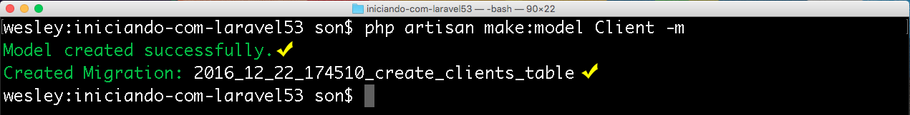

# Models, migrations e Eloquent ORM

Chegou o momento de trabalharmos com persistência em banco de dados. Um assunto muito importante no mundo do desenvolvimento.

Este assunto é o mais importante, quando alguém vai começar a trabalhar com um framework novo. 
Todos querem saber como o framework faz a conexão com o banco de dados, como podemos criar os Models da aplicação e como os dados serão gravados.

Model é a letra **M** da arquitetura MVC, o último elemento que iremos falar.

Com Laravel, conseguimos trabalhar de uma forma muito fácil em relação a este assunto. Assim como tudo que envolve este framework.

# Migrations

Antes, temos que entender o que é uma **migration**, porque iremos utilizá-la, constantemente, durante o desenvolvimento de qualquer aplicação.

Vamos supor que você já tenha criado o seu banco de dados e uma tabela de clientes, no MySQL. Durante o desenvolvimento da sua aplicação, você acaba subindo para o ambiente de produção.

Por enquanto, tudo maravilha. Em certo momento, seu contratante solicita que você acrescente mais um campo no cadastro de clientes da sua aplicação. Como você faria?

Você deveria ir até o banco de dados e incluir esta coluna. Sem falar que teria que analisar vários pontos: se a coluna será ou não obrigatória. Se for obrigatória, você terá que gerar um valor padrão para todos os campos e por aí vai.

Toda vez que necessitamos realizar uma alteração no  banco de dados e  a fazemos de forma manual, estamos dificultando  a manutenção, porque tudo que fizermos localmente, no ambiente de desenvolvimento, terá que ser feito, também, no ambiente de produção.

A migration é uma forma, através do php, da criação de classes. A intenção é que estas classes criem as tabelas no banco de dados e também as modifiquem, conforme vamos desenvolvendo e evoluindo a aplicação.

Dessa forma, temos esta administração de forma fácil e organizada. Tudo feito através do php. Você não irá mais mexer nas tabelas do MySQL ou qualquer outro banco que você tenha que trabalhar.

Para iniciarmos com as migrations, iremos criar a primeira migration, através do artisan, e consequentemente, iremos criar a tabela no banco de dados.

Quando fazemos uma migração, para criar a tabela de clientes, precisamos, também, criar um modelo de clientes para que consigamos administrar toda a persistência de dados. Isso significa que poderemos executar consultas, atualizações e remoções.

Nós trabalhamos com os modelos e as migrações ao mesmo tempo.

Para trabalharmos com os modelos, utilizaremos uma biblioteca já existente no Laravel, chamada de Eloquent. Tudo que fizermos de **Model**, utilizaremos o Eloquent, como base.

O Eloquent é um ORM.  Significa, Object Relational Mapping, ou Mapeamento de Objeto Relacional.

Um ORM, através de toda sua estrutura, pegará os objetos, com todos os dados, e registrará nas tabelas, sem que tenhamos trabalho algum. Portanto, teremos muita facilidade trabalhando com Eloquent.

Através do Eloquent, poderemos fazer query complexa, join, conseguimos trabalhar com relacionamentos.

Exemplo: Suponha que, em seu sistema, exista um relacionamento entre cliente e endereço, ou seja, um cliente pode ter mais de um endereço.

Vamos traduzir isso, utilizando orientação a objetos. Faremos todas as inclusões em nossos objetos, e ao salvar, o Eloquent resolverá como pegar estes dados, da orientação a objetos, e traduzir em registro, nas tabelas.

Vamos praticar para facilitar o entendimento.

# Criando primeiro model ou modelo

Existe um comando no artisan para a criação de model:

`$ php artisan make:model`

Este comando irá criar um modelo baseado no Eloquent. Basta que passemos o nome do nosso modelo no final do comando. O nome deste modelo será o nome de uma classe. Em nosso caso, a classe se chamará client. Existe uma convenção de nomearmos os models, sempre no singular e com a primeira letra maiúscula.

`$ php artisan make:model Client`

É interessante manter esta convenção, pois facilitará na hora de conectarmos nosso modelo com nossa migração e com a tabela do banco de dados, que iremos criar.

Ao rodarmos o comando, nosso modelo já será criado. 
Sempre que colocarmos somente o nome do Model, o artisan irá criar o modelo na pasta **app**. Caso queira criar um modelo dentro de uma pasta, você pode alterar o comando desta maneira:

`$ php artisan make:model Model/Client`

Desta forma, será criado um Model Client dentro da pasta Model, se esta pasta não existir, ela será criada, automaticamente.

Em nosso exemplo, iremos trabalhar com o modelo na pasta app mesmo.

Sempre que criamos um modelo com Eloquent, através do artisan, este modelo virá com a seguinte configuração:

```php
namespace App;

use Illuminate\Database\Eloquent\Model;

class Client extends Model
{
    //
}
```
 Teremos o namespace e uma classe, que irão extender de outra classe, chamada Model. Só de extender nosso modelo, desta classe, já teremos super poderes.

Já estamos prontos para podermos fazer as persistências. Mas não queremos criar somente o modelo, porque esta classe Client não tem finalidade alguma, se não existir a tabela criada no banco de dados.

# Criando primeira migration ou migração

Existe uma maneira de criar a migração e model em um mesmo comando. Neste caso, iremos excluir nosso model, que já tinha sido criado, e vamos rodar o comando completo de criação com migration junto.

`$ php artisan make:model Client -m`



Pronto, agora temos modelo e migração criados.

Pra onde foi a migração?

* database
    * migrations

A pasta **database** abrigará todas as migrations e algumas configurações de banco de dados que utilizaremos.

Abrindo a pasta de migrações você poderá ver que já existem duas migrations, que são padrões de instalação do Laravel. 
São migrações para trabalhar com autenticação de usuários e reset de passwords.
Caso seu sistema possua autenticação, você já terá isso pronto.

Além das duas migrations padrões, encontraremos a migration que acabamos de criar. 
Se abrir este arquivo, verá que é uma classe e ela já contém tudo o que é necessário para a criação da tabela.

Só precisamos adicionar as configurações que quisermos. Veremos isso no próximo conteúdo.