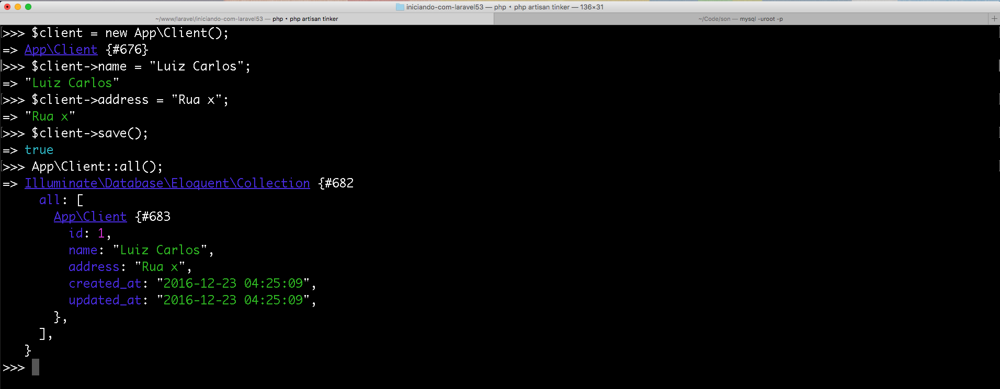
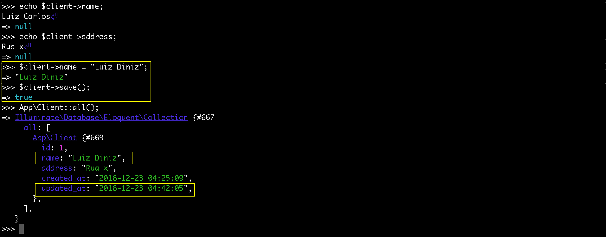

# Artisan tinker

No Laravel existe um terminal interativo que nos possibilita rodarmos nossa aplicação no terminal, sem precisarmos recorrer ao  browser, constantemente. 
Certas ações, valem mais a pena fazermos pelo **tinker** do que ir até o browser.

O tinker faz parte de uma categoria de software chamado **repl**: read eval print loop. 

Ele possibilitará a interação com a aplicação.

O tinker utiliza uma biblioteca Psy que pegará o boot, que temos em nossa aplicação, presente no index.php e rodará a aplicação. Na sequência, podemos fazer o que quisermos, via console.

# Iniciando com tinker

O comando para iniciar o tinker é o seguinte:

`$ php artisan tinker`

Depois de rodarmos este comando, poderemos fazer o que quisermos, dentro da aplicação. Neste terminal é possível rodar qualquer instrução php. O objetivo inicial é brincarmos com o modelo que criamos.

Nós já criamos o banco de dados e também o modelo Client. É para estar tudo pronto, para conseguirmos incluir dados em nossa tabela. Será que isso é possível?

Sim, é possível e iremos mostrar os passos para criarmos os dados, através do tinker: Veja abaixo:

# Criando primeiro registro

Vamos explicar a imagem acima de forma ordenada:

1. Criamos uma variável chamada client e atribuímos uma instância do modelo Client. Repare que, no tinker, você deve passar o  namespace, para que ele consiga localizar o seu modelo.
2. Atribuímos, ao campo nome, o valor de Luiz Carlos.
3. Atribuímos, ao campo address, o valor de Rua x.
4. Depois de alimentar os campos, do objeto $client, basta executar o método **save**, para concluir a inserção no banco de dados. 
Antes deste comando **save()** tínhamos apenas uma instância e mais nada. Depois que salvamos, o Eloquent pegou os dados do objeto e se encarregou de salvar os dados no banco. Notem que o tinker retornou true, isso quer dizer que foi salvo com sucesso.
5. Utilizamos um método que se chama **all()** que é do próprio Eloquent. Ele lista todos os elementos da tabela. Podemos concluir que os dados foram salvos, com sucesso. 
Podemos acessar o banco de dados e fazer um select, para confirmar.

Reparem que os campos **timestamp**, created_at e updated_at, que são criados pelo próprio framework,  foram preenchidos, automaticamente.

O tinker tem o objetivo de nos auxiliar no desenvolvimento. Com ele podemos testar nossa aplicação. Podemos testar também os relacionamentos entre tabelas, tudo isso sem precisar do auxílio do browser.

Para atualizar um dado no tinker, podemos fazer desta forma:

Notem que, primeiro imprimimos o valor das variáveis, para que pudéssemos saber que é possível e também saber o valor atual. Depois, atribuímos um novo valor para **name** e salvamos. 
Ao listar os dados, novamente, podemos conferir, na imagem, que o nome foi alterado e também o campo **updated_at**. 
Atente para o fato que, cada vez que for atualizado, este campo será modificado. Isso pode ser muito importante dependendo o projeto.

# Pesquisando registro por id

Já falamos sobre o método all do Eloquent, que é responsável por listar todos os dados da tabela. Agora, vamos falar de outro método, que busca um elemento pelo identificador único.

Vejam que ele utiliza o mesmo modelo da facade all, porém o comando agora é find. 
Este método recebe um parâmetro, que será um número inteiro, no exemplo, o id. Primeiro, pesquisamos um elemento que existe e depois, um elemento que não existe, para mostrarmos a diferença. 
Quando encontra um id, retorna um objeto, mas quando não encontra, o Eloquent retorna null.

Estamos vendo como é fácil listar todos os dados, buscar um elemento por id, incluir e atualizar dados em nossa tabela e até mesmo, saber se um elemento existe ou não. Tudo isso se torna mais fácil com o tinker. 
Temos a possibilidade de deletar um registro do banco de dados, também.

# Deletando registro

Primeiro, temos que atribuir um objeto a uma variável, utilizando o find, com o id que deseja deletar. 
Depois que temos um objeto, basta executar o método delete. Assim, ele apagará aquele registro.
Percebam que, logo após a remoção, pesquisando por id ele já retornou null e quando listamos, todos, retornou uma coleção vazia.

Se acostumem com esta coleção de dados, ao trabalhar com o Laravel, porque sempre trabalharemos com esta coleção. 
Ela nos permite gerenciar todo nosso array de itens, que é retornado do banco de dados. 
Se retornou um array vazio, quer dizer que não temos mais nenhum dado em nossa tabela e isso quer dizer que tivemos êxito em nossa exclusão.

Você pode praticar, cadastrando um novo cliente do mesmo jeito que foi criado, no início deste conteúdo, depois disso, utilize o comando all e verá que seu elemento fará parte da tabela, novamente.