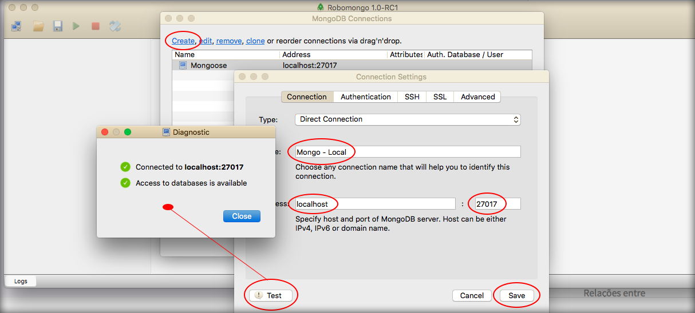

# MongoShell e ferramentas GUI para MongoDB

Neste módulo apresentaremos algumas ferramentas de interface de administração para MongoDB.

Já mostramos o MongoShell que você pode acessar via terminal, através do comando abaixo:

```sh
sudo mongo
```

Agora, falaremos de interfaces que podem ajudar de uma forma mais visual.

Mostraremos 5 opções de programas, para que você possa conhecer melhor:

1. RockMongo - <http://rockmongo.com/>
2. phpMoAdmin - <http://phpmoadmin.com/>
3. MongoHub
4. Robomongo - <https://robomongo.org/>
5. MongoChef

### RockMongo

O RockMongo possui uma interface muito parecida com a do phpMyAdmin, para quem vem de uma experiência com o MySQL utilizando este programa de interface.

Existe documentação em vários idiomas e disponibiliza alguns plugins para acrescentar algumas funcionalidades. Um exemplo é o Sharding que nos ajuda na clusterização do Mongo.

A documentação é muito simples e completa, abordando instalação, download e alguns artigos para que você possa se inteirar mais sobre a tecnologia.

### phpMyAdmin

Esta é uma interface muito simples e não deixa de ser funcional.

Não tem a mesma indicação como a interface anterior. Ela permite trabalhar tranquilamente com o gerenciamento de seus bancos de dados. Não indicamos pelo fato de não possuir uma documentação tão boa quanto a anterior.

### MongoHub

Esta ferramenta não possui um site e foi desenvolvida somente para o sistema operacional OSX.

Você pode baixar diretamente do repositório do Github e também é um projeto open source, que ainda está ativo e em constante desenvolvimento.

A documentação pode ser baixada no link do repositório e é muito completa e fácil de ser entendida. Veja o link abaixo:

<https://github.com/jeromelebel/MongoHub-Mac>

### Robomongo

Esta ferramenta deve ser uma das mais utilizadas ultimamente, porém não temos dados que comprovem.

O site é muito bem construído e moderno, com algumas estatísticas e projetos relacionados ao MongoDB.

É um projeto open source e vem sido mantido com constantes atualizações.

No próprio site você pode encontrar download para Windows, MAC e Linux.

A documentação não se encontra explícita no site, mas se você acessar a wiki do Github terá acesso à documentação do projeto. Caso queira contribuir com o projeto, você pode utilizar esta documentação.

### MongoChef

Esta ferramenta compete diretamente com o Robomongo, pois possui diversas features interessantes.

Possui uma versão free e outras duas versões pagas.

Está disponível para Windows, MAC e Linux e não se trata de um projeto open source. Este projeto é mantido por uma empresa chamada **3T.io**.

Para fazer o download você precisa acessar o site e preencher um formulário simples.

A empresa 3T, além de manter o projeto desenvolve novas features para deixar a ferramenta cada vez mais atrativa. 

Veja alguns exemplos:

1. Syntax Highlighting
2. Drag-and-Drop Search
3. Import + Export

***

### Conclusão

Dentre as opções apresentadas, utilizaremos o Robomongo.

Baixe e instale de acordo com seu sistema operacional. A instalação é muito simples e intuitiva, portanto você não deve ter problemas.

Depois de instalar, abra o programa e crie sua conexão para que possamos continuar nosso conteúdo proposto.

