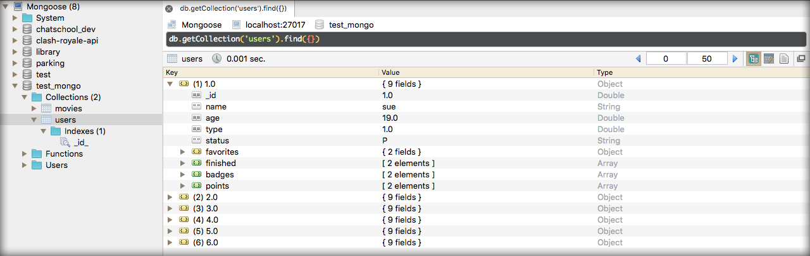
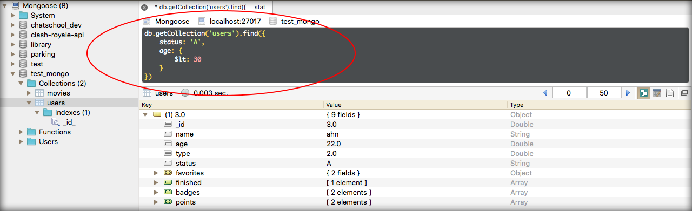

# CRUD Operations - Querying

Falaremos mais sobre querying que trabalha com a palavra chave **find**. O comando find tem a função de filtrar dados de diversas maneiras de acordo com as configurações que passamos a ele.

Podemos filtrar por um ou mais registros, ou podemos dar um match em algum item interno que exista em um array. É possível saber se existe alguma propriedade dentro do documento ou não entre outras configurações afim de refinar cada vez mais nossas buscas.

Mostraremos os comando na prática e explicaremos um a um após os exemplos. Faremos as buscas utilizando a collection criada no módulo anterior.

```
# Comando
db.movies.find({})

# Resultados
{ "_id" : ObjectId("59ae1c3c5c20d0a22996ef49"), "name" : "Movie 1", "author" : "Author 1", "date" : ISODate("2017-09-05T03:38:36.117Z") }
{ "_id" : ObjectId("59ae1c455c20d0a22996ef4a"), "name" : "Movie 2", "author" : "Author 1", "date" : ISODate("2017-09-05T03:38:45.397Z") }
{ "_id" : ObjectId("59ae1c585c20d0a22996ef4b"), "name" : "Movie 2", "author" : "Author 1", "date" : ISODate("2017-09-05T03:39:04.044Z") }
{ "_id" : ObjectId("59ae1c585c20d0a22996ef4c"), "name" : "Movie 3", "author" : "Author 3", "date" : ISODate("2017-09-05T03:39:04.044Z") }
```

Este comando já foi utilizado e retora todos os resultado existentes sem filtragem alguma. Não existe nenhum filtro porque passamos um objeto vazio como parâmetro para o comando.

Veja um exemplo com parâmetros informados:

```
# Comando
db.movies.find({name: 'Movie 2'})

# Resultados
{ "_id" : ObjectId("59ae1c455c20d0a22996ef4a"), "name" : "Movie 2", "author" : "Author 1", "date" : ISODate("2017-09-05T03:38:45.397Z") }
{ "_id" : ObjectId("59ae1c585c20d0a22996ef4b"), "name" : "Movie 2", "author" : "Author 1", "date" : ISODate("2017-09-05T03:39:04.044Z") }
```

Você pode perceber facilmente que o MongoDB trouxe apenas os resultados que possuiam a propriedade **name** com o valor **Movie 2**.

Para fazer testes mais específicos utilizaremos um modelo de insert que está no site do MongoDB, na sessão de CRUD Operations. Copie o código abaixo e rode no terminal para criar 6 usuários de teste.

```
db.users.insertMany(
	[
		{
			_id: 1,
			name: "sue",
			age: 19,
			type: 1,
			status: "P",
			favorites: { artist: "Picasso", food: "pizza"},
			finished: [17, 3],
			badges: ["blue", "black"],
			points: [
				{points: 85, bonus: 20},
				{points: 85, bonus: 10},
			]
		},
		{
			_id: 2,
			name: "bob",
			age: 42,
			type: 1,
			status: "A",
			favorites: { artist: "Miro", food: "meringue"},
			finished: [11, 25],
			badges: ["green"],
			points: [
				{points: 85, bonus: 20},
				{points: 64, bonus: 12},
			]
		},
		{
			_id: 3,
			name: "ahn",
			age: 22,
			type: 2,
			status: "A",
			favorites: { artist: "Cassatt", food: "cake" },
			finished: [6],
			badges: ["blue", "red"],
			points: [
				{ points: 81, bonus: 8 },
				{ points: 55, bonus: 20 }
			]
		},
		{
			_id: 4,
			name: "xi",
			age: 34,
			type: 2,
			status: "D",
			favorites: { artist: "Chagall", food: "chocolate" },
			finished: [5, 11],
			badges: ["red", "black"],
			points: [
				{ points: 53, bonus: 15 },
				{ points: 51, bonus: 15 }
			]
		},
		{
			_id: 5,
			name: "xyz",
			age: 23,
			type: 2,
			status: "D",
			favorites: { artist: "Noguchi", food: "nougat"},
			finished: [ 14, 6 ],
			badges: [ "orange" ],
			points: [
				{ points: 71, bonus: 20 },
			]
		},
		{
			_id: 6,
			name: "abc",
			age: 43,
			type: 1,
			status: "A",
			favorites: { artist: "Picasso", food: "pizza"},
			finished: [ 18, 12 ],
			badges: [ "black", "blue" ],
			points: [
				{ points: 78, bonus: 8 },
				{ points: 57, bonus: 7 }
			]
		},
	]
)
```

Após rodar o código abaixo abra o seu Robomongo para efetuarmos testes e facilitar a visualizações dos resultados.



Primeiro find com parâmetros:



Na imagem acima vocês podem ver que estamos pesquisando documentos que possuam o status com valor **A** e que tenham idade menor que 30 anos. O operador **$lt** significa **menor que** e é um operador padrão do MongoDB pronto para ser utilizado.

Existe também o operador **$gt** que seria **maior que**.

```
db.getCollection('users').find({
    status: 'A',
    age: {
        $gt: 30
    }
})
```

Neste caso existiriam dois resultados. Vamos adicionar os outros exemplos de buscas com o find e você deve seguir fazendo os testes no seu Robomongo para visualizar os resultados alternando de acordo com nossos filtros.

Quando colocamos um objeto para filtrar, cada elemento separado por vírgula representa o operador **and / e** e isso significa que ambos os elementos devam existir nos resultados, ou seja, documentos que não possuam os dois atributos como verdadeiro não farão parte dos resultados.

Existe também o operador **ou / or** que significa que pode existir um ou a outra propriedade, neste caso não precisa ter as duas propriedades, mas apenas uma delas para fazer parte do resultado.

```
db.getCollection('users').find({
	$or: [
		{ status: 'A' },
	    {
	    	age: {
	        	$lt: 30
	    	}
	    }
	]    
})
```

Neste caso para fazer parte dos resultados o documento deve ter o status igual a **A** ou ter idade menor do que trinta anos. Se rodar esta query com os nossos dados de exemplo deverá receber 5 documentos no filtro.

Quando queremos acessar elementos internos de uma propriedade devemos executar o padrão abaixo:

```
db.getCollection('users').find({
	"favorites.artist": "Picasso"   
})
```

De acordo com nossos dados de teste você deverá receber dois resultados cujo artista favorito é o **Picasso**.

Quando queremos pesquisar valores internos de um array em uma determinada propriedade, temos a opção de procurar apenas um valor direto ou de procurar mais do que um valor. Veja os dois exemplos abaixo, onde precisamos passar um array quando se trata de mais de um valor a ser pesquisado:

```
# um valor
db.getCollection('users').find({
	badges: "black"   
})

# mais do que um valor
db.getCollection('users').find({
	badges: ["black","blue"]   
})
```

Podemos sempre somar mais do que um parâmetro para as buscas. Além das badges queremos filtrar também por artista favorito. Veja abaixo:

```
db.getCollection('users').find({
	badges: ["black","blue"],
	"favorites.artist": "Picasso"
})
```

Podemos utilizar o helper **$exists** para verificar se existe algum item em que o objeto artist está vazio.

```
db.getCollection('users').find({
	"favorites.artist": {
		$exists: false
	}
})
```

Neste caso você não terá nenhum resultado, uma vez que todos os documentos possuem um valor para o objeto artist. Altere o valor para true e terá todos os resultados listados.

```
db.getCollection('users').find({
	"favorites.artist": {
		$exists: true
	}
})
```

Em todas as nossas buscas os resultados vieram completos, ou seja, com todos os campos presentes na coleção, mas podemos limitar somente os valores que nos interessa. Não preciso trazer todos as propriedades do objeto de resposta, posso retornar apenas id e name, caso eu queira:

```
db.getCollection('users').find({
	"favorites.artist": {
		$exists: true
	}
}, { _id: 1, name: 1})
```

Existe outro tipo de busca que utiliza o método **findOne** que pega sempre o primeiro resultado apenas, mesmo que existam muitos outros resultados na busca. Podemos utilizar os mesmo filtros anteriores para mostrar este método, uma vez que o filtro anterior traziam todos os resultados:

```
db.getCollection('users').findOne({
	"favorites.artist": {
		$exists: true
	}
}, { _id: 1, name: 1})
```

Faça todos os testes e caso haja alguma dúvida volte para rever.

Você vai chegar a conclusão de que trabalhar com query no MongoDB além de muito fácil é muito produtivo e lhe dá um poder muito grande na hora de desenvolver sua aplicação.