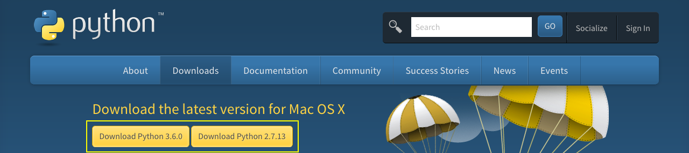

# Instalando python

Iniciaremos o processo de instalação do python. Devemos prestar muita atenção a um detalhe. O python tem duas versões principais e vocês terão que escolher, neste momento.

O python é muito conhecido pela versão 2.7, ou seja, a maioria dos programas e softwares utilizam esta versão e ela continua sendo mantida. Em paralelo, houve um processo muito grande para a criação da versão 3, da linguagem.

Estas versões foram mantidas de forma independentes e a aceitação da versão 3, demorou um pouco para acontecer. 
Atualmente, já existem muitas pessoas que a utilizam. Concluímos que o python 3 é uma linguagem melhor. No entanto, não há problema em utilizarmos a versão 2.7 da linguagem. Pelo contrário, é mais fácil encontrarmos softwares e bibliotecas na versão 2.7, para nos ajudar nos projetos.

No momento da criação deste conteúdo, as versões disponíveis são: **3.6.0** e **2.7.13**. Como podem ver na imagem acima.

O python pode ser rodado em qualquer sistema operacional. Se estiverem utilizando Linux, podem instalar utilizando o comando `$ apt-get install python3`. Se estiverem utilizando MAC, podem instalar utilizando **brew** ou utilizando o pacote binário, disponibilizados no site.

Para Windows, podem baixar o instalador direto do site, escolhendo a versão que quiserem trabalhar.

Não existe problema algum em termos as duas versões do python instaladas na máquina, basta configurarmos as variáveis de ambiente, para que consigamos trabalhar com as duas, ao mesmo tempo.

Se vocês não têm nenhuma versão instalada, instale a versão 3, diretamente. Durante a instalação, no Windows, vocês podem marcar uma opção, que configura a variável de ambiente no path.

Caso tenham a versão 2.7 instalada, deverão instalar a versão 3 e configurar a variável de ambiente também, para que consigam executar as duas versões, na mesma máquina. 
Após a instalação é interessante renomear o arquivo python.exe para python3.exe. Assim, depois de configurada a variável de ambiente, poderemos digitar **python** para acessar a versão 2.7 e **python3** para acessar a versão 3. Isso é indicado para não haver conflitos entre versões.

Para configurarmos as variáveis de ambiente no Windows, basta copiarmos o caminho completo da pasta, em que a instalação do python se encontra, em seguida, clicamos com o botão direito em **meu computador** e em **propriedades**. 
O próximo passo é acessar **Configurações avançadas do sistema** e depois **variáveis de ambiente**. Nas variáveis de ambiente encontraremos uma variável chamada **path**, é nesta que deveremos incluir o caminho da instalação da versão 3 do python. 
Lembrando que este procedimento é para quem quiser rodar as duas versões na mesma máquina. Caso estejam instalando pela primeira vez, não terão que fazer este procedimento.

Depois da instalação, vocês deverão abrir o console, do sistema operacional, e digitar **python**. O comando acessará o interpretador do python e mostrará a versão instalada. Caso estejam trabalhando com duas versões, pode ser que precisem digitar **python3**, para acessar a versão 3.

O que vocês precisam saber é que, utilizaremos o console do sistema operacional, seja ele qual for, e também, utilizaremos a versão 3 do python, para continuar com o conteúdo proposto.