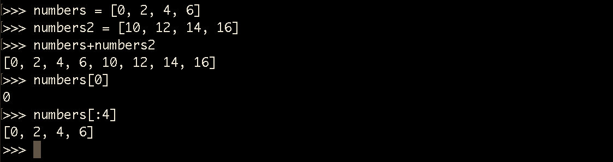

# Brincando com listas

Falaremos de outro tipo de dado que podemos trabalhar com python. Este módulo será sobre listas.

As aplicações desenvolvidas com python, utilizam listas a todo momento. Logo, este assunto é muito importante.

Existem listas de clientes, listas de resultados e muitos outros tipos de lista. Ensinaremos a trabalharem com estas listas.

O primeiro detalhe, que precisam saber é que, as listas recebem qualquer tipo de dado dentro dela. Não precisa ser só string, flutuante ou inteiro. Podemos ter todos os tipos de dados dentro de uma mesma lista.

# Declarando listas

`numbers = [0, 2, 4, 6]` | `numbers2=[10, 12, 14, 16]`

# Concatenando listas

`numbers + numbers2`

# Slice em listas

Podemos utilizar o método slice, da mesma forma que utilizamos com strings. Em vez de caracteres, temos elementos independentes. Vejam a imagem, abaixo:

Da mesma forma que as strings possuem índices, as listas também os possuem. Por isso o **slice** funciona da mesma forma, para os dois tipos de dados.

Vamos supor uma lista com vários tipos de dados, inclusive uma lista dentro desta outra lista. Vejam como trabalhar com este tipo de situação:

Vejam que basta controlar os índices, para chegarmos até o elemento que desejamos acessar.

# Listas mutáveis

Falar que uma lista é mutável, significa que ela pode sofrer alterações. Em uma lista, já criada, podemos adicionar ou remover elementos. Vejam no exemplo, abaixo:

Para adicionar um elemento a uma lista, utilizamos o comando **append()**.

Para remover elementos de uma lista, existem duas formas. Prestem muita atenção, para não confundirem.

Método | Exemplo    | Característica
---------- | -------------- | ----------------
remove | remove(8) | Remove o elemento pelo valor, apagando apenas a primeira ocorrência encontrada
del        | del(numbers[4]) | Remove o elemento, de acordo com seu índice

A principal diferença entre **del** e **remove**, além da estrutura, é que *del* apaga por índice e *remove* apaga por valor. Com o *remove* corremos o risco de apagar o elemento errado, que tenha o mesmo valor. Com *del*  temos a certeza de estar apagando o elemento, de acordo com o índice. Veja qual se adequa melhor ao projeto que estão trabalhando ou a situação em que se encontram.

Pratiquem bastante este assunto de listas, porque, apesar de ser simples, é muito utilizada, durante a programação com python.