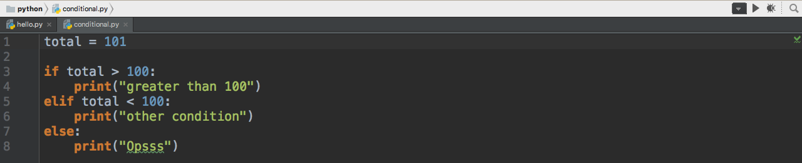

# Condicionais

Neste módulo de condicionais sairemos do cenário do interpretador no terminal. Utilizaremos, para exemplificar os testes e o conteúdo, a IDE PyCharm. Vocês podem utilizar outra.

A PyCharm tem duas versões, a Community e a Professional. Para a conclusão do nosso conteúdo a versão community atende todas as necessidades e é gratuita, podem baixar.

Vocês podem fazer o download direto do site da JetBrains: <https://www.jetbrains.com/pycharm/download/>.

Neste módulo, o objetivo não é falar sobre IDE e sim, de condicionais. Começaremos a falar sobre este assunto, que é tão importante para o desenvolvimento de aplicações.

Criaremos um arquivo chamado conditional.py, no mesmo local onde criamos o arquivo hello.py. Neste arquivo inseriremos o conteúdo e os exemplos do assunto atual.

# If, elif e Else

O **if**, **elif** e **else** são condições existentes para utilizarmos sempre que precisamos fazer uma escolha, em um determinado momento, na aplicação. Quando existem 3 ou mais condições, possíveis, utilizamos todas as condicionais, se forem apenas duas, podemos utilizar o if e o else apenas.

## Estrutura condicional

Na imagem acima podemos ver o seguinte teste:

1. Testamos se o valor, atribuído à variável total, é maior que 100
2. Testamos se o valor, atribuído à variável total, é menor que 100
3. A terceira e última condicional só vale caso as duas anteriores não forem atendidas. Se trata do else.

Em nosso exemplo, como atribuímos 101, a primeira condição será verdadeira, então teremos a execução do primeiro bloco.

Vocês podem e devem alterar os valores para a variável **total**, para irem testando. Podem, também, alterar as lógicas das condicionais, para fixarem melhor.

Notem que, em python, nós não utilizamos ponto e vírgula(;) no final de cada linha, nem utilizamos abertura e fechamento de chaves nas estruturas condicionais.

O python trabalha, totalmente, de forma identada. Vocês devem definir um padrão de identação para manter do início até o final do seu projeto. O importante é manter o padrão, para diferenciarem os blocos e condicionais.

Condicional | Característica
---------------- | ------------------
if | Primeiro teste de condição, caso seja verdadeiro executa o bloco definido
elif | Testes intermediários a serem feitos, caso o primeiro não seja verdadeiro, podemos ter quantos **elif** quisermos
else | Última verificação, caso nem a primeira nem as demais condições tenham sido atendidas, caímos no bloco **else**, que será executado

Vocês podem verificar que o modo de trabalhar com condicionais, no python, é muito simples. Apenas fiquem atentos com a sintaxe que o python trabalha, principalmente se vêm de outras linguagens. 
Pratiquem bastante, criem novas estruturas condicionais e exemplos, para fixarem o conceito de identação e o **NÃO** uso de ponto e vírgula nos finais de cada linha.

Depois de tudo feito, acessem a pasta do projeto, pelo terminal, e rodem o comando abaixo, para conferirem os resultados:

`python3 conditional.py`

Desta forma terão os resultados do arquivo que acabaram de desenvolver as lógicas.