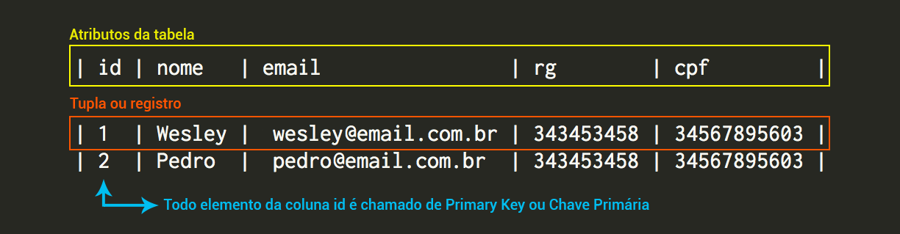
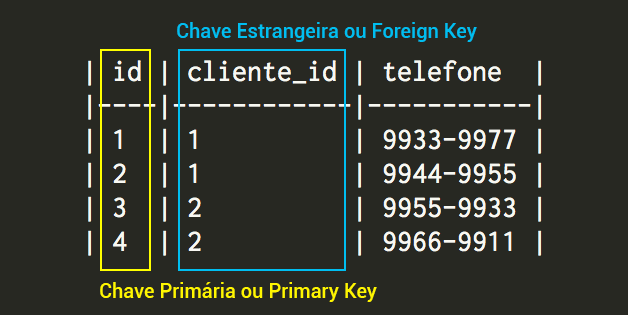

# Relacionando

Criaremos um exemplo de relacionamento entre duas tabelas simples. As tabelas serão clientes e contatos.

**Tabela de clientes**

| id | nome   | email                | rg        | cpf         |
|----|--------|----------------------|-----------|-------------|
| 1  | Wesley | wesley\@email.com.br | 343453458 | 34567895603 |
| 2  | Pedro  | pedro\@email.com.br  | 343453458 | 34567895603 |

**Tabela de contatos**

| id | cliente_id | telefone  |
|----|------------|-----------|
| 1  | 1          | 9933-9977 |
| 2  | 1          | 9944-9955 |
| 3  | 2          | 9955-9933 |
| 4  | 2          | 9966-9911 |

Confira, na imagem abaixo, os nomes de cada elemento das tabelas, para que comece a se habituar com os mesmos.

As colunas id, nome, email, rg e cpf são chamados de atributos da tabela. Assim como a tabela de contato de os atributos id, cliente_id e telefone.

Cada linha de registro no banco de dados é chamado de tupla ou registro.

Os elementos da coluna id são as chaves primárias que não podem ser repetidas e servem de identificador único de cada cliente, por exemplo.

Vejam que quando fazemos um relacionamento entre tabelas identificamos um dado de outra tabela através da chave estrangeira. Isso quer dizer que o registo um e dois, da tabela de contatos, referenciam o cliente de id igual a um, da tabela de clientes, ou seja, Wesley. Desta mesma forma se darão os demais relacionamentos.

Não se preocupem se ainda não entenderam completamente, porque no decorrer dos módulos falaremos mais sobre estes detalhes de relacionamentos e nomenclaturas dos elementos da tabela.