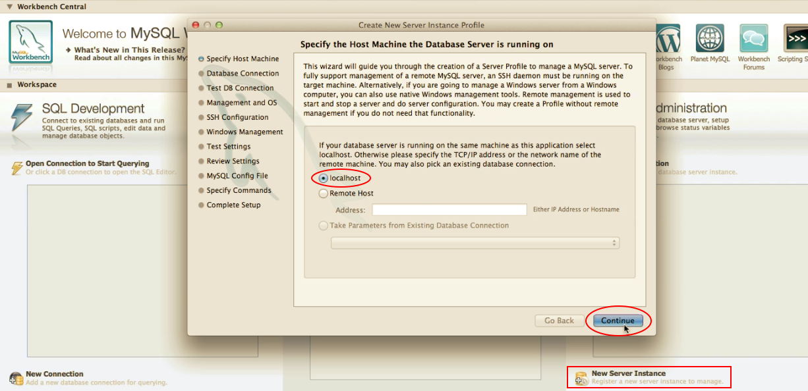
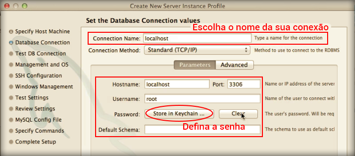
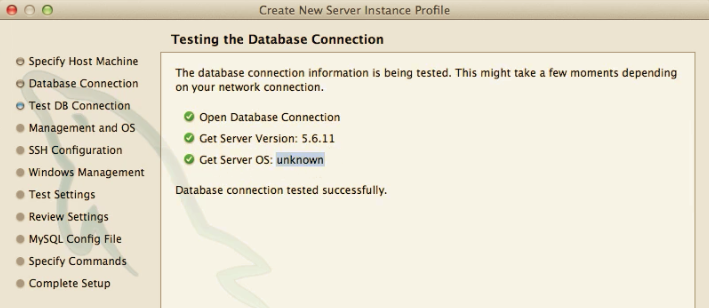

# Configurando instância

Após a instalação precisamos fazer a configuração do MySQL Workbench, para que consigamos trabalhar corretamente com o programa.

O primeiro passo será encontrar o local para adicionar uma nova instância, lembrando que pode alterar de acordo com a versão do Workbench instalado em sua máquina.

Vejam que você deve informar se o seu servidor MySQL está local ou remoto, como instalamos em nossa própria máquina temos que marcar localhost.

O segundo passo será configurar as credenciais para acessar o servidor MySQL. Estas credenciais são: usuário, senha e porta.

Durante a instalação do MySQL você configura sua senha de acesso e o usuário. O padrão de usuário para bancos de dados é root e a senha em branco, quando se trata de localhost, mas alguns desenvolvedores costumas utilizar o root também como senha.

Nesta sessão você só deve alterar dados de usuário e senha, pois a porta já vem padrão e o hostname também. Você pode também configurar um nome para a sua conexão, mas geralmente deixamos localhost como padrão.

O sistema checa as informações que você adicionou acima e se conseguir realizar uma conexão com o servidor você terá a imagem abaixo.

Depois deste processo você pode avançar até o final da configuração e terá, finalmente, sua instância configurada e pronta para gerencias seus bancos de dados.

