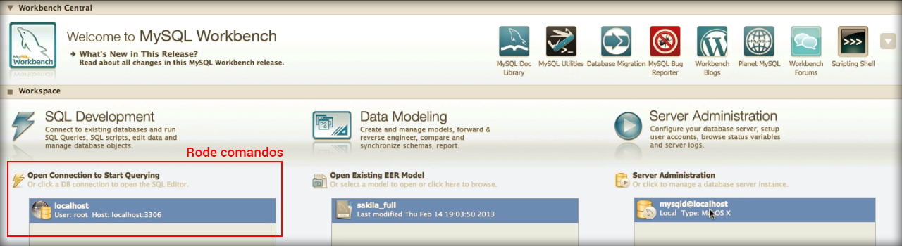
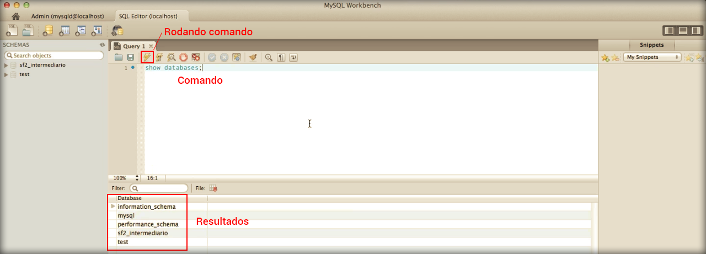

# Rodando primeiro comando

Clicando duas vezes na instância de servidor, que criamos no módulo anterior, conseguimos acessá-lo.

O Workbench nos fornece muitas informações sobre o servidor entre elas estão:

1. Saúde do servidor
2. Status do carregamento
3. Quantos usuários estão acessando
4. Possibilidade de reinicar o servidor
5. Logs do servidor
6. Usuários e previlégios(permissões de cada usuário)

Para que consigamos rodar nosso primeiro comando devemos sair da instância que acessamos anteriormente e acessar outra sessão do programa Workbench. Veja imagem abaixo:



Depois de acessar a sessão onde podemos rodar comandos SQL, você pode listar os bancos de dados existentes através do comando abaixo:

```
show databases;
```

Veja a imagem do comando e os resultados gerados.



Para rodar os comandos basta clicar no ícone de raio.

No próximo módulo mostraremos como criar usuários para gerenciar os bancos de dados.