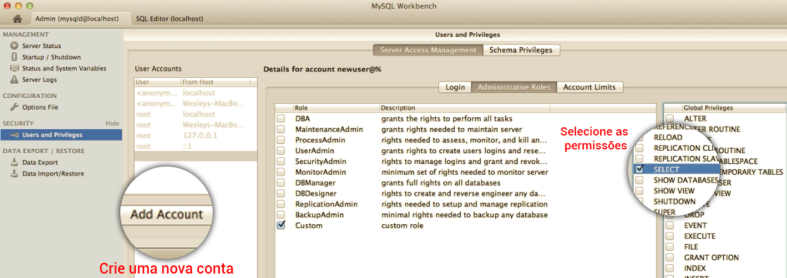
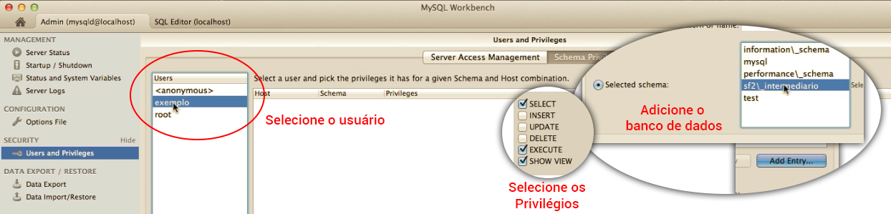

# Usuários

Neste módulo ensinaremos como criar usuários no banco de dados.

Podemos criar um banco de dados e um usuário com o nome de Pedro, por exemplo. O mais interessante é que conseguimos limitar os acessos de Pedro para que ele possa fazer, apenas, seleções no banco. Ele não conseguirá adicionar, alterar ou remover dados, apenas consultar.

Da mesma forma, existe a possibilidade de criarmos um usuário que tenha acesso total ao banco e que possa fazer todas as operações.

Existem algumas formas de atribuir privilégios a um usuário. Veja abaixo:



Primeiro, você deve acessar o menu **Users and Privileges** e clicar em **Add account**. Assim que clicar neste botão você terá acesso a sessão de dados do usuário onde você definirá o nome e a senha do mesmo.

Em seguida, você deve acessar a área de definição de privilégios (Administrative Roles) e selecionar as permissões do usuário criado.

Assim que você cria o usuário e define suas permissões, você está informando que ele terá estas permissões para todo e qualquer banco criado no servidor. Existe uma maneira de estipular permissão para o usuário em um determinado banco. Basta acessar a área **Schema Privileges**. Veja imagem abaixo:



Desta forma, você limita um usuário a um determinado banco, apenas.

As mesmas configurações podem ser atribuídas, via comando. Abra o painel de comandos e rode o comando abaixo:

```
grant all privileges on *.* to exemplo@localhost identified by 'exemplo' with grant option;
```

Para remover, também é muito simples, basta rodar o comando abaixo:

```
revoke all privileges on *.* from exemplo@localhost;
```

Assim, garantimos que o usuário **exemplo** tenha acesso a todos os bancos de dados, pois não definimos um nome específico,  adicionamos **\*.\***, que significa todos.

Não há necessidade de decorar estes códigos porque eles são facilmente encontrados na internet e provavelmente você não precisará criar usuário, a não ser que crie o seu próprio servidor. Caso contrário, as hospedagens já fornecem um usuário criado e configurado.

Durante o desenvolvimento você, geralmente, utiliza o usuário root que tem todos os privilégios. Logo, você não terá problemas de permissões.

O Workbench fornece uma interface muito simples, de forma que você consegue criar usuários facilmente, sem precisar saber muita coisa, pelo fato de ser muito intuitivo.