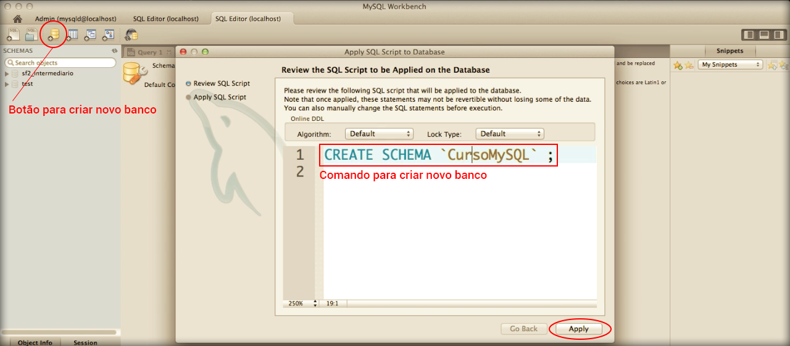

# Criando schema

Da mesma forma que você aprendeu a criar usuários, você aprenderá a criar bancos de dados ou schemas.

O Workbench nos fornece uma interface fácil e intuitiva para criação de banco de dados, também. 

Veja a imagem abaixo:



Após clicar no botão de criação de banco de dados, você deve informar o nome do banco.

Observe que, assim que você cria o banco através da interface gráfica, o Workbench revisa o código antes de aplicar o comando de fato. Desta forma, você pode ver como criar o banco através da linha de comando. Isso é muito bom para que você possa acompanhar os comandos, antes da execução.

Caso crie um banco com o nome errado e queira excluir, basta clicar com o botão direito e clicar em **Drop Schema**. Os comandos para criar e excluir são muito parecidos. 

Veja abaixo:

```
# Criando banco
CREATE SCHEMA `CursoMySQL`
CREATE DATABASE `CursoMySQL`

# Excluindo banco
DROP SCHEMA `CursoMySQL`
DROP DATABASE `CursoMySQL`
```

Você pode escolher criar o banco de forma visual, via interface ou via comandos, caso ache mais simples e rápido. O mesmo se aplica para a exclusão.

Note que com Workbench, ambos são muito simples.