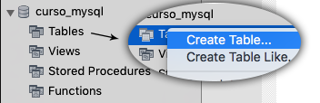

# Criando tabela

Para iniciar a criação de tabelas em nosso banco de dados primeiramente devemos criar um banco de dados. Caso já tenha criado no módulo anterior pode utilizar, caso contrário crie outro banco de dados para este módulo.

Criaremos um banco, chamado **curso_mysql**, com o comando abaixo:

```
create database `curso_mysql`;
```

Depois de criado você pode ir até o banco, na listagem de bancos de dados do Workbench, e clicar na seta que tem ao lado de todos os bancos criados. Ao clicar nesta seta lhe abrirá algumas opções, entre elas a opção **table**.

Basta clicar com o botão direito sob esta opção para criar uma nova tabela. Veja imagem abaixo:



Percebam que basta colocar o nome da tabela e sair adicionando campos dentro dela e no final basta clicar em **Aply** para que a tabela seja criada em seu banco de dados.

Em nosso caso criamos os campos abaixo:

| Campo | Tipo         | Descrição                                                   |
|-------|--------------|-------------------------------------------------------------|
| id    | int          | Campo identificador de cliente configurado como Primary Key |
| nome  | varchar(45)  | Campo de nome do cliente com tamanho de 45 caracteres       |
| email | varchar(100) | Campo de email do cliente com tamanho de 100 caracteres     |

O comando para geração da mesma tabela seria:

```
CREATE TABLE `curso_mysql`.`clientes` (
  `id` INT NOT NULL,
  `nome` VARCHAR(45) NOT NULL,
  `email` VARCHAR(100) NOT NULL,
  PRIMARY KEY (`id`));
```

Esta código sempre é gerado pelo Workbench, antes de executar de fato o comando, serve para que você possa conferir os dados antes de executar.

Sempre que fizer alguma coisa através da interface, ou seja, de forma visual, saiba que você pode executar o mesmo procedimento via comando no MySQL. Você deve escolher qual maneira prefere trabalhar.

Vamos criar uma tabela de produtos somente via código, para que você possa conferir que o processo é o mesmo.

```
CREATE TABLE `curso_mysql`.`produtos` (
  `id` INT NOT NULL,
  `nome` VARCHAR(100) NOT NULL,
  `preco` DOUBLE NOT NULL,
  PRIMARY KEY (`id`));
```

Após rodar este comando você pode atualizar o Workbench, na sessão de banco de dados, e verá as duas tabelas criadas, com suas colunas e prontas para receberem dados.

O mais importante é você entender que por trás de tudo o que estamos fazendo é trabalhar com a linguagem SQL, rodando comandos para a execução de tudo que fizemos até o momento.

Quando executamos um comando de forma visual o Workbench estará rodando o comando MySQL e quando fazemos de forma manual estamos trabalhando diretamente com o comando SQL. Portanto tudo gira em torno do SQL no final das contas.