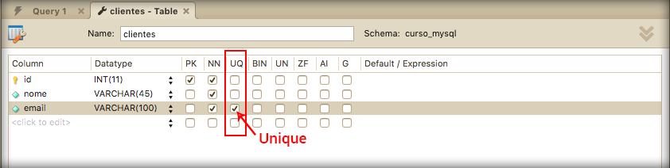

# Unique

No módulo anterior, criamos campos para a tabela clientes e produtos. Ambas tabelas possuiam campos **not null**. Isso significa que aqueles campos não poderiam estar em branco, no momento da inserção dados.

Existem campos que não necessitam ser obrigatórios. Não necessitam estar configurados como not null(NN).

Existem casos que os campos não podem ser repetidos, como:

* Email
* CPF
* RG

Para que dados repetidos sejam bloqueados no momento da inserção, precisamos configurar o campo como **unique(UQ)**. 

Veja na imagem abaixo:



Ao marcar o campo email como unique, o Workbench executou um comando de alteração. 

Veja o comando abaixo:

```
ALTER TABLE `curso_mysql`.`clientes` 
ADD UNIQUE INDEX `email_UNIQUE` (`email` ASC);
```

Isso quer dizer que podemos fazer o mesmo procedimento para qualquer campo, de forma manual e via comando no MySQL.

Não deixe de praticar todos os passos até aqui, para que estes comandos e ações fiquem cada vez mais comuns para você. Desta forma sua fixação será muito melhor e você não terá nenhum problema para criar bancos de dados para suas aplicações futuras.