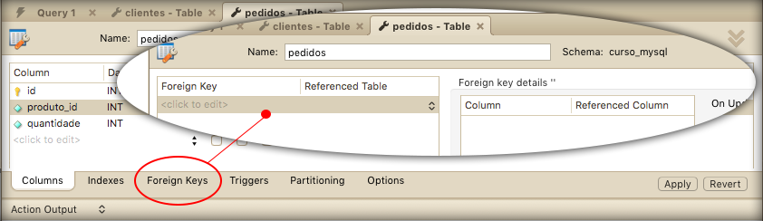

# Chave estrangeira

Antes de falarmos sobre chave estrangeira, precisamos explicar a diferença entre **Primary Key** e campos **Unique**.

Em ambos os casos, não podemos ter elementos repetidos. Porém, a primary key nos auxilia a trabalhar com as chaves estrangeiras, ou seja, ela é responsável por nos auxiliar nos relacionamentos entre tabelas.

Uma chave estrangeira ou foreign key, sempre será uma primary key em outra tabela.

Para explicar melhor o conceito de chave estrangeira, criaremos uma outra tabela chamada pedidos. Todo pedido precisa de um produto, por este motivo será um exemplo perfeito para mostrar a chave estrangeira.

Se fôssemos criar uma tabela de pedidos via comando, sem chave estrangeira, seria desta forma:

```
CREATE TABLE `curso_mysql`.`pedidos` (
  `id` INT PRIMARY KEY,
  `produto_id` INT,
  `quantidade` INT,
  PRIMARY KEY (`id`));
```

Lembrando que você pode fazer o mesmo procedimento visualmente, caso prefira.

Existe a possibilidade de configurar a chave estrangeira através da interface do Workbench, porém faremos de forma manual via comando, para que você possa entender a criação do SQL.

Criando a mesma tabela com chave estrangeira:

```
CREATE TABLE `curso_mysql`.`pedidos` (
  `id` INT PRIMARY KEY,
  `produto_id` INT,
  `quantidade` INT,
  FOREIGN KEY (produto_id) REFERENCES produtos(id)
  );
```

Caso queira criar a relação de chave estrangeira visualmente, siga a imagem abaixo:



Observe que criamos uma referência, através do comando **REFERENCES**, à tabela produtos e ao campo **id** da mesma. Isso significa que o campo **produto_id** da tabela pedidos está relacionado ao campo **id** da tabela de produtos, que é a primary key.

Caso não existisse este relacionamento, teríamos que gravar todos os dados do produto na tabela de pedidos. Com o relacionamento, basta possuir o id do produto e já teremos todos os dados do mesmo.

```
FOREIGN KEY (produto_id) REFERENCES produtos(id)
```

O restante não é nenhuma novidade para você.

As grandes responsáveis pelo relacionamento entre tabelas no MySQL são: 

- as chaves primárias 

- as chaves estrangeiras

Entendendo este conceito, você pode relacionar qualquer tabela de acordo com suas chaves.

Lembrando que uma chave estrangeira sempre será uma chave primária de outra tabela.