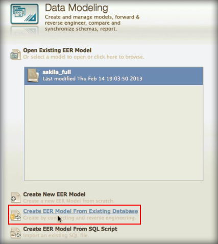
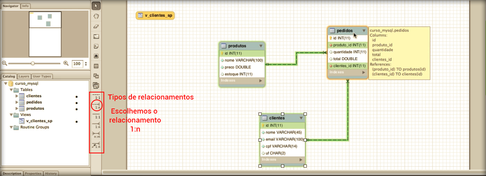
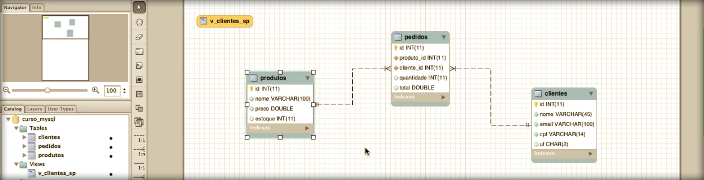

# Modelando

Para trabalhar com modelagem no Workbench você deve escolher iniciar uma modelagem do zero ou inciar a partir de um banco já existente. Como já temos nosso banco de teste vamos seguir a segunda opção.

Após preencher os dados que o programa pede você terá a modelagem aberta em um diagrama e você terá acesso a todos as tabelas criadas, views e relacionamentos.

Arraste as tabelas da maneira que for melhor para você exergar.

Nós adicionaremos mais um relacionamento para que você entenda. Crie o relacionamento de pedidos com clientes, uma vez que sempre um pedido deve estar relacionado a um cliente.

Veja imagem:

Vejam que escolhemos o tipo de relacionamento, do lado esquedo da imagem, depois clicamos na box de pedidos e logo depois na box de clientes. Isso já é o suficiente para criar o relacionamento entre as duas tabelas.

Portanto o procedimento para criar o relacionamento é:

1. Escolha o relacionamento
2. Clique na primeira tabela
3. Clique na segunda tabela

Pronto o relacionamento está criado de uma forma extremamente fácil.

Em nosso caso criamos um relacionamento **1:n**, isso significa que um cliente pode estar em vários pedidos, mas em um pedido só pode haver um cliente.

Você pode estudar mais sobre relacionamentos para entender os diversos tipos existentes.

Na imagem acima você pode ver o nosso relacionamento de uma forma bem visual, onde nós escolhemos a posição das tabelas com o recurso de arrastar que o programa de modelagem oferece.

No próximo módulo falaremos mais sobre relacionamento.