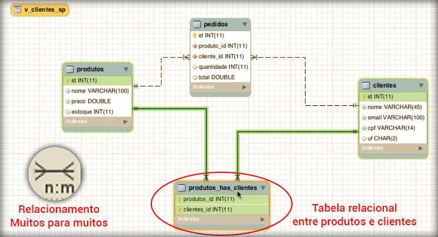

# Relacionamentos

Neste módulo falaremos mais sobre os tipos de relacionamentos.

### Um para um(1:1)

Cada registro de uma tabela pode estar relacionado a apenas um outro registro de outra tabela.

### Um para muitos(1:n)

Este é o relacionamento que utilizamos tanto de produtos para pedidos quanto de clientes para pedidos. Ou seja, um produto pode estar em vários pedidos e um cliente também pode estar em vários pedidos.

| Um       | Muitos  |
|----------|---------|
| produtos | pedidos |
| clientes | pedidos |

Um exemplo clássico deste relacionamento é um blog, que possui vários posts e nestes posts podem haver muitos comentários. Isso significa que para cada post existem vários comentários, então se caracteriza um relacionamento um para muitos.

### Muitos para muitos(n:n)

Este relacionamento exige uma tabela intermediária onde podemos fazer a relação entre outras duas tabelas.

Para exemplificar uma relação deste tipo podemos criar um relacionamento de muitos para muitos entre a tabela de produtos e a tabela de clientes. Imagine que você queira saber qual cliente comprou cada produto, por exemplo.

Isso quer dizer que teremos uma tabela intermediária para fazer este relacionamento.

Observe que, ao criar o relacionamento muitos para muitos o próprio workbench cria a tabela pivô e também sugere um nome.

Desta forma, conseguimos fazer relatórios de qual cliente comprou cada produto e vice-versa.

Após realizar a alteração no modo modelagem, basta acessar o menu **Database** e clicar em **Synchronize model**. O Workbench fará toda sincronização, adicionando todas as alterações e criações efetuadas.

Para finalizarmos este tema de MySQL, gostaríamos de frisar que o conteúdo não é avançado. Nosso objeto é dar uma boa base e uma boa introdução ao conhecimento da linguagem SQL, utilizando o banco de dados MySQL e o programa Workbench.

Este assunto é muito extenso e cabe a você querer uma especialização ou não. Garantimos que com a base que demos você terá condições de acompanhar qualquer outro conteúdo do mesmo tema, para expandir os seus conhecimentos.

Esperamos que você tenha gostado.