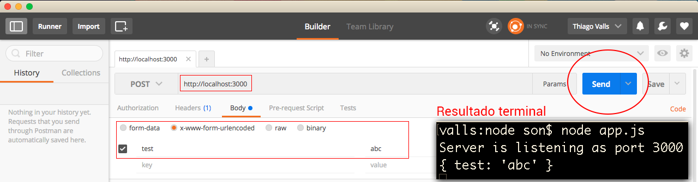

# Trabalhando com evento emitter

Neste capítulo falaremos sobre event emitter. Mostraremos como este recurso ajuda o Node a ter uma boa velocidade de processamento. Utilizaremos o arquivo app.js, para os exemplos.

Com o **evento**, o Node cria determinadas funções que, logo após serem criadas, ficam aguardando um evento, pré-programado, acontecer. A partir do momento que o evento acontece, a função é chamada, imediatamente.

O Node possui uma classe chamada **event emitter** que trata destes eventos. Ensinaremos como utilizá-la.

```js
var events = require('events');
var emiter = new events.EventEmitter();

emiter.on('say' , say);

function say(){
    console.log('Im saying...');
}
```

Reparem que importamos a classe **events**, para a variável events. Em seguida, criamos uma variável chamada emiter e atribuímos o método **EventEmitter** a ela.

Logo após, preparamos o evento **say**, que chamará a função **say**, assim que acionado. Observem que, deixamos o evento programado, conforme falamos anteriormente, mas a função não foi acionada, apenas foi carregada e está aguardando o disparo.

Para termos certeza de que a função está criada, rodaremos um **console.log** e subiremos o servidor, novamente, com o comando abaixo:

```js
var events = require('events');
var emiter = new events.EventEmitter();

emiter.on('say' , say);

function say(){
    console.log('Im saying...');
}

console.log(say);
```

`node app.js`

Vejam o resultado abaixo:


De acordo com a imagem acima, podemos ter certeza de que a função foi criada e está apenas aguardando o disparo, para executar. Vamos chamá-la.

```js
// Chamando função direta
say();
// Chamando função via evento
emiter.emit('say');
```

Em nosso exemplo, o evento tem o mesmo nome da função, mas não precisa ter o mesmo nome, vocês podem registrar o evento com o nome que quiserem.

Este, foi um exemplo com eventos criados por nós. Existem eventos nativos, do próprio Node. Aproveitaremos que estamos utilizando o servidor como exemplo e utilizaremos a função handle, para exemplificar. 
Acessem o arquivo handle e adicionem o código abaixo:

```js
var querystring = require('querystring');
function handle(request,response){
    response.writeHead(200,{
        'Content-Type': 'text/html'
    });

    var body = '';
    request.on('data',function (data) {
        body += data.toString();
    });

    request.on('end', function () {
        var decode = querystring.parse(body);

        console.log(decode);
    });

    response.write("<!DOCTYPE html>");
    response.write("<html>");
    response.write("<head><title>Http Module</title></head>");
    response.write("<body>");
    response.write("<h1>Hello from http module SON</h1>");
    response.write("</body>");
    response.write("</html>");

    response.end();
}

module.exports = handle;
```

Primeiro, nós importamos a **querystring**, em seguida, criamos uma variável **body**, inicialmente vazia. Logo depois, preparamos o evento **data**, que pega os valores da requisição e joga na variável body.

Depois de ter capturado os valores para variável body, o evento **end** pega a querystring, dá um **parse** na variável body e decodifica.

O importante é entenderem que estes eventos já são executados durante o ciclo de vida do servidor que criamos. Logo, teremos o resultado, automaticamente. Não precisaremos disparar estes eventos. Vejam, na imagem abaixo, o resultado que teremos após enviar uma request para o servidor.
Utilizamos o **postman**, para enviar a requisição.



Nós, somente, enviamos uma requisição, que já foi capturada pelos eventos e a decodificou para o formato json.

Este é um exemplo de como trabalhar com programação orientada a eventos. Chegamos próximo ao que os frameworks executam para fazer o decode para json, por exemplo.

Façam testes e leiam com calma. Este assunto não é tão simples, mas lendo com calma e analisando os procedimentos, temos certeza que irão entender e adorar este recurso que o Node disponibiliza.