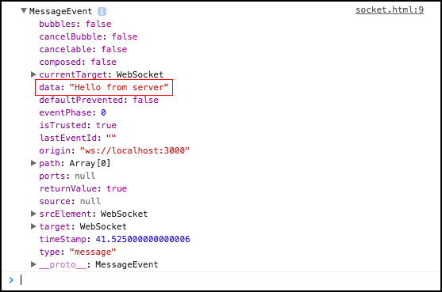
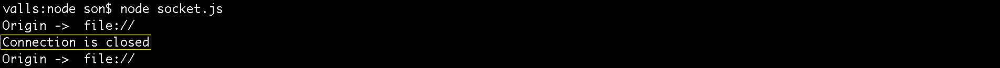

# Trabalhando com Websockets

Ensinaremos como trabalhar com Websockets.

Todos sabem que o node é famoso por ter um suporte muito bom a Websockets. Por este motivo, é tão comum encontrarmos, na internet, materiais falando de websockets, com exemplos de chats, ou qualquer aplicação que exija tempo real.

Websockets é uma forma, muito interessante, de mantermos uma aplicação de ponta a ponta, onde seja necessária a execução em tempo real, sem a necessidade de refresh.

O primeiro passo será a instalação do pacote chamado **websocket**.

`npm install websocket --save`

Após a instalação, criaremos um novo arquivo chamado **socket.js**. Neste arquivo configuraremos nossos eventos, da mesma forma que trabalhamos com event emitter.

```js
var ws = require('websocket').server;
var http = require('http');

var socket = new ws({
   httpServer: http.createServer().listen(3000)
});

socket.on('request' , function (req) {
    var conn = req.accept(null, req.origin);
    console.log('Origin -> ', req.origin);

    conn.on('message', function (message) {
        conn.sendUTF('Hello from server');
    })

    conn.on('close', function () {
        console.log('Connection is closed');
    })
});
```

Primeiro, importamos o webpack que instalamos. Em seguida, importamos a classe http e, somente depois, criamos uma instância do websocket, passando como propriedade **httpServer**.  Um server que criamos através da classe http.

O próximo passo é definirmos 3 eventos para serem disparados:

1. O primeiro evento é disparado quando uma requisição é feita e o evento é responsável por pegar os dados de origem do usuário que está acessando.
2. O segundo evento irá responder, com uma mensagem, quando o client enviar uma mensagem.
3. O terceiro evento enviará uma mensagem, quando a conexão for fechada.

Se rodarem o arquivo socket.js, no terminal, vocês não terão resultado no browser, porque ainda não estamos fazendo nenhuma requisição

Para isso, criaremos um arquivo chamado socket.html, onde teremos o conteúdo abaixo:

```html
<script type="text/javascript">
    var socket = new WebSocket('ws://localhost:3000');

    socket.onopen = function () {
        socket.send('Im open from client');
    };

    socket.onmessage = function (message) {
        console.log(message);
    }

    socket.onerror = function (err) {
        console.log('Erro ->' , err);
    }
</script>
```

No arquivo html, criamos um script onde instanciamos uma variável do websocket, passando o endereço de nosso server.

Como o browser já tem suporte ao HTML 5, nós temos suporte ao websocket, nativamente. Portanto, logo que abrirem a página, já terão disparado um evento ao servidor, que retornará um objeto. 
Vejam na imagem abaixo:



Se quisermos mostrar só a mensagem do servidor e não o objeto completo, bastam acessar a propriedade data do objeto.

```js
    socket.onmessage = function (message) {
        console.log(message.data);
    }
```
Se olharmos no terminal, veremos os seguintes dados.



Podemos ver que a origem do acesso é **file** e conseguimos ver, também, a mensagem de encerramento da conexão, que configuramos no arquivo socket.js.

# Conclusão

Apesar de ser um conceito um pouco mais complexo, vocês podem observar que trabalhar com websocket não é tão difícil. 
Com pouco código, conseguimos fazer uma interação com websocket, conectando client e server, em tempo real.

Leiam com atenção este conteúdo, refaçam quantas vezes forem necessárias, para fixarem o conceito. Pesquisem um pouco mais sobre o assunto, para aprofundarem os conhecimentos. 
