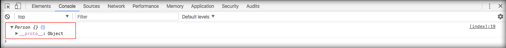
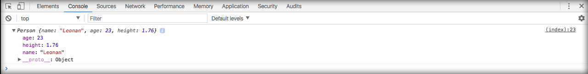

# Métodos e atributos

Mostraremos qual a diferença entre atributo e método. Veja como criar atributos em uma classe.

```html
<script>
    function Person() {
        this.name;
        this.age;
        this.height;   
    }
</script>
```

Observe que adicionamos os atributos sem valores específicos. Você pode atribuir valores nulos ou valores pré-definidos. O comum é criar de forma vazia para que o valor seja atribuído quando o objeto for instanciado.

Na classe Person você pode ver três atributos ou características. Para trabalhar com esta classe, criaremos um novo objeto que receberá uma instância desta classe. Veja abaixo:

```js
var leonan = new Person();
```

Note que estamos atribuindo um novo objeto, que é uma instância da classe Person, para a variável **leonan**. À partir deste ponto temos acesso a: altura, idade e ao nome do objeto leonan.

Caso queira conferir, você pode adicionar um log para inspecionar no browser.

```html
<script>
    function Person() {
        this.name;
        this.age;
        this.height;   
    }

    var leonan = new Person()
    console.log(leonan)
</script>
```

Veja o resultado do developer tools informando que a variável leonan é um objeto da classe Person.



Para atribuir valores aos atributos, podemos acessá-los da seguinte forma:

```js
var leonan = new Person()
leonan.name = "Leonan"
leonan.age = 23
leonan.height = 1.76

console.log(leonan)
```

O console deverá mostrar o seguinte resultado:



Para que você entenda o conceito de objeto e veja a possibilidade de usar uma mesma classe para duas pessoas diferentes, analise o código abaixo:

```js
var leonan = new Person()
leonan.name = "Leonan"
leonan.age = 23
leonan.height = 1.76

var victor = new Person()
victor.name = "Victor"
victor.age = 23
victor.height = 1.76

console.log(leonan)
console.log(victor)
```

Acesse o navegador e analise o console. Você verá que se tratam de dois objetos diferentes e com dados diferentes, mas instâncias de uma mesma classe. Este é o conceito de reaproveitamento de código que nos referimos nos módulos anteriores.

Você pode criar quantos objetos forem necessários para sua aplicação, basta instanciar e utilizar.

### Métodos

Métodos são funções internas a uma determinada classe, ou seja, funções dentro de funções.

Diferentemente dos atributos que só guardam valores, os métodos são capazes de processar os atributos e retornar outros valores através de uma lógica pré-estabelecida.

```html
<script>
function Person() {
    this.name;
    this.age;
    this.height;   

    this.sayHello = function(){
        console.log('Hello')
    }
}
</script>
```

Observe que, além dos três atributos agora temos um método chamado **sayHello**. Este método estará disponível tanto no objeto leonan, quanto no objeto victor. Basta acessar o console para conferir.

Este método precisa ser executado para ter o efeito esperado. Caso não seja executado ele apenas estará disponível no objeto, sem efeito algum.

Para executar a função, basta acessar diretamente assim como qualquer atributo. Veja abaixo:

```js
var leonan = new Person()
leonan.sayHello()

var victor = new Person()
victor.sayHello()
```

Você poderia trabalhar com métodos dinâmicos, que recebem parâmetros. Desta forma você pode ter uma função que imprime uma mensagem de saudação, por exemplo. Veja o exemplo abaixo onde passamos o atributo name do objeto, como parâmetro, para o método.

```js
function Person() {
    this.name;
    this.age;
    this.height;   

    this.sayHello = function(name){
        console.log('Hello ' + name)
    }
}

var leonan = new Person()
leonan.name = "Leonan"
leonan.age = 23
leonan.height = 1.76
leonan.sayHello(leonan.name)
```

Desta forma o método **sayHello** devolverá a seguinte mensagem, no console:

> Hello Leonan

O último ponto importante a ser ressaltado é o uso do operador **this**. Caso você tente criar um método dentro da classe sem o uso deste operador, o mesmo não fará parte do escopo e você não conseguirá acessá-lo através do objeto. É muito importante o uso do **this**, para que sua classe tenha os atributos e métodos associados corretamente a ela.

Você entenderá melhor este conceito quando falarmos de modificadores de acesso. No momento, apenas entenda estes conceitos de métodos e atributos e saiba diferenciá-los.