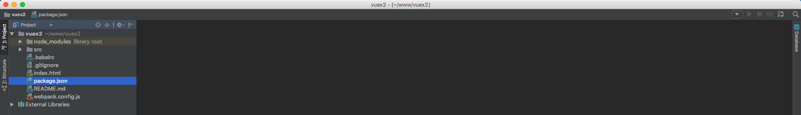

# Criando aplicação Vue.js

Para trabalhar com o conteúdo proposto, iremos refatorar a  aplicação do Campeonato Brasileiro, visto no conteúdo sobre Vue.js 2.

Deixaremos o link, abaixo, para a documentação do Vuex 2. Vocês poderão consultá-lo durante o estudo. 
Poderão, também, ler sobre as versões anteriores e pesquisarem sobre a biblioteca. 

<http://vuex.vuejs.org/en/>

Vale lembrar que é muito importante, sempre que tiverem qualquer dúvida, buscar primeiro, a documentação da ferramenta, antes de ir em qualquer fórum ou blog para consultar. Isto porque,  a documentação da ferramenta é o local oficial e mais seguro para obter qualquer informação.

***

É muito importante que tenham conhecimento de **webpack** para que possam aproveitar, ao máximo, o conteúdo deste assunto. Caso não tenham conhecimento, procurem ler, antes de prosseguir. 
A School Of Net tem conteúdo sobre webpack, também.

Será preciso ter instalado, em sua máquina, o Node.js.

Caso não tenha, acesse o link <https://nodejs.org/en/> e faça o download e instalação da ferramenta. 
É pré-requisito ter a ferramenta configurada em seu sistema operacional. 
Se já leu o conteúdo de Vue.js 2, com certeza, já fez a instalação e já tem em sua máquina local. 
No momento da criação deste conteúdo, estamos na versão 6.9.2 como sendo LTS, mas temos a versão 7.3.0 que é atual. 
Vocês podem escolher com qual trabalhar. Idicamos utilizar a versão LTS, sempre, porque terá suporte garantido durante um bom tempo, até que a versão atual torne-se a LTS (Long Term Support).

No Windows e no Mac a instalação se dá com apenas alguns cliques e no Linux vocês conseguem encontrar o tutorial, no próprio site, onde conseguirão instalar via `apt-get ou yum`, dependendo a distribuição que utilizarem.

Além do Node, precisaremos ter instalada a ferramenta de linha de comando do Vue. Quem vem do conteúdo de Vue 2 já terá instalada. 
Para saber se tem ou não a ferramenta, basta digitar `$ vue` no terminal. Terá o retorno de dois comandos: init e list

Comando | Função
------------- | ----------
init | serve para iniciarmos uma aplicação com Vue
list | listar os tipos de templates que podemos criar na aplicação. Atualmente existem 5 tipos.

Liste em seu terminal para saber todas as opções. Já adiantamos que utilizaremos o template webpack-simple. 
Desta forma, para trabalharmos com o webpack, teremos que fazer algumas configurações, para que ele funcione corretamente. 
No conteúdo de Vue 2, nós fizemos a configuração e falamos sobre.

Com webpack nós conseguimos criar módulos, fazer requires e trabalhar com módulos da ES6. 
Poderíamos trabalhar da forma antiga, utilizando somente javascript puro. Mas, queremos orientá-los a sempre trabalharem com a ES6. 
A ES6 já está disponível, há um bom tempo. 
Na School Of Net há conteúdo sobre o assunto para que possam aprender a utilizar e estar por dentro do que há de mais novo no mundo do desenvolvimento.

# Iniciando a  aplicação

Abra seu terminal, acesse o local onde queira criar sua aplicação e rode o comando 

`$ vue init webpack-simple vuex2`.

A instalação pedirá algumas informações para que seja criado o arquivo **package.json**. 

Você pode informar ou clicar em "enter" para ir prosseguindo.

Segue a estrutura da aplicação após a instalação:

Diretório/Arquivo | Função
---------------------- | -----------
**node_modules** | Pasta criada à partir do comando `npm install` que armazena todos os arquivos pertencentes às dependências instaladas em seu projeto
**src** | Pasta responsável por armazenar os arquivos do projeto
**.babelrc** | Arquivo de configuração, necessário para informar para qual versão de nossa ECMAScript será compilado o código. Neste caso da ES6 para ES5. Lembrando que, isso é necessário porque, nem todos os browsers são compatíveis com a ES6
**.gitignore** | Arquivo que ignora os itens para o controle de versão
**index.html** | Arquivo inicial do projeto
**package.json** | Arquivo com todas informações e dependências do projeto
**README.md** | Arquivo de instruções sobre a aplicação
**webpack.config.js** | Arquivo de configuração do **webpack**, que nos permite empacotar toda aplicação javascript

Já falamos que o package.json é responsável por toda configuração das dependências do projeto. Mas precisamos falar, também, que existem dois scripts: dev e build.

Script | Função
-------- | -----------
dev | podemos rodar a aplicação em modo de desenvolvimento com a funcionalidade inline hot, rodando apenas o comando `$ npm run dev`
build | gera a aplicação em modo de produção para que possamos subir para o servidor. Comando `$ npm run build`

Vocês podem pesquisar sobre cada dependência da instalação do projeto, mas não é o foco, no momento. Falaremos, a medida que for necessário.

# Subindo aplicação

Para conferirmos se a aplicação está rodando corretamente, iremos rodar, no terminal, `$ npm run dev`. 

Veja a imagem abaixo:

Se em seu browser, tiver o resultado acima, é porque está tudo correto e estamos prontos para dar início ao conteúdo.