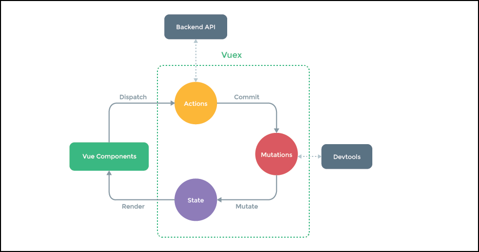

# Vuex

O conteúdo apresentado até aqui e todas as informações complementares, servirão como base para inciarmos com o VueX.

Ela é a implementação da fonte única da verdade, baseada no Flux e no Redux, para que possamos trabalhar com os componentes usando o Vue.js.

Há a  documentação que poderão acessar. Ela é muito pequena, bem menor que a do Redux e a implementação é muito simples. 
O VueX é muito fácil de usar.

<https://vuex.vuejs.org/en/intro.html>

O que autor do Vuex fez, é digno de aplausos. Todas as ferramentas desenvolvidas para o Vue.js, difere, e muito, de todas as outras. 
Por esse motivo, o Vue tem sido mais utilizado e, algumas empresas e desenvolvedores, já vêm aderindo ao uso dele. 
Temos que olhar para este framework com carinho e não podemos ficar desatualizados.

Precisamos, sempre, manter a imagem acima em nossa cabeça. Este é o fluxo que os dados irão seguir para trabalhar com o Vuex. Temos as views chamando as ações, que irão refletir no estado que, por sua vez, irão refletir na view. 
Este fluxo ou ciclo, é sempre constante.

A imagem, acima, resume toda implementação do Vuex. Preste muita atenção em todo conteúdo, abaixo.

Imaginem que temos o componente, que está de cor verde. Em seguida, despacharemos alguma ação, que será a alteração do estado da aplicação. 
A ação pode ser assíncrona, por isso, temos aquela ação externa chamada **backend API**. 
Depois da ação, teremos uma mutação e é a mutação que, de fato, alterará o estado. 
Por fim, o estado irá refletir as atualizações, na renderização das views.

É desta forma que funciona o ciclo do Vuex. Você precisa entender este processo e, se precisar, acesse sempre esta imagem, porque ela resume muito bem, todo o ciclo.

Se analisarem a imagem, vocês poderão ver que, durante a mutação, existe um processo que pode agir, externamente. 
É uma ferramenta de desenvolvimento do Vue.js. Conseguimos ver os componentes que temos e também ter um acompanhamento e histórico dos estados, sendo alterados.

Podemos reduzir a imagem, acima, se não utilizarmos nenhum tipo de ação assíncrona ou ações normais. 
Há a possibilidade de  trabalhar, diretamente, com as mutações. Isso quer dizer que, o componente pode executar uma mutação, direta, no estado.

O fato mais importante que temos que entender, é que, o estado ou armazém, só será alterado por mutações, independente se existirá uma action ou não. 
O estado nunca será acessado, diretamente, pois este é o conceito da fonte única da verdade.

A partir de agora, aquela funcionalidade de two-way databinding, se torna obsoleta, porque,mesmo que tenhamos o objeto, com o modelo de dados pronto para ser alterado, nós não conseguiremos alterar, diretamente, como tínhamos feito até o momento. Somente através das mutações.

Iremos trabalhar exatamente como manda a arquitetura do Vuex. E utilizaremos o Vuex 2, que foi lançado, logo após o lançamento do Vue 2.

# Diferença do Vuex 2 para o Vuex 1

Alguns equívocos foram removidos e temos uma ferramenta muito menos acoplada ao Vue.js. 
Antes, tínhamos que fazer: algumas configurações, restritas no componente, configurar getters e actions. 
Agora, não precisamos mais. Estamos centralizando as configurações no próprio armazém, só temos que chegar no componente e utilizá-lo. 
Não precisamos mais ficar acoplando o componente ao Vuex. Será necessário apenas importar o armazém e fazer o que quisermos, a partir daí.

Não temos uma mudança muito drástica de uma versão para outra. A migração será muito fácil para quem já utilizava a versão anterior. 
Não há nada que poderá quebrar, totalmente, sua aplicação quando mudar para o Vuex 2.

Preparem-se para começar a trabalhar com a nova ferramenta, que revolucionará  suas aplicações. 
Terão todo controle, de todos os componentes.