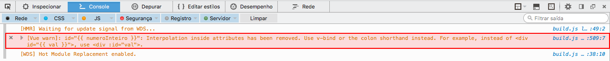
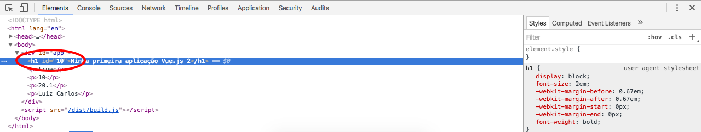

# Property binding

Antes de falarmos sobre **property binding**, daremos outros exemplos de **data binding**, para fixarmos melhor. 
Vale lembrar que, o objeto **data**, que definimos no arquivo **main.js**, pode trabalhar com muitos modelos de dados. Como por exemplo: pode ser número inteiro, número decimal, booleano e também objetos.

Lembre-se que você é responsável por controlar todos os dados da sua aplicação. Não há outra forma de controle dentro da instância Vue, a não ser, utilizando objetos. 
Portanto, qualquer valor que for controlar, deverá adicionar um objeto referente à ele.

**Exemplos**

```
new Vue({
  el: '#app',
  data: {
    título: "Minha primeira aplicação Vue.js 2",
    bool: true,
    numeroInteiro: 10,
    numeroFloat: 20.10,
    objeto: {
        name: "Luiz Carlos"
      }
  }
})
```

Recuperando dados na **view**:

```html
<div id="app">
    <h1>{{ título }}</h1>
    <p>{{ bool }}</p>
    <p>{{ numeroInteiro }}</p>
    <p>{{ numeroFloat }}</p>
    <p>{{ objeto.name }}</p>
</div>
```

Resultado:


***

## Antigo modelo do uso de propriedades

Vamos explicar a diferença entre a estrutura utilizada na versão 1 e o **property binding** utilizado pelo Vue 2.0. Observando os dois modelos, dará para entender melhor.

```html
<div id="app">
  <h1 id="{{ numeroInteiro }}">{{ título }}</h1>
</div>
```

Na versão 1 poderíamos utilizar o código acima, que não teríamos problema algum e a interpolação iria definir o **id** com o valor informado, porém com o Vue 2.0, este modelo foi depreciado. 
Se rodar no browser, irá ocorrer um erro, onde podemos conferir no console do developer tool.



***

## Novo modelo do uso de propriedades

Para conseguirmos atribuir um valor ao nosso **id**, da maneira correta na versão 2.0, temos que utilizar o conceito de **property binding**. Ou seja, iremos pegar uma propriedade de um elemento HTML e ligar ao nosso modelo de dados, presente na nossa instância Vue.

**Veja o novo exemplo**

```html
<div id="app">
  <h1 v-bind:id="numeroInteiro">{{ título }}</h1>
</div>
```

Dessa maneira, adicionamos o **v-bind:**, antes da propriedade, que quisermos alterar, e inserimos o nosso **modelo de dados**, sem a interpolação **{{ }}**. 
Só isso, já será capaz de trazer, automaticamente, o dado para propriedade **id**.



Podemos transformar todas as propriedades, de um elemento, em um **property binding**. Dependendo qual propriedade for utilizar, poderá ter um comportamento diferente.

> **Por exemplo:**  o caso de um style ou class, nós temos mais funcionalidades.

***

## Mais um exemplo, utilizando elemento âncora do HTML

Primeiro adicionamos nosso modelo de dados, chamado **link** em nossa instância Vue.

```
new Vue({
  el: '#app',
  data: {
    link: "http://localhost:8080"
  }
})
```

Depois, adicionamos o nosso property binding, à propriedade **href**, do nosso elemento **a** do HTML.

```html
<div id="app">
  <a v-bind:href="link">Home</a>
</div>
```

Resultado:


Esta, é uma outra maneira de ligarmos a nossa **view** com nosso modelo de dados, além da interpolação que já vimos, anteriormente.

***

# Forma abreviada de property binding

Podemos utilizar a forma mais enxuta do **property binding** da seguinte forma:

Em vez de utilizar `v-bind:id`, podemos utilizar somente `:id`, que teremos o mesmo resultado e o código fica menor e mais legível.

