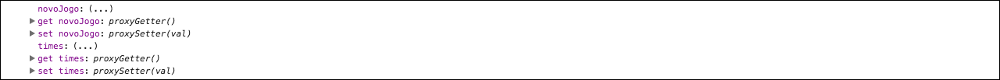
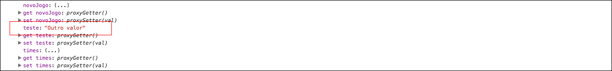
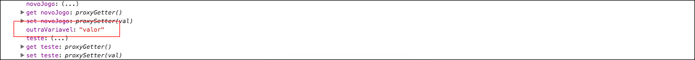

# Dados por trás do Vue

Iniciaremos falando de outro ponto, muito importante do Vue.js, que é entender o seu funcionamento por trás. 
Evidente que não iremos pegar todo código do Vue para estudar e entender. Mas precisamos ter este conhecimento macro do seu funcionamento, no back-end.

Vocês puderam ver, no conteúdo anterior, que nós conseguimos fazer a inicialização do modelo de dados **novoJogo**, através do método **created** e, pudemos verificar que o **this** se tratava do próprio contexto do objeto. 
No Vue.js tudo é explícito, você tem acesso aos dados, métodos e recursos, diretamente. 
Não estamos trabalhando com um framework que esconde a sua implementação e que você não consegue enxergar, de cara, os dados se movimentando. Com Vue, podemos enxergar tudo, claramente.

Em vez de, somente, criarmos uma instância Vue, iremos criar uma variável **let** e atribuir esta instância a ela.

**Exemplo:**

Modo anterior | Novo modo
-------------------- | ----------------
`new Vue({ })` | `let meuVue = new Vue({ })`

Depois desta alteração, podemos dar um `console.log(meuVue);`, no final do arquivo main.js. Assim analisaremos o objeto no console:


O mais importante neste console.log, é observar que, na sua raiz podemos encontrar nossos modelos de dados, facilmente. Também é interessante falar que, para cada modelo de dados que criarmos, existirá um **get** e um **set** para ele.

## Como o Vue.js trabalha?

Quando criamos uma propriedade em nosso objeto **data**, seja ela qual for, esta propriedade, de fato, não irá existir. 
Para que os **observadores - {{ }}** consigam entender quando um dado é modificado, o Vue.js irá criar um encapsulamento para nossa propriedade.

Quando executamos `this.novoJogo.casa.time = this.times[indexCasa];` o Vue está fazendo um `setNovoJogo()` por trás. 
A propriedade se torna um método, com o encapsulamento do Vue. Podemos disparar eventos e criar lógicas, para que os **data bindings** possam ser executados, manualmente.

Isso quer dizer que um modelo de dados não é só alterado dentro do meu main.js, de forma manual. Podemos fazer estas alterações de diversas formas.



Na imagem, acima, podemos ver que o conteúdo do objeto **times** não é mostrado, diretamente. Existe um bloqueio (**(...)**), porque não é um conteúdo acessado de forma direta, mas sim, através de um **get**. Quando clicamos em cima dos três pontos, ele acessará o get e nos trará os resultados.

Esta é uma característica do Vue, que o torna muito rápido. Todas as propriedades que ele controla, são propriedades puras do javascript que ele deixa pronta para o uso, a qualquer momento. 
Tudo isso o torna muito leve, ao contrário de outros frameworks que criam as suas propriedades com muitos métodos e com diversas propriedades ocultas, que podem causar lentidão.

A implementação do Vue é muito simples, ela chega a ser tão simples que conseguimos, através desta instância, modificar informações, estando fora da instância e fora da propriedade created, também.

**Exemplo:**

Eu posso criar uma propriedade chamada **teste** em meu objeto **data**.

```
teste: "School of Net"
```

Como vimos, acima, temos acesso direto a esta propriedade. Vamos fazer um teste:

`meuVue.teste = "outro valor";`

Será que vamos ter o nosso modelo de dado alterado ou não? Veja imagem abaixo:



Segundo a imagem, podemos **sim** alterar o valor, diretamente. Para isso, precisamos passar a propriedade para que ele saiba onde modificar. Se fizermos da forma descrita, abaixo, não teremos o mesmo efeito. Vejam:

`meuVue.outraVariavel = "valor";`



Podemos verificar que o Vue insere o valor, mas é como se ele nem se importasse para este termo, porque não é criado **get** e nem **set** para o gerenciamento. 
Isso quer dizer que, desta forma não conseguimos surtir efeito algum, é apenas código inutilizado em nossa aplicação. 
Porém, quando informamos uma propriedade existente, na inserção de dados, o Vue trabalha de forma correta e insere os dados diretamente.

Concluimos que, se desejamos declarar uma variável que iremos utilizar em uma aplicação,  devemos declará-la no objeto **data** e não em qualquer lugar do código, pois se isso for feito, o Vue irá ignorar e não teremos controle, algum, sobre ela.