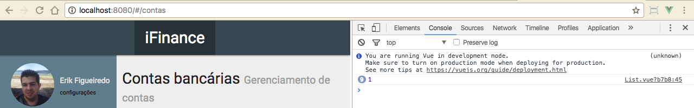

# Criando componente de listagem

Depois de termos criado o layout básico, no módulo passado, faremos o layout, real, do projeto, onde criaremos um CRUD.

Criaremos um sisteminha de cadastro de contas e para isso criaremos uma pasta chamada **Accounts** e dentro desta pasta iremos criar os componentes de cada página. Faremos de forma bem organizada para não bagunçarmos nossa aplicação.

O primeiro componente que criaremos será o **List.vue**. Este componente terá a responsabilidade de renderizar todo template e fará toda lógica da listagem de nossas contas.

Os componentes criados com Vue.js sempre terão 3 blocos:

Bloco | Descrição
------- | --------------
template | Marcação e estruturação HTML
script | Comportamento, ações e eventos
style | Estilização do componente

```js
<template>
  <!-- Template HTML -->
</template>
<script>
// Código javascript
</script>
<style>
/** Style CSS **/
</style>
```

# Template HTML

```html
<template>
  <div class="row">
    <div class="content-header">
      <h1>Contas bancárias <small>Gerenciamento de contas</small></h1>
      <div class="grey-text">
        <small>
          <a href="#/">iFinance</a> >
          <span>Suas contas</span>
        </small>
      </div>
    </div>
    <div class="card col s12">
      <div class="card-content">
        <table class="highlight">
          <thead>
            <tr>
              <th>contas</th>
            </tr>
          </thead>
          <tbody>
            <tr v-for="conta in contas">
              <td class="valign-wrapper">
                Conta título&nbsp;
                <small>agência: 0000 / conta: 0000  / código do banco: 000 </small>
              </td>
            </tr>
          </tbody>
        </table>
      </div>
      <div class="card-action">
        <a href="#/contas/novo">Nova conta</a>
      </div>
    </div>
  </div>
</template>
```

Colocando este bloco de template, já temos toda marcação do nosso componente, claro que ainda não existe nenhuma lógica envolvida e nada funcionando. Por enquanto é somente texto e marcação.

# Configurando Component usando javascript

```js
export default {
  name: 'accounts'
}
```

Por enquando, estamos, apenas, exportando o nosso componente.

Não utilizamos, até o momento, nenhum estilo. O bloco de **style** pode ficar vazio.

# Importando componente no arquivo de rotas

```js
import Hello from 'components/Hello'
import AccountsList from '../components/Accounts/List'

const routes = [
    { path: '/', name: 'Hello', component: Hello },
    { path: '/contas', component: AccountsList },
]

export default routes
```

Observem que, primeiro importamos o componente e depois adicionamos às nossas rotas. Significa que, quando o usário acessar a rota **/contas**, terá o componente renderizado.

Por enquanto não temos nenhum estilo, porém já irá funcionar. Vejam na imagem abaixo, acessando a rota /contas:


Vocês poderão ver, no browser, que temos uma conta sendo listada, mas ela não tem efeito nenhum, ao passar o mouse. Como queremos que tenha um efeito de link, adicionaremos o seguinte estilo ao style do nosso componente.

```css
tbody tr {
  cursor: pointer
}
```

Depois de adicionar este estilo, podem passar o mouse sobre a linha da conta e verão que agora existe um comportamento de link.

Já que temos o efeito de um link, vamos configurar um evento de click na tag **tr** do HTML. Vejam, primeiro o HTML e depois o bloco script:

```html
<tr @click="goTo(1)">
    ...
</tr>
```

```js
export default {
  name: 'accounts',
  methods: {
    goTo: function (id) {
      console.log(id)
    }
  }
}
```

Criamos um evento de click que chama um método chamado **goTo**. Configuramos este método para  mostrar o id passado como argumento para o evento. Vejam a imagem abaixo:



Depois que conseguimos fazer o **console.log**, alteramos para gerar uma rota.

```js
export default {
  name: 'accounts',
  methods: {
    goTo: function (id) {
      this.$router.push('/contas/' + id)
    }
  }
}
```

Assim, vocês podem acessar a conta listada e clicar. Verão que a página será direcionada para uma página sem conteúdo, mas a url terá o comportamente que queríamos.

No próximo módulo criaremos um componente para atender esta nova rota.