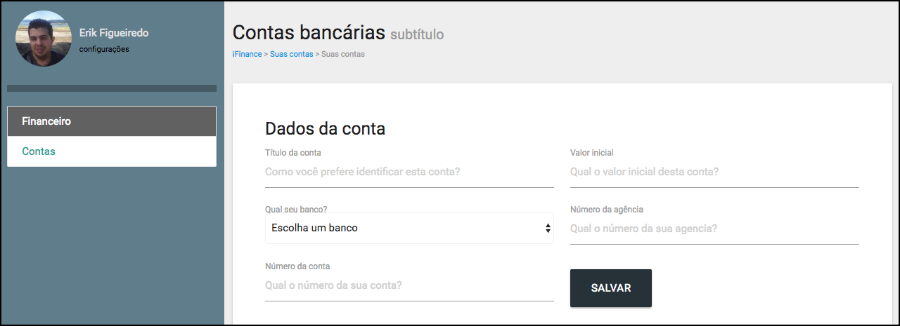

# Criando componente de edição e criação

Temos nossas contas sendo listadas e a visualização, individual, de cada uma delas. Até então, está tudo estruturado, porém, sem nenhuma funcionalidade.

No módulo passado ficou pendente a edição e a criação de uma nova conta, pois os botões **Editar** e o **Nova Conta** não nos direciona para lugar algum.

Neste módulo faremos este direcionamento e criaremos estes dois componentes, para não ficarmos sem navegação em nosso projeto. Depois de tudo estruturado, começaremos a aplicar as lógicas e trazer os dados de outro local. No momento, está tudo manual, apenas para ilustrar.

# Componente Nova Conta

### Template

Neste componente não teremos o bloco de template, porque carregarremos o formulário de criação de outro arquivo.

Para isso, criem um arquivo chamado form.html, dentro da pasta **Accounts**, com o seguinte conteúdo:

```html
<div class="row">
    <div class="content-header">
        <h1>Contas bancárias <small>editando/adicionando</small></h1>
        <div class="grey-text">
            <small>
                <a href="#/">iFinance</a> >
                <a href="#/contas">Suas contas</a> >
                <span>Suas contas</span>
            </small>
        </div>
    </div>
    <div class="card col s12">
        <div class="card-content">
            <form class="row" autocomplete="off">
                <div class="input-field col s12">
                    <h5>Dados da conta</h5>
                </div>
                <div class="input-field col s6">
                    <input type="text" id="title" class="validate" placeholder="Como você prefere identificar esta conta?" required>
                    <label for="title" class="active">Título da conta</label>
                </div>
                <div class="input-field col s6">
                    <input type="text" id="balance_initial" class="validate" placeholder="Qual o valor inicial desta conta?" required>
                    <label for="title" class="active">Valor inicial</label>
                </div>
                <div class="input-field col s6">
                    <select class="browser-default">
                        <option value="0">Escolha um banco</option>
                        <option class="left circle">Banco (000)</option>
                    </select>
                    <label for="" class="active">Qual seu banco?</label>
                </div>
                <div class="input-field col s6">
                    <input type="number" id="agency" class="validate" placeholder="Qual o número da sua agencia?" required>
                    <label for="agency" class="active">Número da agência</label>
                </div>
                <div class="input-field col s6">
                    <input type="number" id="account_number" class="validate" placeholder="Qual o número da sua conta?" required>
                    <label for="accont_number" class="active">Número da conta</label>
                </div>
                <div class="input-field col s6">
                    <input type="submit"class="waves-effect waves-light btn-large blue-grey darken-4" value="salvar">
                </div>
            </form>
        </div>
        <div class="card-action">
            <a href="#/contas">Voltar</a>
        </div>
    </div>
</div>
```

Fizemos isso para que o conteúdo seja priorizado e não percamos tempo no desenvolvimento do formulário. Vejam que nos scripts, chamamos o código acima, através de um **require**.

### Script

```js
export default {
  name: 'accounts-create',
  template: require('./form.html')
}
```

### Configurando Rota create

```js
import Hello from 'components/Hello'
import AccountsList from '../components/Accounts/List'
import AccountsCreate from '../components/Accounts/Create.vue'
import AccountsView from '../components/Accounts/View.vue'

const routes = [
  { path: '/', name: 'Hello', component: Hello },
  { path: '/contas', component: AccountsList },
  { path: '/contas/novo', component: AccountsCreate },
  { path: '/contas/:id', component: AccountsView }
]

export default routes
```

É muito importante seguir a ordem de rotas acima, porque se adicionarem a rota de criação depois da rota view, o VueRouter interpretará o **/novo** como sendo um **/id** na url e redirecionará para a rota view, em vez de carregar a rota create.

Façam o teste para entenderem o que estamos falando. Depois, retornem a rota no lugar correto.

Fazendo isso, era para estar funcionando corretamente. Mas, para que o **webpack** consiga carregar um html, precisamos instalar um loader específico, que se chama **html-loader** e depois configurá-lo no arquivo de configuração.

Já falamos que existem 3 tipos de arquivos de configuração: um só para desenvolvimento, outro só para produção e outro para ambos os ambientes.

Neste caso, como o formulário será carregado em ambos os ambientes, deveremos configurá-lo no arquivo **webpack.base.config.js**, que está na pasta **build**. Vejam a configuração do loader que deverá ser feita:

```js
{
    test: /\.(html)$/,
    loader: 'html-loader',
}
```

Adicionem esta configuração dentro da propriedade **module** e depois do último loader que estiver configurado. Este loader fará um teste em todos. Se tiver a extensão html, ele aplica o loader e inclui o arquivo no empacotamento.

Depois de realizada a configuração, não esqueçam de parar o servidor no terminal de comando e instalem o loader, seguindo o comando abaixo:

`npm install html-loader --save`

Após este procedimento, rodem o comado de desenvolvimento, novamente, (`npm run dev`), para ver se não existe nenhum erro. Em seguida, cliquem no botão **Nova Conta**. Vocês deverão ver o formulário, conforme imagem abaixo:



Depois de checar o funcionamento do formulário, podemos começar a trabalhar com modelo de dados e resgatar valores, dinamicamente, através do vue, em nosso formulário. Para isso, vejam as alterações:

```js
export default {
  name: 'account-create',
  data () {
    return {
      sub_title: 'Criando conta'
    }
  },
  template: require('./form.html')
}
```

Observem que adicionamos a propriedade **data** e configuramos um dado chamado **sub_title**.

Agora, precisamos recuperar este dado em nosso formulário, utilizando a interpolação do Vue ( {{ }} ). Onde estiver, encontrar o conteúdo **editando/adicionando**, substitua por **{{ sub_title }}**. Assim, o valor será carregado do nosso componente. Dessa forma, vocês poderão alterar este valor, posteriormente, sem mexer no template.

# Componente Nova Conta

Para agilizar o processo, duplicaremos o arquivo **Create.vue** e renomearemos para **Edit.vue**. Em seguida, alteraremos o conteúdo, que ficará assim:

```js
export default {
  name: 'account-edit',
  data () {
    return {
      sub_title: 'Editando conta'
    }
  },
  template: require('./form.html')
}
```

### Configurando rota edit

```js
import Hello from 'components/Hello'
import AccountsList from '../components/Accounts/List'
import AccountsCreate from '../components/Accounts/Create.vue'
import AccountsEdit from '../components/Accounts/Edit.vue'
import AccountsView from '../components/Accounts/View.vue'

const routes = [
  { path: '/', name: 'Hello', component: Hello },
  { path: '/contas', component: AccountsList },
  { path: '/contas/novo', component: AccountsCreate },
  { path: '/contas/:id', component: AccountsView },
  { path: '/contas/:id/editar', component: AccountsEdit }
]

export default routes
```

# Conclusão

Todos os nossos componentes estão conectados e existe uma navegabilidade por todos eles. Desta forma, só falta carregarmos as informações do banco de dados, para a aplicação ficar dinâmica.

Faremos isso no próximo módulo.