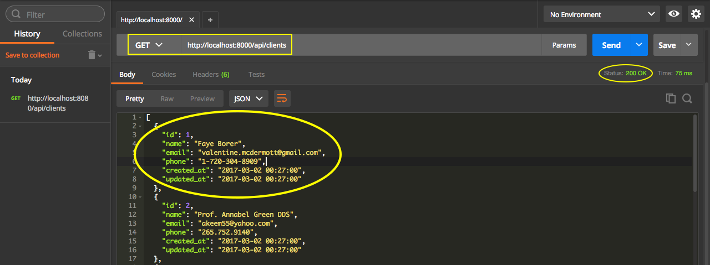

# REST - GET clients

Criaremos o primeiro recurso da aplicação RESTful.

Para isso, teremos que acessar a pasta **app/http** e abrir o arquivo chamado **routes.php**. Algumas versões mais novas do Lumen e do Laravel já trazem a pasta Routes, fora da pasta app. Se não encontrarem este arquivo no caminho informado, procurem fora da pasta app, uma pasta chamada **Routes**, na raiz do projeto. Entrem na pasta Routes e abram o arquivo **web.php**. Na nova estrutura existe um arquivo separado para APIs que vocês podem utilizar, falaremos sobre este assunto em outros conteúdos, mais atualizados e avançados. Por enquanto, utilizaremos um destes dois arquivos, para exemplificar.

Nestes arquivos, podemos configurar os **endpoints** e **rotas** da aplicação. Quando falamos endpoints, nos referimos ao recurso que será acessado, externamente.

Por padrão, temos a seguinte rota:

```php
$app->get('/', function () use ($app) {
    return $app->version();
});
```

É a rota padrão do projeto atual. Esta rota retorna a versão do Lumen. Por este motivo, quando iniciaram o servidor embutido e acessaram o browser, retornou a versão, como conteúdo do arquivo.

Como teremos diversas variações de recursos em nossa API, trabalharemos com o modelo de grupos de rotas, que o Lumen oferece. Com os grupos, conseguimos organizar melhor os recursos/rotas da nossa API.

Vejam abaixo:

```php
$app->group([
    'prefix' => 'api/clients',
    'namespace' => 'App\Http\Controllers'
], function () use ($app) {
    $app->get('','ClientsController@index');
});
```

No Laravel, temos mais recursos para trabalhar com grupo de rotas. Podemos colocar todas as rotas dentro de um mesmo nível e trabalhar com subníveis, dentro de um mesmo prefixo. No Lumen, não podemos trabalhar desta forma,  teremos que criar grupo por grupo, para utilização dos prefixos.

Lembrando que, no exemplo acima, o recurso é somente **clients**. A API faz parte do domínio que será acessado para ter como resultado, os dados do recurso.

Depois do prefixo, configuramos o namespace que trabalharemos com os recursos. No nosso exemplo, estamos passando o caminho da pasta de Controllers da nossa aplicação: **App\Http\Controllers**.

O próximo passo será importar a instância do **$app**, para dentro do contexto da função, utilizando o **use** e, invocar o método get, que fará uma requisição do tipo get para a API. Em seguida, temos que informar algum valor a mais, para complementar a rota. No nosso caso, deixamos vazio o primeiro parâmetro. Significa que o usuário precisará acessar, **api/clients**, para ter o resultado dos clientes. Por fim, passamos o nome do controler, seguido do método que será executado ao acessarem esta rota ou recurso, como segundo parâmetro.

## Conteúdo do Controller

Dentro da pasta de Controllers, citada acima, criaremos o nosso controller chamado **ClientsController**. Lembrando que deve ter o mesmo nome que informamos para a rota do recurso acima.

```php
namespace App\Http\Controllers;

use App\Client;

class ClientsController extends Controller
{
    public function index()
    {
        return Client::all();
    }
}
```

Se estiverem utilizando a versão mais atual do Lumen e Laravel, vocês não devem utilizar o namespace, para evitar erro na hora de retornar os dados. Basta remover ou comentar a linha. Vejam abaixo:

```php
$app->group([
    'prefix' => '/api/clients',
    //'namespace' => 'App\Http\Controllers'
], function() use($app) {
    return $app->get('','ClientsController@index');
});
```

Desta forma, já podem acessar o browser e o recurso, que obterão o resultado da listagem dos clientes em formato JSON, pois o Laravel já consegue converter o resultado para JSON, automaticamente.

Para acessar o recurso, acessem a seguinte URL: **http://localhost:8000/api/clients**. Lembrando que 8000 foi a porta que definimos no servidor embutido, se utilizarem outra porta, deverão alterar o endereço.

Mesmo tendo o resultado no browser, não indicamos o navegador para realização de testes em APIs. O mais indicado é instalar uma ferramenta para a realização destes teste. Utilizaremos o **Postman**. Este recurso já tem uma extensão no Chrome para quem quiser instalar.

Com esta ferramenta, vocês possuem histórico de todas as requisições, opção de selecionar o verbo http que irão utilizar, consegue passar, facilmente, parâmetros, além de conseguir enviar informações de headers, específicos. É uma ferramenta maravilhosa, que simula um ambiente, perfeito, para seus testes.

Vejam, na imagem abaixo, o resultado da requisição, utilizando o Postman:



Não estamos fazendo nenhuma alteração de dados, estamos apenas consultando os mesmos. Por este motivo dissemos, em módulos anteriores, que esta é uma requisição segura.