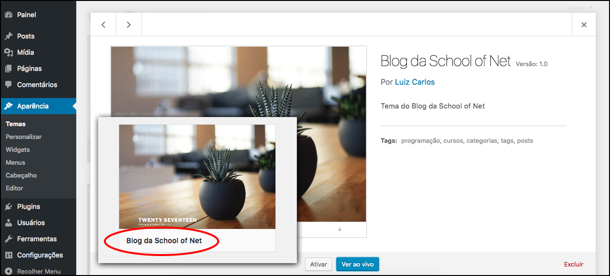

# Criando primeiro tema

Iniciaremos com a criação de um tema customizado com Wordpress, para que você tenha autonomia suficiente para criar seus próprios temas.

Os temas disponíveis estão no painel administrativo na parte de **Aparência/Temas**. Acessando este setor, do painel administrativo, você terá acesso ao tema que estiver ativo e também os demais.

O próximo passo será começar a criar nosso tema para que ele apareça, nesta tela, junto com os demais.

# Primeiro passo

Para criação de um tema precisamos de uma pasta e dois arquivos. Somente isso já é a base de um tema. A pasta pode ter o nome que você quiser, pois será o seu tema personalizado.

Nossa pasta se chamará **sonblog**. Os arquivos que estarão dentro desta pasta serão: **index.php** e **style.css**. No arquivo index iremos apenas colocar uma mensagem, para ver se está funcionando quando o ativarmos. No arquivo style teremos que declarar todas as informações do tema para que o Wordpress consiga reconhecê-lo. Colocaremos informações como: nome, descrição, autor, versão e muitos outros possíveis.

### Conteúdo arquivo index.php
```php
Blog da School of Net
```

### Conteúdo arquivo style.css

```css
/*
Theme Name: Blog da School of Net
Theme URI: http://schoolofnet.com
Author: Luiz Carlos
Author URI: http://github.com/argentinaluiz
Description: Tema do Blog da School of Net
Version: 1.0
License: MIT
License URI: http://schoolofnet.com
Tags: programação, cursos, categorias, tags, posts
Text Domain: sonblog
*/
```

As próprias informações já são auto explicativas, precisamos falar apenas das Tags e Text Domain. As tags são utilizadas para identificação, caso queira disponibilizar o tema na internet e o text domain é utilizado para criação de traduções, ele serve como uma apelido único que você configura. Não confunda text domain com o nome do tema, são coisas totalmente diferentes.

Somente este comentário no arquivo **style.css** já é capaz de configurar o tema e fazer com que ele apareça entre os demais. Lembrando que somente criar a pasta não fará com que o tema seja reconhecido e nem aceito pelo Wordpress.

A criação do arquivo index.php e o style.css é obrigatório. Isso é uma convenção do próprio framework e deve ser mantida.

Se você já criou os arquivos e já editou seu arquivo style com o comentário acima, o seu tema já estará aparecendo dentro do painel. Porém você perceberá que ainda não tem imagem, como os padrões. Ensinaremos como colocar esta imagem agora mesmo.

Basta você criar uma imagem chamada screenshot.png e colocar dentro do seu tema, que ele irá reconhecer esta imagem e aparecerá automaticamente. Nós iremos pegar a mesma imagem do tema twentyseventeen para facilitar o entendimento, mas você pode criar a sua própria imagem para colocar em seu tema.

Veja imagem abaixo:



# Ativando tema

Depois de ter criado a estrutura básica de um tema e ter visto o funcionamento no painel administrativo, falta ativarmos o mesmo. Ative o seu tema e vá até a página inicial, do seu site, para ver se está realmente tudo funcionando.

Você deverá estar vendo o conteúdo do arquivo index.php(**Blog da School of Net**).

Caso você não tivesse criado o arquivo index.php você teria um erro do modo debug. Veja imagem abaixo:


# Conclusão

Agora você pode ver a importância da estrutura mínima que o Wordpress exige para um tema. Não existe um tema sem a pasta principal e os dois arquivos internos, lembrando que a screenshot é opcional.

Agora que já sabemos o procedimento e a estrutura básica iremos deslanchar no restante do conteúdo.